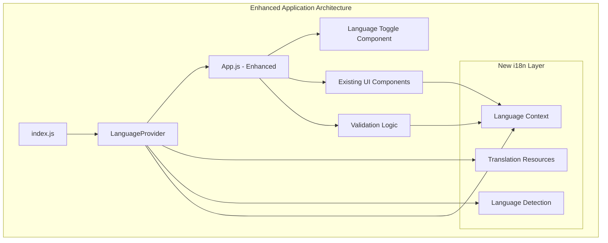
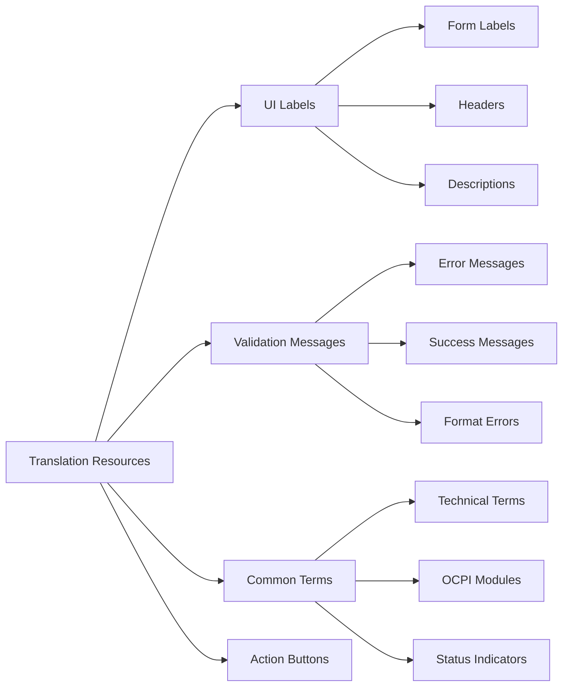
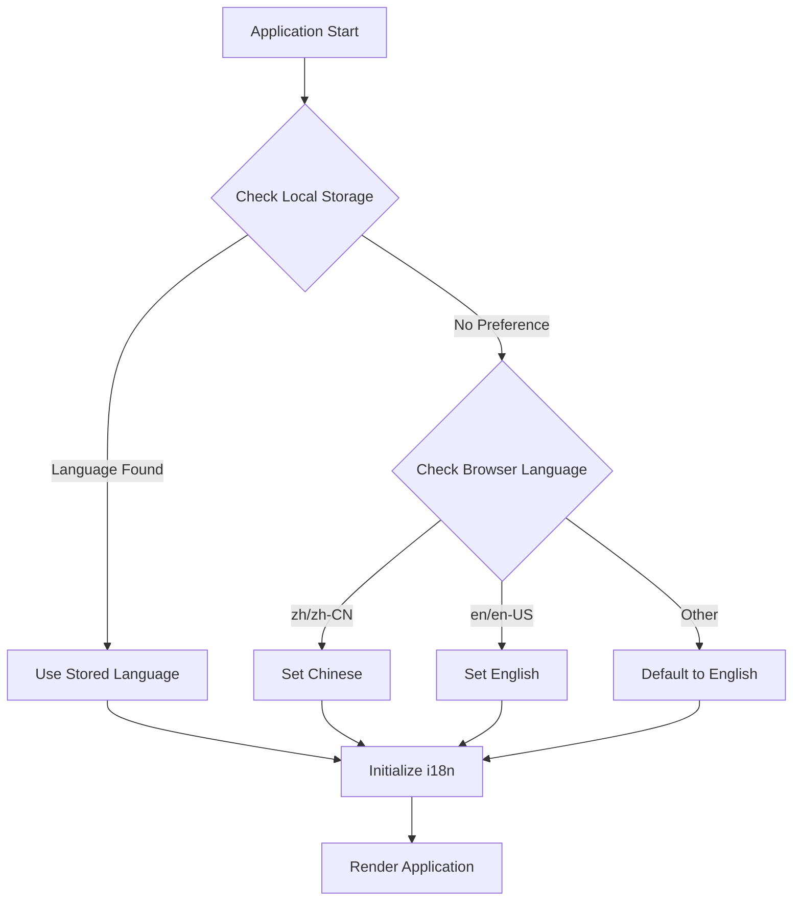
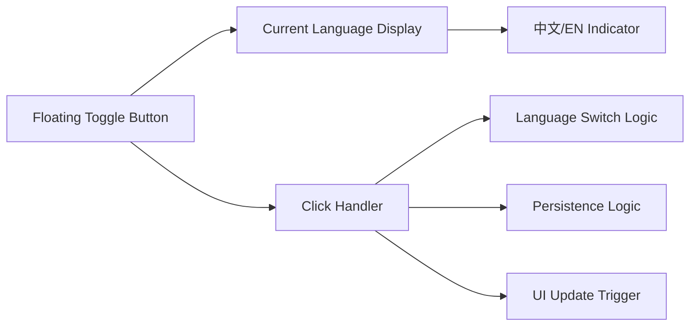
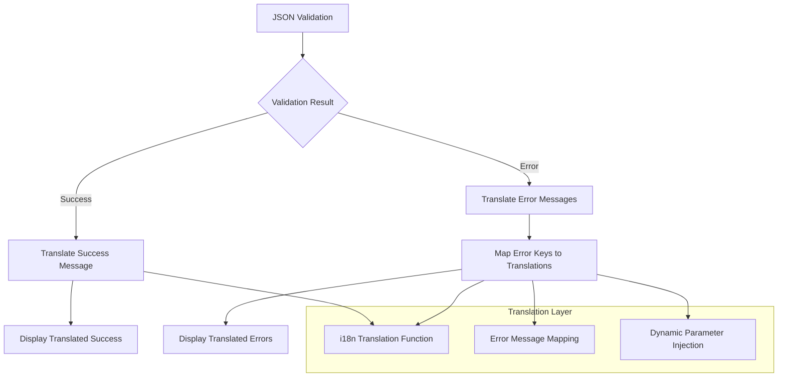
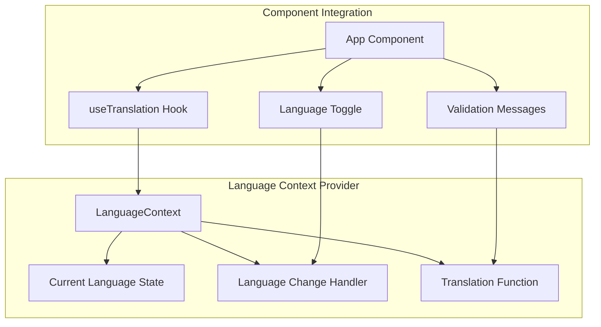
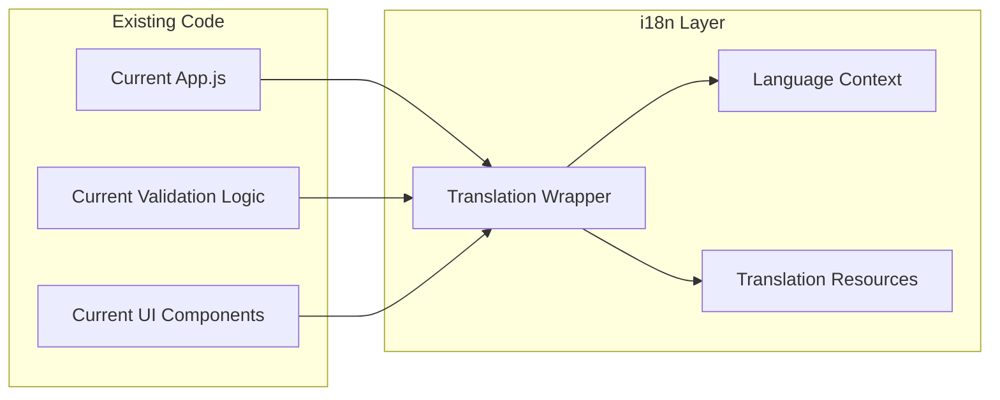
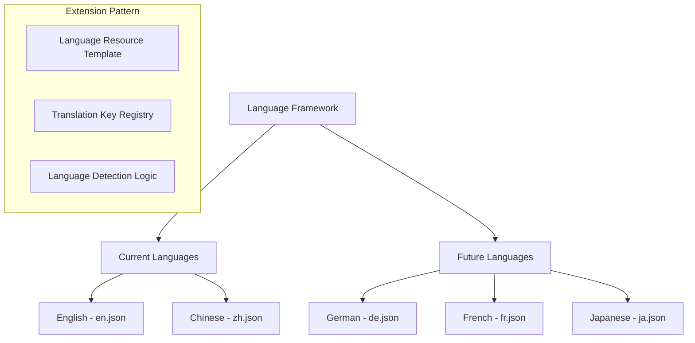
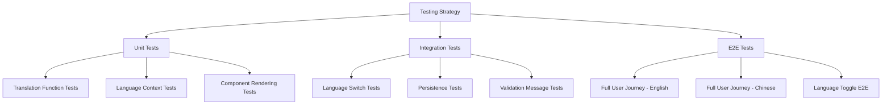

# Multi-Language Support Design

## Overview

This design document outlines the implementation of multi-language support for the OCPI JSON Validation Tool, enabling seamless switching between Chinese and English languages while maintaining the existing functionality and interface design. The solution is designed to be extensible for future language additions.

## Technology Stack & Dependencies

| Component | Current State | Required Addition |
|-----------|---------------|-------------------|
| **Internationalization Library** | None | react-i18next |
| **Language Detection** | None | i18next-browser-languagedetector |
| **Resource Management** | None | i18next-resources-to-backend |
| **React Integration** | React 19.1.1 | react-i18next hooks integration |
| **State Management** | React useState | Enhanced with language context |

## Component Architecture

### Language Context Layer

A new internationalization layer will be added to wrap the existing application components without disrupting the current architecture.



### Component Hierarchy Enhancement

| Component | Current Role | i18n Enhancement |
|-----------|--------------|------------------|
| **App.js** | Main component with UI and state management | Enhanced with useTranslation hook |
| **LanguageProvider** | N/A - New Component | Wraps App with i18next context |
| **LanguageToggle** | N/A - New Component | Floating language switcher |
| **ValidationLogic** | ocpi-validators.js | Enhanced with translated error messages |

## Internationalization Strategy

### Translation Resource Structure

Translation resources will be organized by functional domains to maintain clarity and ease of maintenance:



### Translation Key Organization

| Translation Domain | Key Structure | Examples |
|-------------------|---------------|----------|
| **UI Components** | `ui.{component}.{element}` | `ui.header.title`, `ui.form.selectVersion` |
| **Validation** | `validation.{type}.{specific}` | `validation.error.jsonFormat`, `validation.success.passed` |
| **Common** | `common.{category}.{item}` | `common.actions.validate`, `common.status.available` |
| **Modules** | `modules.{moduleName}` | `modules.locations`, `modules.sessions` |

### Language Resource Files

**English Resources (en.json)**
```
{
  "ui": {
    "header": {
      "title": "OCPI JSON Validation Tool",
      "subtitle": "Supported versions: OCPI 2.1.1-d2, OCPI 2.2.1-d2, OCPI 2.3.0 | Modules: Locations, Sessions, CDRs, Tariffs, Tokens, Commands, Bookings"
    },
    "form": {
      "selectVersion": "Select OCPI Version",
      "selectModule": "Select Module",
      "jsonInput": "JSON Input",
      "placeholder": "Enter OCPI JSON data here, or click 'Load Sample Data' button to load version-specific test data"
    }
  },
  "validation": {
    "error": {
      "jsonFormat": "JSON format error: {{message}}",
      "moduleNotAvailable": "{{module}} module is not available in OCPI 2.1.1-d2 version",
      "bookingsOnly230": "Bookings module is only available in OCPI 2.3.0 version",
      "unsupportedModule": "Unsupported module: {{module}} (version: {{version}})"
    },
    "success": {
      "passed": "✅ Validation Passed!",
      "description": "JSON data conforms to OCPI {{version}} specification"
    },
    "failed": "❌ Validation Failed"
  },
  "common": {
    "actions": {
      "loadSample": "Load Sample Data ({{version}})",
      "formatJson": "Format JSON",
      "clear": "Clear",
      "validate": "Validate"
    }
  }
}
```

**Chinese Resources (zh.json)**
```
{
  "ui": {
    "header": {
      "title": "OCPI JSON验证工具",
      "subtitle": "支持的版本: OCPI 2.1.1-d2, OCPI 2.2.1-d2, OCPI 2.3.0 | 模块: Locations, Sessions, CDRs, Tariffs, Tokens, Commands, Bookings"
    },
    "form": {
      "selectVersion": "选择OCPI版本",
      "selectModule": "选择模块",
      "jsonInput": "JSON输入",
      "placeholder": "在此输入OCPI JSON数据，或点击'加载示例数据'按钮加载版本特定的测试数据"
    }
  },
  "validation": {
    "error": {
      "jsonFormat": "JSON格式错误: {{message}}",
      "moduleNotAvailable": "{{module}}模块在OCPI 2.1.1-d2版本中不可用",
      "bookingsOnly230": "Bookings模块仅在OCPI 2.3.0版本中可用",
      "unsupportedModule": "不支持的模块: {{module}} (版本: {{version}})"
    },
    "success": {
      "passed": "✅ 验证通过！",
      "description": "JSON数据符合OCPI {{version}}规范"
    },
    "failed": "❌ 验证失败"
  },
  "common": {
    "actions": {
      "loadSample": "加载示例数据 ({{version}})",
      "formatJson": "格式化JSON",
      "clear": "清空",
      "validate": "验证"
    }
  }
}
```

## Language Detection & Persistence

### Detection Strategy



### Language Persistence Flow

| Trigger | Action | Storage | Effect |
|---------|--------|---------|--------|
| **User Selection** | Language toggle clicked | Save to localStorage | Immediate UI update |
| **Page Reload** | Application initialization | Read from localStorage | Restore user preference |
| **New Session** | First-time user | Browser language detection | Set initial language |

## Language Toggle Component Design

### Visual Design Strategy

The language toggle will be implemented as a floating action button positioned in the top-right corner to avoid disrupting the existing layout.



### Toggle Component Specifications

| Property | Specification | Rationale |
|----------|---------------|-----------|
| **Position** | Fixed, top-right corner | Non-intrusive, always accessible |
| **Visual Style** | Material-UI Fab with language icon | Consistent with existing design |
| **States** | Chinese (中文) / English (EN) | Clear language identification |
| **Animation** | Smooth fade transition | Professional user experience |
| **Accessibility** | ARIA labels and keyboard support | Inclusive design |

## Enhanced Validation System

### Validation Message Translation

The existing validation system will be enhanced to support multilingual error messages while maintaining the same validation logic.



### Error Message Enhancement Strategy

| Current Error Pattern | Translation Key | Parameter Injection |
|----------------------|-----------------|-------------------|
| `JSON格式错误: ${error.message}` | `validation.error.jsonFormat` | `{{message}}` |
| `${module}模块在OCPI 2.1.1-d2版本中不可用` | `validation.error.moduleNotAvailable` | `{{module}}` |
| `不支持的模块: ${module} (版本: ${version})` | `validation.error.unsupportedModule` | `{{module}}, {{version}}` |

## State Management Integration

### Language Context Implementation



### State Flow Architecture

| State Element | Type | Source | Consumer |
|---------------|------|--------|----------|
| **currentLanguage** | String ('en' \| 'zh') | LanguageContext | All components |
| **translations** | Object | i18next resources | Translation function |
| **isReady** | Boolean | i18next initialization | App rendering |

## Backward Compatibility Strategy

### Minimal Disruption Approach

The internationalization implementation will follow a wrapper pattern to ensure zero disruption to existing functionality:



### Migration Strategy

| Phase | Scope | Impact | Validation |
|-------|-------|--------|------------|
| **Phase 1** | Core UI elements | Minimal - wrapper approach | Existing tests pass |
| **Phase 2** | Validation messages | Moderate - message replacement | Error handling preserved |
| **Phase 3** | Language toggle | Low - additive feature | No functional changes |

## Future Extensibility

### Multi-Language Support Framework

The design accommodates future language additions through a scalable resource structure:



### Extensibility Design Principles

| Principle | Implementation | Benefit |
|-----------|----------------|---------|
| **Resource Consistency** | Standardized JSON structure | Easy language addition |
| **Key Standardization** | Hierarchical naming convention | Maintainable translations |
| **Dynamic Loading** | Lazy resource loading | Performance optimization |
| **Fallback Strategy** | English as default fallback | Robust error handling |

## Testing Strategy

### Multi-Language Testing Approach



### Test Coverage Requirements

| Test Category | Coverage Target | Key Scenarios |
|---------------|----------------|---------------|
| **Translation Accuracy** | 100% key coverage | All UI elements translated |
| **Language Switching** | All interaction paths | Toggle, persistence, reload |
| **Validation Messages** | All error scenarios | Multilingual error display |
| **Fallback Behavior** | Edge cases | Missing translations, invalid languages |