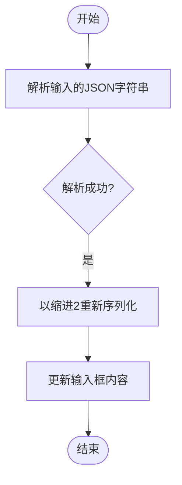
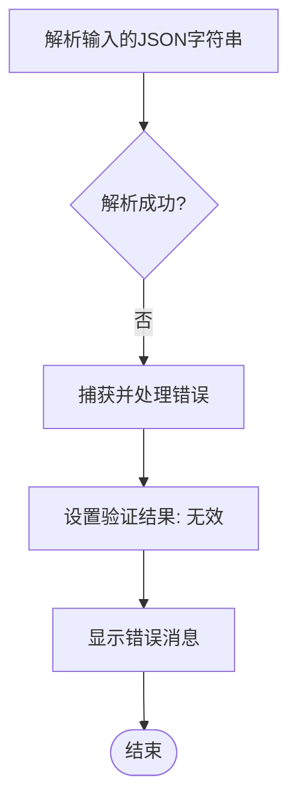

# JSON格式化功能

<cite>
**Referenced Files in This Document **   
- [App.js](file://src/App.js)
</cite>

## 目录
1. [功能概述](#功能概述)
2. [核心实现机制](#核心实现机制)
3. [异常处理流程](#异常处理流程)
4. [典型使用场景](#典型使用场景)

## 功能概述

“格式化JSON”按钮是OCPI JSON验证工具中的一个实用功能，旨在帮助用户将杂乱或压缩的JSON输入转换为结构清晰、易于阅读的格式。该功能通过解析当前输入的JSON字符串，并以缩进为2个空格的方式重新序列化输出，从而实现美化效果。当用户粘贴原始数据后，只需点击此按钮即可一键美化，便于后续的阅读和编辑。

**Section sources**
- [App.js](file://src/App.js#L141-L150)

## 核心实现机制

该功能的核心实现在于`App.js`文件中的`formatJson`函数。该函数首先尝试使用`JSON.parse()`方法解析当前输入框中的JSON字符串。如果解析成功，则调用`JSON.stringify()`方法将解析后的JavaScript对象重新序列化为JSON字符串，并指定缩进参数为2，从而生成格式化后的输出。最后，将格式化后的字符串更新回输入框中，完成美化操作。

**Diagram sources **
- [App.js](file://src/App.js#L141-L146)

**Section sources**
- [App.js](file://src/App.js#L141-L146)

## 异常处理流程

在执行格式化操作时，若输入的字符串不符合合法的JSON语法，`JSON.parse()`方法会抛出异常。此时，`formatJson`函数的`catch`块会被触发，系统将设置验证结果状态，显示相应的错误提示信息，告知用户具体的JSON格式错误原因。这种异常处理机制确保了即使输入无效数据，也不会导致程序崩溃，而是提供友好的反馈。

**Diagram sources **
- [App.js](file://src/App.js#L147-L150)

**Section sources**
- [App.js](file://src/App.js#L147-L150)

## 典型使用场景

该功能特别适用于以下几种典型场景：当用户从其他系统复制粘贴原始的、未经格式化的JSON数据到输入框后，可以直接点击“格式化JSON”按钮，使数据立即变得结构清晰、层次分明，极大提升了可读性；在调试或审查复杂的JSON结构时，一键美化可以帮助开发者快速定位字段位置；此外，在团队协作中分享JSON示例时，先进行格式化可以保证代码整洁，便于他人理解和使用。总之，这一功能显著提高了处理JSON数据的效率和用户体验。

**Section sources**
- [App.js](file://src/App.js#L211)