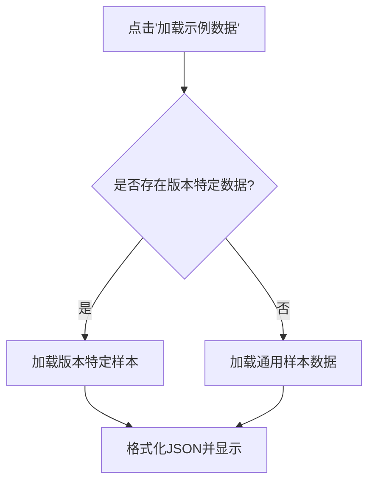
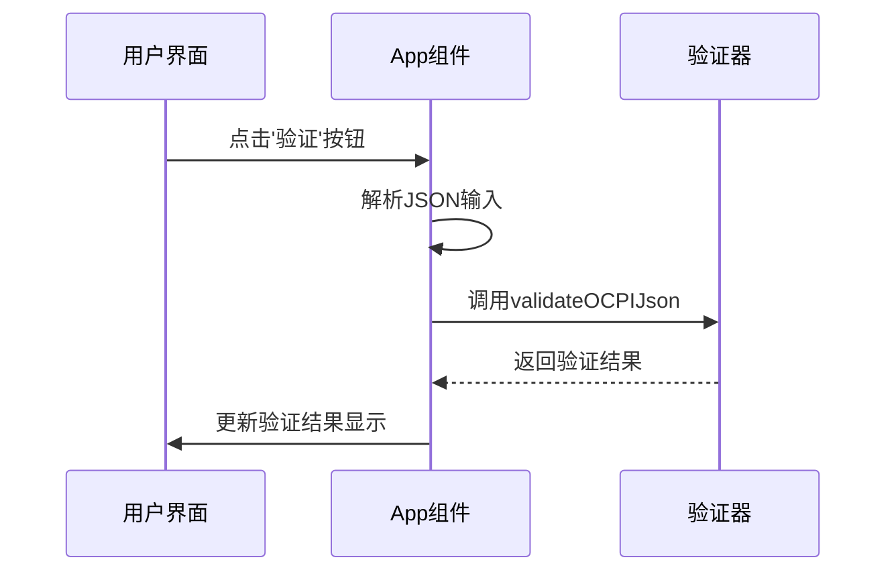

# 使用指南

<cite>
**本文档引用的文件**  
- [USAGE_GUIDE.md](file://USAGE_GUIDE.md)
- [App.js](file://src/App.js)
- [ocpi-validators.js](file://src/ocpi-validators.js)
- [sample-data.js](file://src/sample-data.js)
</cite>

## 目录
1. [用户界面控件行为解析](#用户界面控件行为解析)
2. [验证结果展示区域设计](#验证结果展示区域设计)
3. [典型使用案例](#典型使用案例)

## 用户界面控件行为解析

### 版本选择器功能说明
版本选择器允许用户在不同OCPI规范之间切换，支持OCPI 2.1.1-d2、OCPI 2.2.1-d2和OCPI 2.3.0三个版本。当用户选择特定版本时，系统会动态调整可用模块列表：在2.1.1-d2版本中不显示Commands和Bookings模块；在2.3.0版本中则包含所有模块，包括增强功能和预订服务。

**Section sources**
- [App.js](file://src/App.js#L74-L89)

### 模块下拉菜单动态调整机制
模块下拉菜单根据当前选择的OCPI版本动态调整验证范围。基础模块（Locations、Sessions、CDRs等）始终可用，而Commands模块仅在2.2.1-d2及以上版本中出现，Bookings模块仅在2.3.0版本中可用。这种动态调整确保了验证逻辑与所选版本的规范完全匹配。

**Section sources**
- [App.js](file://src/App.js#L74-L89)

### '加载示例数据'按钮功能实现
'加载示例数据'按钮通过`getVersionSpecificSampleData`函数注入预设测试数据。该函数首先检查是否存在针对当前版本和模块的特定样本数据，如果存在则优先使用；否则回退到通用样本数据。例如，在选择2.3.0版本的Locations模块时，将加载专为该版本设计的HDV充电枢纽数据。

**Diagram sources**
- [App.js](file://src/App.js#L125-L134)
- [sample-data.js](file://src/sample-data.js)

**Section sources**
- [App.js](file://src/App.js#L43-L95)
- [sample-data.js](file://src/sample-data.js)

### '格式化JSON'功能详解
'格式化JSON'功能通过解析输入的JSON字符串并重新序列化为带缩进的格式来美化内容。此操作不仅提升了可读性，还能帮助发现潜在的语法错误。当用户点击该按钮时，系统尝试解析当前输入，若成功则以标准缩进格式重新显示；若失败，则在验证结果区域提示JSON格式错误。

**Section sources**
- [App.js](file://src/App.js#L141-L151)

### '验证'按钮触发流程
'验证'按钮触发完整的验证流程，包括JSON解析、模式验证和结果呈现。首先解析输入的JSON数据，然后调用`validateOCPIJson`函数进行模式验证，最后将结果存储在状态中供UI显示。验证过程考虑了OCPI版本差异，确保每个版本的特定要求都得到正确处理。

**Diagram sources**
- [App.js](file://src/App.js#L112-L123)
- [ocpi-validators.js](file://src/ocpi-validators.js#L968-L1004)

**Section sources**
- [App.js](file://src/App.js#L112-L123)
- [ocpi-validators.js](file://src/ocpi-validators.js#L968-L1004)

## 验证结果展示区域设计

### 成功提示呈现方式
当验证通过时，系统显示绿色勾号图标和"✅ 验证通过！"的成功提示，并附带说明"JSON数据符合OCPI {version}规范"。这种视觉反馈清晰地传达了验证结果，使用户能够立即确认其数据的有效性。

**Section sources**
- [App.js](file://src/App.js#L275-L279)

### 错误详情展示机制
当验证失败时，系统显示红色叉号图标和"❌ 验证失败"的错误提示，并列出详细的错误信息。每个错误条目包含字段路径和具体错误描述，如"coordinates.latitude: 纬度格式不正确"。这种详细的错误报告帮助用户快速定位和修复问题。

**Section sources**
- [App.js](file://src/App.js#L283-L291)

## 典型使用案例

### 验证Locations创建请求
要验证Locations创建请求，首先选择"Locations"模块和目标OCPI版本，然后点击"加载示例数据"获取预设的充电站数据。修改相关字段后点击"验证"按钮，系统将检查必填字段（如country_code、party_id）、格式要求（如坐标精度）和枚举值（如connector_standard）是否符合规范。

**Section sources**
- [sample-data.js](file://src/sample-data.js)
- [ocpi-validators.js](file://src/ocpi-validators.js#L297-L418)

### 验证Sessions结束通知
验证Sessions结束通知时，选择"Sessions"模块和相应版本，加载示例会话数据。重点关注end_date_time字段的存在性和时间顺序（必须晚于start_date_time），以及kwh字段的非负性要求。对于2.3.0版本，还需验证新增的vehicle_info和charging_preferences字段。

**Section sources**
- [sample-data.js](file://src/sample-data.js)
- [ocpi-validators.js](file://src/ocpi-validators.js#L588-L636)