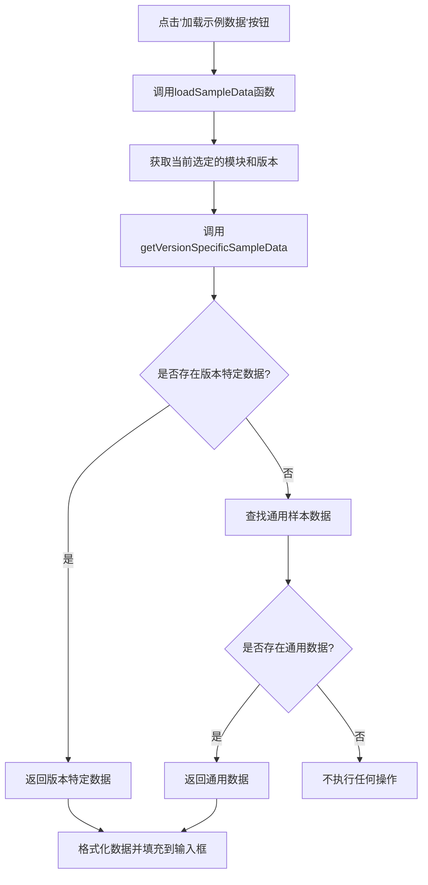
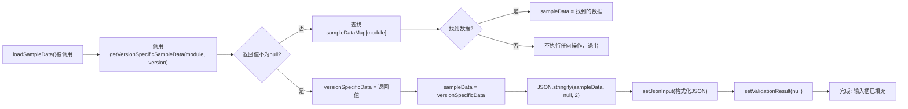

<cite>
**Referenced Files in This Document**
- [USAGE_GUIDE.md](file://USAGE_GUIDE.md)
- [App.js](file://src/App.js)
- [sample-data.js](file://src/sample-data.js)
</cite>

## 目录
1. [加载示例数据功能](#加载示例数据功能)
2. [核心工作机制](#核心工作机制)
3. [版本特定数据优先策略](#版本特定数据优先策略)
4. [用户交互流程](#用户交互流程)
5. [数据加载与填充过程](#数据加载与填充过程)
6. [使用指南](#使用指南)

## 加载示例数据功能

本功能旨在为用户提供一种快速、便捷的方式来加载符合OCPI规范的测试数据，以便进行验证和测试。通过点击"加载示例数据"按钮，系统能够根据当前选定的OCPI版本和模块自动加载相应的测试数据。

该功能的核心价值在于：
- 提供即用型测试数据，无需手动编写复杂的JSON结构
- 确保测试数据符合所选OCPI版本的规范要求
- 支持多版本兼容性测试，便于比较不同版本间的差异
- 作为学习OCPI数据结构的参考样本

此功能特别适用于开发人员、测试工程师以及API集成者，帮助他们快速开始验证工作，提高工作效率。

**Section sources**
- [USAGE_GUIDE.md](file://USAGE_GUIDE.md#L0-L230)
- [App.js](file://src/App.js#L0-L317)
- [sample-data.js](file://src/sample-data.js#L0-L722)

## 核心工作机制

"加载示例数据"功能的工作机制基于一个精心设计的数据映射和选择逻辑。当用户点击该按钮时，系统会执行一系列协调操作来确定并加载最适合当前上下文的测试数据。

整个过程始于`loadSampleData`函数的调用，该函数位于`App.js`文件中。这个函数首先尝试获取与当前选定OCPI版本和模块相匹配的版本特定数据。如果找不到合适的版本特定数据，则会回退到通用样本数据。

数据源主要来自`sample-data.js`文件，其中包含了针对不同OCPI版本（2.1.1-d2、2.2.1-d2和2.3.0）组织的测试数据集。这些数据集按照模块进行了分类，包括位置(locations)、会话(sessions)、计费记录(CDRs)等。

这种分层的数据管理策略确保了系统的灵活性和可维护性，使得添加新版本或修改现有数据变得简单而直观。



**Diagram sources**
- [App.js](file://src/App.js#L43-L128)
- [sample-data.js](file://src/sample-data.js#L0-L722)

**Section sources**
- [App.js](file://src/App.js#L43-L128)
- [sample-data.js](file://src/sample-data.js#L0-L722)

## 版本特定数据优先策略

系统采用了一种智能的版本特定数据优先策略，以确保为用户提供最准确的测试数据。这一策略的核心是`getVersionSpecificSampleData`函数，它根据当前选定的OCPI版本和模块来决定返回哪个数据集。

对于支持版本差异的主要模块（如locations、sessions、cdrs等），系统会检查当前版本是否为2.1.1-d2、2.2.1-d2或2.3.0，并相应地返回对应的数据。例如，当选择locations模块且版本为2.1.1-d2时，系统将返回`sampleData_211.location`；若版本为2.3.0，则返回`sampleData_230.location`。

某些模块在较新版本中才被引入，比如bookings模块仅在OCPI 2.3.0中可用。在这种情况下，系统会对不支持的组合返回null，从而禁用加载按钮，防止用户加载不兼容的数据。

对于没有版本差异的模块（如tariffs、tokens等），系统会统一使用通用样本数据。此外，命令类模块（commands）在2.1.1-d2版本中不受支持，因此在该版本下这些选项会被隐藏。

这种策略确保了数据的相关性和准确性，同时提供了清晰的用户体验反馈。

```mermaid
graph TB
subgraph "版本判断"
A[获取当前版本] --> B{版本 == 2.1.1-d2?}
B --> |是| C[使用sampleData_211]
B --> |否| D{版本 == 2.3.0?}
D --> |是| E[使用sampleData_230]
D --> |否| F[使用sampleData_221]
end
subgraph "模块处理"
G[获取当前模块] --> H{模块有版本差异?}
H --> |是| I[返回版本特定数据]
H --> |否| J[返回通用数据]
end
subgraph "特殊规则"
K[bookings模块] --> L{版本 == 2.3.0?}
L --> |是| M[可用]
L --> |否| N[不可用]
O[commands模块] --> P{版本 == 2.1.1-d2?}
P --> |是| Q[隐藏]
P --> |否| R[显示]
end
A --> G
C --> I
E --> I
F --> I
J --> K
```



**Diagram sources**
- [App.js](file://src/App.js#L43-L95)
- [sample-data.js](file://src/sample-data.js#L0-L722)

**Section sources**
- [App.js](file://src/App.js#L43-L95)
- [sample-data.js](file://src/sample-data.js#L0-L722)

## 用户交互流程

用户的交互流程从选择适当的OCPI版本和模块开始。界面提供了两个下拉菜单：一个用于选择OCPI版本（2.1.1-d2、2.2.1-d2或2.3.0），另一个用于选择要测试的模块。

根据所选版本，系统会动态调整可用模块列表。例如，在选择2.1.1-d2版本时，booking模块将不会出现在选项中，因为该功能在此版本中不存在。同样，命令类模块在2.1.1-d2版本中也不可用。

一旦选择了版本和模块，"加载示例数据"按钮的状态就会更新。如果存在对应的测试数据（无论是版本特定还是通用），按钮将变为可用状态；否则将保持禁用状态，向用户传达当前组合无可用数据的信息。

点击按钮后，系统会在后台执行数据检索逻辑，并将格式化的JSON数据填充到主输入区域。此时，用户可以立即查看数据内容，进行必要的修改，或者直接点击"验证"按钮开始验证过程。

```mermaid
sequenceDiagram
participant User as 用户
participant UI as 用户界面
participant Logic as 业务逻辑
participant Data as 数据存储
User->>UI : 选择OCPI版本
UI->>Logic : 更新版本状态
Logic->>UI : 动态更新模块选项
User->>UI : 选择模块
UI->>Logic : 更新模块状态
Logic->>Logic : 检查数据可用性
Logic->>UI : 更新按钮状态(启用/禁用)
User->>UI : 点击"加载示例数据"
UI->>Logic : 调用loadSampleData()
Logic->>Logic : 调用getVersionSpecificSampleData()
alt 存在版本特定数据
Logic->>Data : 获取版本特定数据
else 存在通用数据
Logic->>Data : 获取通用数据
else 无可用数据
Logic-->>UI : 返回null
UI-->>User : 按钮保持禁用
stop
end
Logic->>Logic : JSON.stringify(数据, null, 2)
Logic->>UI : 返回格式化数据
UI->>UI : 填充JSON输入框
UI-->>User : 显示格式化JSON数据
```

**Diagram sources**
- [App.js](file://src/App.js#L43-L128)
- [sample-data.js](file://src/sample-data.js#L0-L722)

**Section sources**
- [App.js](file://src/App.js#L43-L128)
- [sample-data.js](file://src/sample-data.js#L0-L722)

## 数据加载与填充过程

数据加载与填充过程是一个高效且用户友好的操作序列。当`loadSampleData`函数被触发时，它首先调用`getVersionSpecificSampleData`函数来获取与当前上下文匹配的版本特定数据。

如果找到了版本特定数据，系统将直接使用该数据；如果没有找到，则会查询`sampleDataMap`对象以获取通用样本数据。这种双重查找机制确保了最大程度的数据可用性。

获得数据后，系统会使用`JSON.stringify(sampleData, null, 2)`方法将JavaScript对象转换为格式良好的JSON字符串，其中`null`参数表示不使用替换函数，`2`参数表示使用两个空格进行缩进，从而使输出更加易读。

最后，格式化后的JSON字符串通过`setJsonInput`状态更新函数被设置到主输入框中。同时，任何先前的验证结果都会被清除，为接下来的验证操作做好准备。

值得注意的是，按钮的`disabled`属性也通过相同的`getVersionSpecificSampleData`和`sampleDataMap`检查来控制，确保只有在有可用数据时才能点击，提供了直观的用户体验反馈。



**Diagram sources**
- [App.js](file://src/App.js#L125-L135)
- [sample-data.js](file://src/sample-data.js#L0-L722)

**Section sources**
- [App.js](file://src/App.js#L125-L135)
- [sample-data.js](file://src/sample-data.js#L0-L722)

## 使用指南

要充分利用"加载示例数据"功能，请遵循以下步骤：

1. **启动应用**：运行`npm start`命令启动应用程序，访问http://localhost:3000

2. **选择版本**：从下拉菜单中选择所需的OCPI版本（2.1.1-d2、2.2.1-d2或2.3.0）

3. **选择模块**：根据所选版本，从可用选项中选择要测试的模块

4. **加载数据**：点击"加载示例数据"按钮，系统将自动填充相应的测试数据

5. **查看和编辑**：检查加载的JSON数据，可根据需要进行修改

6. **格式化**：如有必要，可点击"格式化JSON"按钮重新格式化数据

7. **验证**：点击"验证"按钮检查数据的有效性

8. **清空**：完成测试后，可点击"清空"按钮重置输入区域

建议在测试过程中尝试不同的版本和模块组合，以全面了解各版本间的差异。还可以基于提供的样本创建自定义测试数据，进一步扩展测试场景。

**Section sources**
- [USAGE_GUIDE.md](file://USAGE_GUIDE.md#L0-L230)
- [App.js](file://src/App.js#L0-L317)