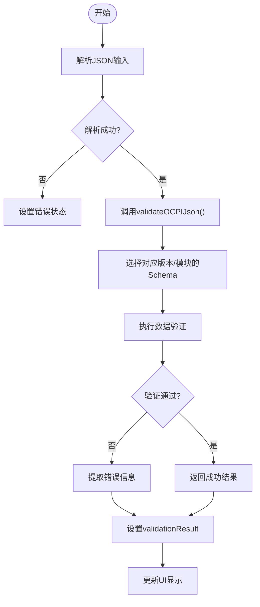
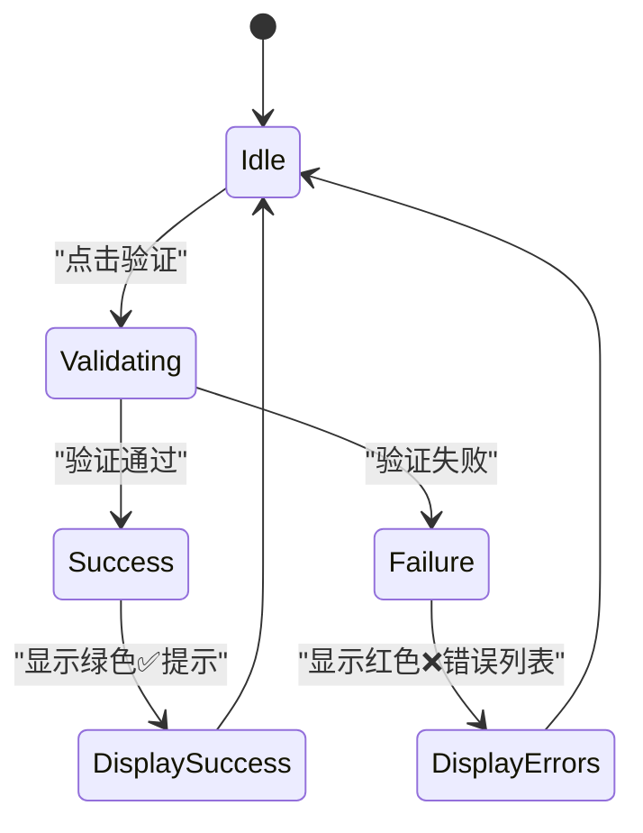

# 执行验证流程

<cite>
**本文档引用的文件**  
- [App.js](file://src/App.js)
- [ocpi-validators.js](file://src/ocpi-validators.js)
</cite>

## 目录
1. [点击验证按钮后的完整流程](#点击验证按钮后的完整流程)
2. [JSON解析与数据对象构建](#json解析与数据对象构建)
3. [调用验证函数并传入参数](#调用验证函数并传入参数)
4. [验证结果的状态更新机制](#验证结果的状态更新机制)
5. [成功与失败情况下的界面反馈差异](#成功与失败情况下的界面反馈差异)

### 点击验证按钮后的完整流程
当用户在OCPI JSON验证工具中点击“验证”按钮时，系统会触发`handleValidate`函数。该函数首先尝试将用户输入的JSON字符串通过`JSON.parse()`方法解析为JavaScript对象。如果解析失败（例如输入内容不符合JSON格式），则捕获异常，并设置验证结果为无效状态，同时返回具体的错误信息。

若解析成功，则调用从`ocpi-validators.js`模块导入的`validateOCPIJson`函数进行校验。此过程涉及三个关键参数：当前选择的模块类型（如locations、sessions等）、已解析的数据对象以及所选的OCPI版本号（如2.1.1-d2或2.3.0）。最终，根据验证结果更新UI状态，以绿色✅提示表示通过，红色❌列表显示具体错误详情。

**Section sources**
- [App.js](file://src/App.js#L85-L126)

### JSON解析与数据对象构建
在执行验证之前，应用必须确保用户提供的JSON文本是有效的。为此，在`handleValidate`函数内部使用了`JSON.parse(jsonInput)`来尝试将存储于`jsonInput`状态中的字符串转换成一个结构化的JavaScript对象。这一操作位于try-catch块内，以便能够优雅地处理任何可能发生的语法错误。

一旦成功解析出数据对象，它就会被传递给后续的验证逻辑。这种设计保证了即使面对格式不正确的输入也能给出明确反馈，而不是让程序崩溃或产生不可预测的行为。

**Section sources**
- [App.js](file://src/App.js#L85-L90)

### 调用验证函数并传入参数
`validateOCPIJson`函数接受三个主要参数：`module`（指定要验证的OCPI模块）、`jsonData`（待验证的实际数据）和`version`（目标OCPI规范版本）。基于这些输入，函数会选择适当的Zod模式来进行验证。例如，对于OCPI 2.3.0版本中的bookings模块，将采用`BookingSchema_230`；而对于其他通用模块，则依据版本号查找对应的验证器映射表（如`ModuleValidators_230`、`ModuleValidators_221`或`ModuleValidators_211`）。

此外，还存在一些特殊情况处理规则，比如某些模块仅限特定版本可用。因此，在确定合适的验证器前，函数会先检查请求是否合理。若找不到匹配项，则直接返回错误信息指出不支持该组合。

**Diagram sources**
- [ocpi-validators.js](file://src/ocpi-validators.js#L968-L1004)
- [App.js](file://src/App.js#L91-L93)

### 验证结果的状态更新机制
无论验证过程成功与否，其最终输出都会通过`setValidationResult(result)`更新React组件的状态变量`validationResult`。这个动作促使UI重新渲染，从而反映出最新的验证状态。当`result.valid`为true时，意味着所有字段均符合相应OCPI版本的要求；反之，若为false，则`result.errors`数组中将包含详细的路径及消息描述每个违规之处。

值得注意的是，除了正常的数据验证外，还包括对JSON语法本身的检查。这意味着即使是非结构化的问题也会被捕获并报告给用户，增强了整体用户体验。

**Section sources**
- [App.js](file://src/App.js#L93-L100)

### 成功与失败情况下的界面反馈差异
根据`validationResult`的内容，前端展示了两种截然不同的视觉反馈：
- **成功场景**：呈现绿色背景的“✅ 验证通过！”标题，并附带一句说明文字：“JSON数据符合OCPI {version}规范”。这表明所提供的文档完全满足所选标准的所有要求。
- **失败场景**：展示红色背景的“❌ 验证失败”标题，下方列出由`result.errors`生成的所有问题条目。每条错误都清晰地标明了发生位置（即`.path.join('.')`）及其原因（即`.message`），帮助开发者快速定位并修复缺陷。

这样的设计不仅提高了可读性，也使得调试变得更加高效直观。

**Diagram sources**
- [App.js](file://src/App.js#L281-L317)
- [App.js](file://src/App.js#L219-L250)