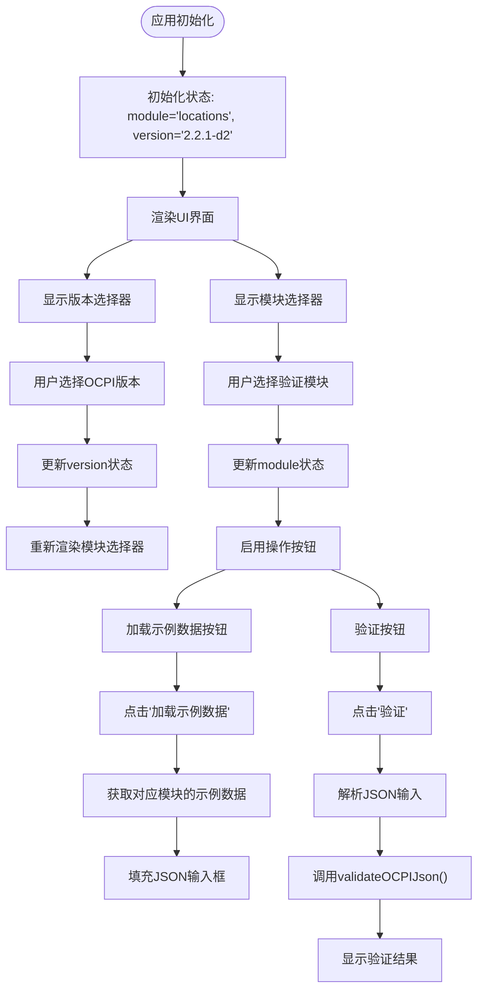
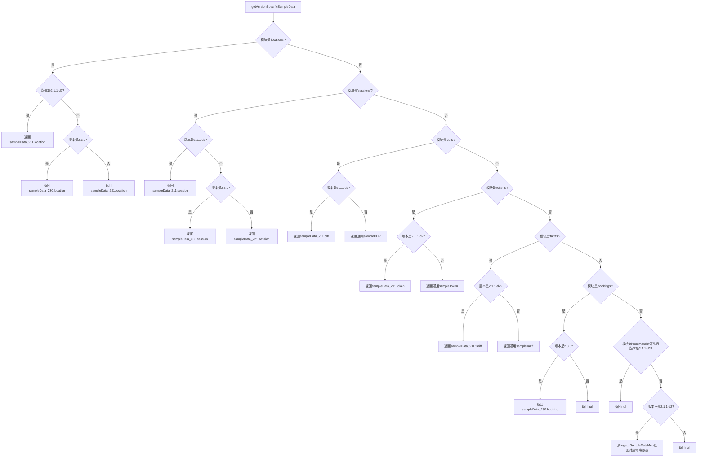
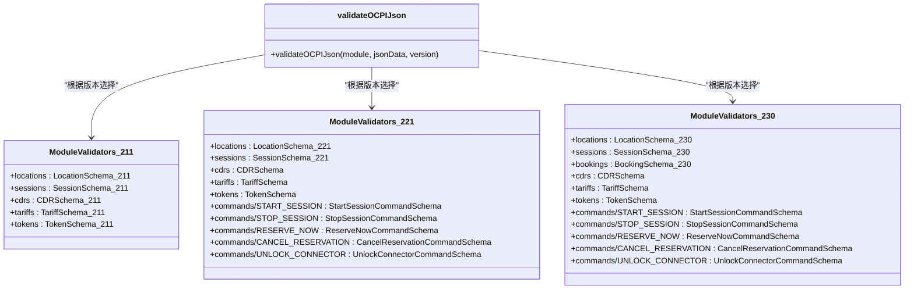
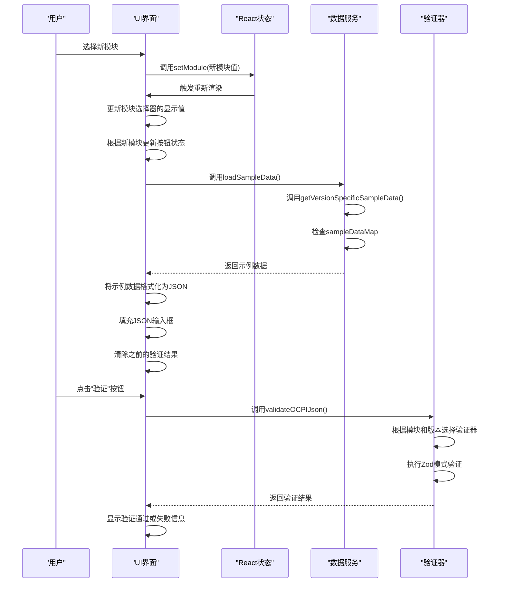

# 模块选择功能

<cite>
**本文档中引用的文件**
- [App.js](file://src/App.js)
- [ocpi-validators.js](file://src/ocpi-validators.js)
- [sample-data.js](file://src/sample-data.js)
</cite>

## 目录
1. [模块下拉菜单设计与行为逻辑概述](#模块下拉菜单设计与行为逻辑概述)
2. [模块选项的动态更新机制](#模块选项的动态更新机制)
3. [模块值命名约定与验证函数对接](#模块值命名约定与验证函数对接)
4. [模块状态变化触发的UI响应流程](#模块状态变化触发的ui响应流程)
5. [模块选择在验证流程中的核心地位](#模块选择在验证流程中的核心地位)

## 模块下拉菜单设计与行为逻辑概述

模块下拉菜单是OCPI JSON验证工具的核心交互组件，它允许用户选择要验证的特定模块。该功能通过`App.js`中的`Select`组件实现，结合React的状态管理机制，实现了动态、响应式的用户体验。

下拉菜单的设计基于两个关键状态变量：`module`和`version`。`module`状态存储当前选中的模块值（如'locations'、'sessions'等），而`version`状态跟踪用户选择的OCPI版本。这两个状态共同决定了下拉菜单中可用的选项以及后续的验证行为。



**Diagram sources**
- [App.js](file://src/App.js#L36-L315)

**Section sources**
- [App.js](file://src/App.js#L36-L315)

## 模块选项的动态更新机制

模块选项的动态更新是本系统的关键特性之一，它确保了用户只能选择与其所选OCPI版本兼容的模块。这种动态行为通过条件渲染和版本检查逻辑实现，保证了验证过程的准确性和有效性。

### 版本依赖的模块可见性规则

系统根据当前选择的OCPI版本动态调整模块选项的可见性：

- **Commands模块**: 仅在OCPI 2.2.1-d2及以上版本中显示。当用户选择2.1.1-d2版本时，所有以`commands/`为前缀的命令模块将被隐藏。
- **Bookings模块**: 仅在OCPI 2.3.0版本中可见。这是2.3.0版本引入的新功能，在早期版本中不可用。

这些规则在`App.js`的JSX代码中通过条件表达式直接实现：

```jsx
{version !== '2.1.1-d2' && (
  <>
    <MenuItem value="commands/START_SESSION">Commands - START_SESSION</MenuItem>
    <MenuItem value="commands/STOP_SESSION">Commands - STOP_SESSION</MenuItem>
    <MenuItem value="commands/RESERVE_NOW">Commands - RESERVE_NOW</MenuItem>
    <MenuItem value="commands/CANCEL_RESERVATION">Commands - CANCEL_RESERVATION</MenuItem>
    <MenuItem value="commands/UNLOCK_CONNECTOR">Commands - UNLOCK_CONNECTOR</MenuItem>
  </>
)}
{version === '2.3.0' && (
  <MenuItem value="bookings">Bookings (2.3.0)</MenuItem>
)}
```

### 版本特定的数据映射逻辑

除了控制模块选项的可见性，系统还实现了复杂的版本特定数据映射逻辑。`getVersionSpecificSampleData`函数负责根据模块和版本组合返回正确的示例数据：



**Diagram sources**
- [App.js](file://src/App.js#L43-L95)

**Section sources**
- [App.js](file://src/App.js#L43-L95)
- [sample-data.js](file://src/sample-data.js#L1-L722)

## 模块值命名约定与验证函数对接

系统的模块值命名遵循清晰的约定，并与后端验证函数精确对接，确保了验证过程的可靠性和可维护性。

### 模块值命名约定

系统采用分层的命名约定来组织不同类型的模块：

- **基础模块**: 使用简单的英文小写名称，如`locations`、`sessions`、`cdrs`等。这些代表OCPI标准中的核心实体。
- **命令模块**: 使用`commands/`作为前缀，后跟大写的命令名称，如`commands/START_SESSION`、`commands/STOP_SESSION`等。这种命名方式清晰地表明了这些模块属于命令类别，并且使用了OCPI规范中定义的标准命令名称。

这种命名约定不仅提高了代码的可读性，还便于在代码中进行模式匹配和字符串操作，例如使用`module.startsWith('commands/')`来识别命令模块。

### 验证函数对接机制

模块值与验证函数的对接通过一组模块验证器映射对象实现。这些映射对象在`ocpi-validators.js`中定义，为每个OCPI版本维护了一个从模块名称到相应Zod验证模式的映射。



**Diagram sources**
- [ocpi-validators.js](file://src/ocpi-validators.js#L928-L961)

**Section sources**
- [ocpi-validators.js](file://src/ocpi-validators.js#L928-L961)
- [ocpi-validators.js](file://src/ocpi-validators.js#L968-L1004)

## 模块状态变化触发的UI响应流程

当用户选择不同的模块时，系统会触发一系列UI响应，确保用户界面始终反映当前的验证上下文。这一流程涉及多个状态更新和组件重渲染。

### 状态变化处理流程

模块选择的变化通过`onChange`事件处理器捕获，并调用`setModule`函数更新React状态。这个状态更新会触发组件的重新渲染，从而更新整个UI。



**Diagram sources**
- [App.js](file://src/App.js#L112-L134)

**Section sources**
- [App.js](file://src/App.js#L112-L134)

## 模块选择在验证流程中的核心地位

模块选择在整个验证流程中扮演着核心角色，它是连接用户输入与后端验证逻辑的桥梁。正确的模块选择确保了验证过程的准确性，避免了因版本不兼容导致的误报。

### 验证流程中的决策点

模块选择直接影响验证流程中的多个关键决策点：

1. **验证器选择**: `validateOCPIJson`函数根据模块和版本参数从相应的模块验证器映射中选择正确的Zod模式。
2. **错误消息生成**: 当模块不支持时，系统会返回明确的错误消息，如"`Bookings`模块仅在OCPI 2.3.0版本中可用"。
3. **示例数据提供**: 系统根据模块选择提供相应的示例数据，帮助用户理解正确的数据结构。

### 完整的验证决策逻辑

```mermaid
flowchart TD
A[开始验证] --> B{版本是2.3.0?}
B --> |是| C{模块是'bookings'?}
C --> |是| D[使用BookingSchema_230]
C --> |否| E[使用ModuleValidators_230[module]]
B --> |否| F{版本是2.1.1-d2?}
F --> |是| G{模块是否为不支持的模块?}
G --> |是| H[返回错误: 模块在2.1.1-d2中不可用]
G --> |否| I[使用ModuleValidators_211[module]]
F --> |否| J{模块是'bookings'?}
J --> |是| K[返回错误: Bookings仅在2.3.0中可用]
J --> |否| L[使用ModuleValidators_221[module]]
D --> M[执行验证]
E --> M
I --> M
L --> M
M --> N{验证成功?}
N --> |是| O[返回有效结果]
N --> |否| P[提取并格式化错误信息]
P --> Q[返回包含错误的验证结果]
```

**Diagram sources**
- [ocpi-validators.js](file://src/ocpi-validators.js#L968-L1004)

**Section sources**
- [ocpi-validators.js](file://src/ocpi-validators.js#L968-L1004)