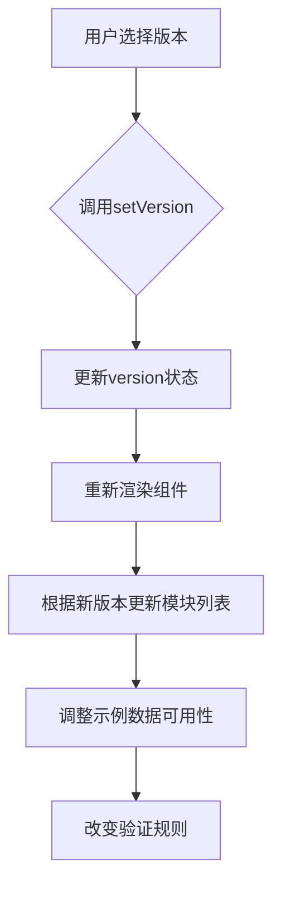
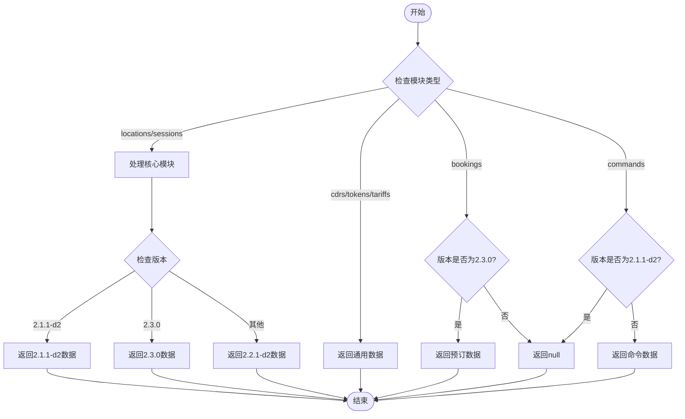
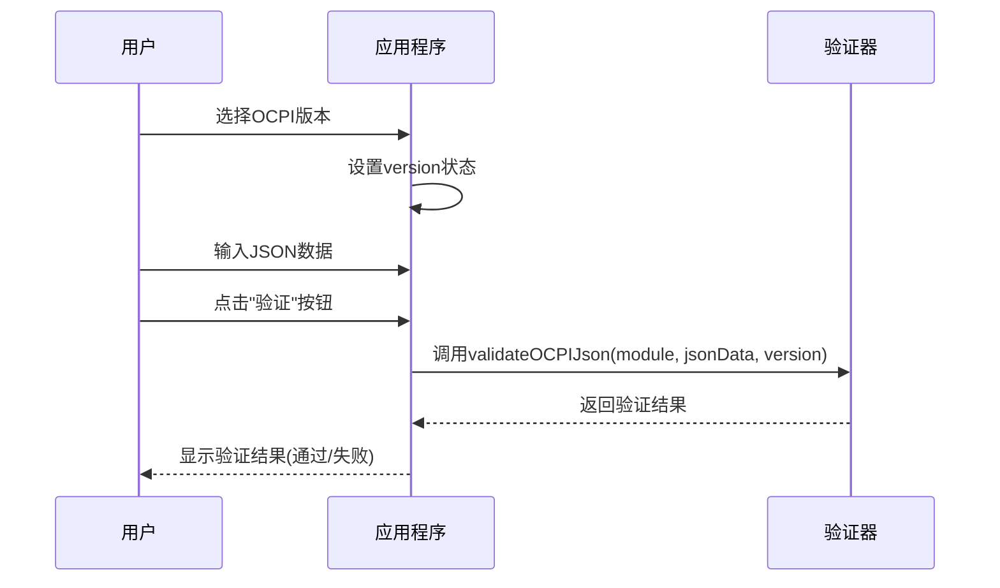

# 版本选择功能

<cite>
**本文档引用的文件**
- [App.js](file://src\App.js)
- [sample-data.js](file://src\sample-data.js)
- [ocpi-validators.js](file://src\ocpi-validators.js)
</cite>

## 目录
1. [简介](#简介)
2. [版本选择器实现机制](#版本选择器实现机制)
3. [模块可用性控制逻辑](#模块可用性控制逻辑)
4. [示例数据加载流程](#示例数据加载流程)
5. [用户交互与UI响应](#用户交互与ui响应)
6. [验证流程中的作用](#验证流程中的作用)

## 简介
OCPI（开放充电点接口）版本选择器是测试工具的核心功能之一，允许用户在不同OCPI规范版本之间切换。该功能通过下拉菜单提供三个版本选项：`OCPI 2.1.1-d2`、`OCPI 2.2.1-d2`和`OCPI 2.3.0`。版本选择直接影响后续操作，包括可用模块列表、示例数据内容以及验证规则的应用。此文档详细说明了版本选择功能的技术实现和使用方法。

## 版本选择器实现机制

版本选择功能基于React的状态管理机制实现，核心是`setVersion`状态更新函数。当用户从下拉菜单中选择不同版本时，会触发状态变更，进而影响整个应用的行为。



**Diagram sources**
- [App.js](file://src\App.js#L1-L318)

**Section sources**
- [App.js](file://src\App.js#L1-L318)

## 模块可用性控制逻辑

版本选择直接影响支持的模块集合。系统通过条件渲染机制动态调整模块下拉菜单的内容，确保用户只能访问当前版本支持的功能。

### 模块限制规则

| 模块 | OCPI 2.1.1-d2 | OCPI 2.2.1-d2 | OCPI 2.3.0 |
|------|---------------|---------------|------------|
| Locations | 支持 | 支持 | 支持 |
| Sessions | 支持 | 支持 | 支持 |
| CDRs | 支持 | 支持 | 支持 |
| Tariffs | 支持 | 支持 | 支持 |
| Tokens | 支持 | 支持 | 支持 |
| Commands | 不支持 | 支持 | 支持 |
| Bookings | 不支持 | 不支持 | 支持 |

### 实现代码分析

系统通过以下逻辑判断模块是否可用：
- **Commands模块**：仅当版本不是`2.1.1-d2`时才显示
- **Bookings模块**：仅当版本为`2.3.0`时才显示

```jsx
{version !== '2.1.1-d2' && (
  <MenuItem value="commands/START_SESSION">Commands - START_SESSION</MenuItem>
)}
{version === '2.3.0' && (
  <MenuItem value="bookings">Bookings (2.3.0)</MenuItem>
)}
```

**Section sources**
- [App.js](file://src\App.js#L1-L318)

## 示例数据加载流程

版本选择直接影响示例数据的加载逻辑。系统通过`getVersionSpecificSampleData`函数确定特定版本和模块的示例数据源。

### 数据映射逻辑



**Diagram sources**
- [App.js](file://src\App.js#L43-L95)

**Section sources**
- [App.js](file://src\App.js#L43-L95)
- [sample-data.js](file://src\sample-data.js#L1-L723)

## 用户交互与UI响应

当用户切换版本时，界面会立即响应，提供直观的反馈。

### 交互示例

1. **初始状态**：默认选择`OCPI 2.2.1-d2`
   - 模块下拉菜单包含Locations, Sessions, CDRs, Tariffs, Tokens, Commands
   - 不包含Bookings模块

2. **切换到2.3.0**：
   - 模块下拉菜单新增"Bookings (2.3.0)"选项
   - "加载示例数据"按钮文本更新为"(2.3.0)"
   - UI指示器显示2.3.0版本特定的数据可用性

3. **切换到2.1.1-d2**：
   - "Commands"相关选项从模块列表中消失
   - "Bookings"选项不可见
   - 只能访问基础模块的示例数据

### UI状态指示器

系统在界面中提供了版本和数据可用性的视觉指示：
- **填充样式芯片**：表示有版本特定的示例数据
- **轮廓样式芯片**：表示使用通用示例数据
- **绿色高亮**：表示当前选中的模块

**Section sources**
- [App.js](file://src\App.js#L1-L318)

## 验证流程中的作用

版本选择在验证流程中起着关键作用，它决定了使用哪个验证规则集来校验输入的JSON数据。

### 验证流程集成



**Diagram sources**
- [App.js](file://src\App.js#L1-L318)
- [ocpi-validators.js](file://src\ocpi-validators.js#L1-L1006)

**Section sources**
- [App.js](file://src\App.js#L1-L318)
- [ocpi-validators.js](file://src\ocpi-validators.js#L1-L1006)