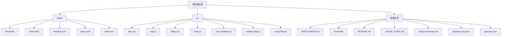
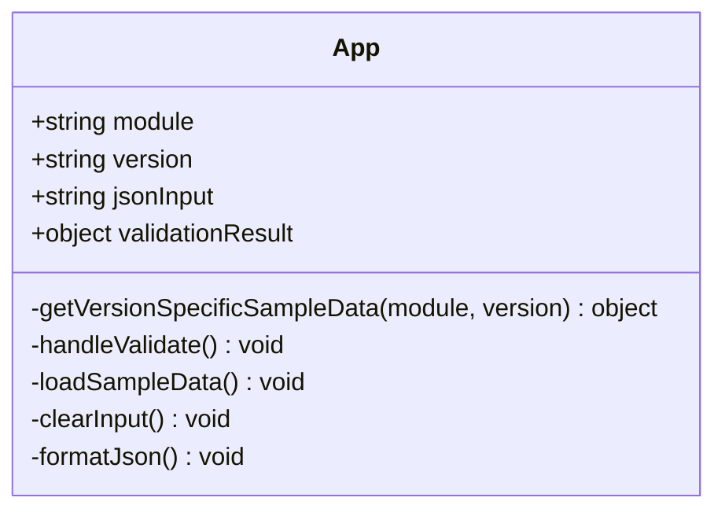
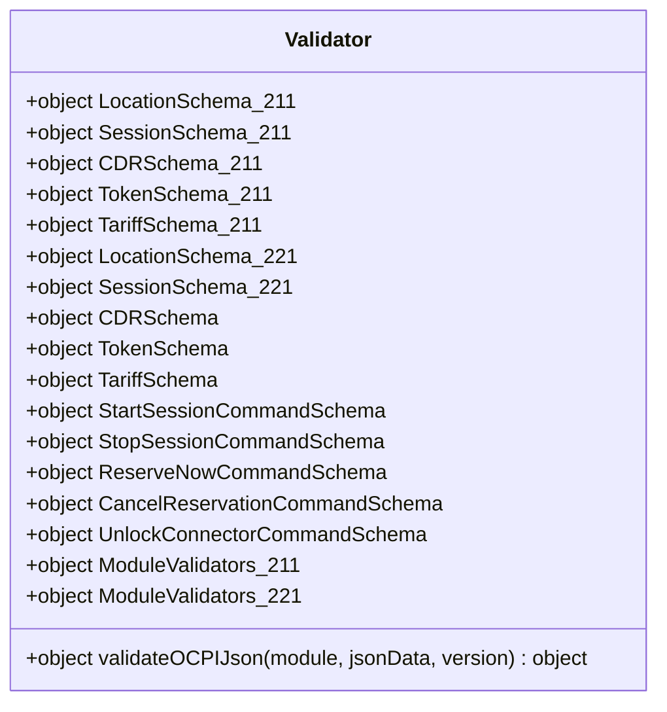
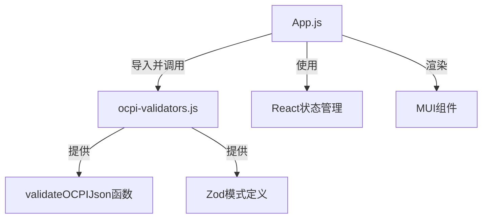
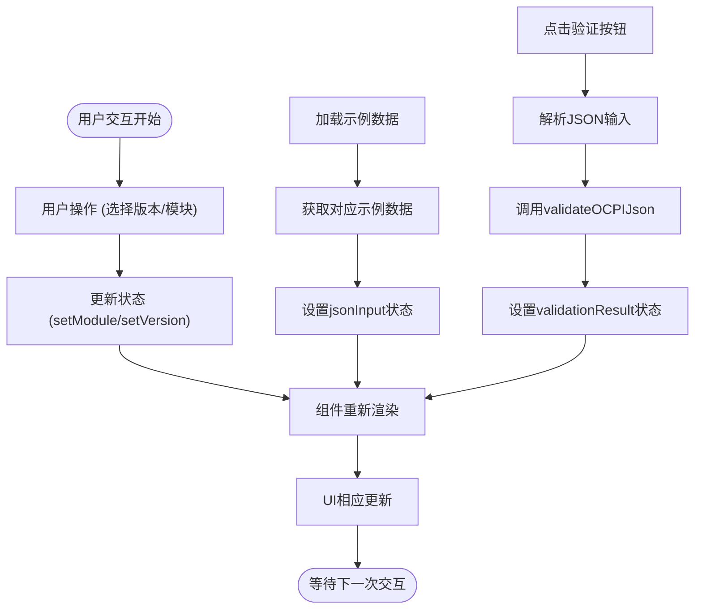
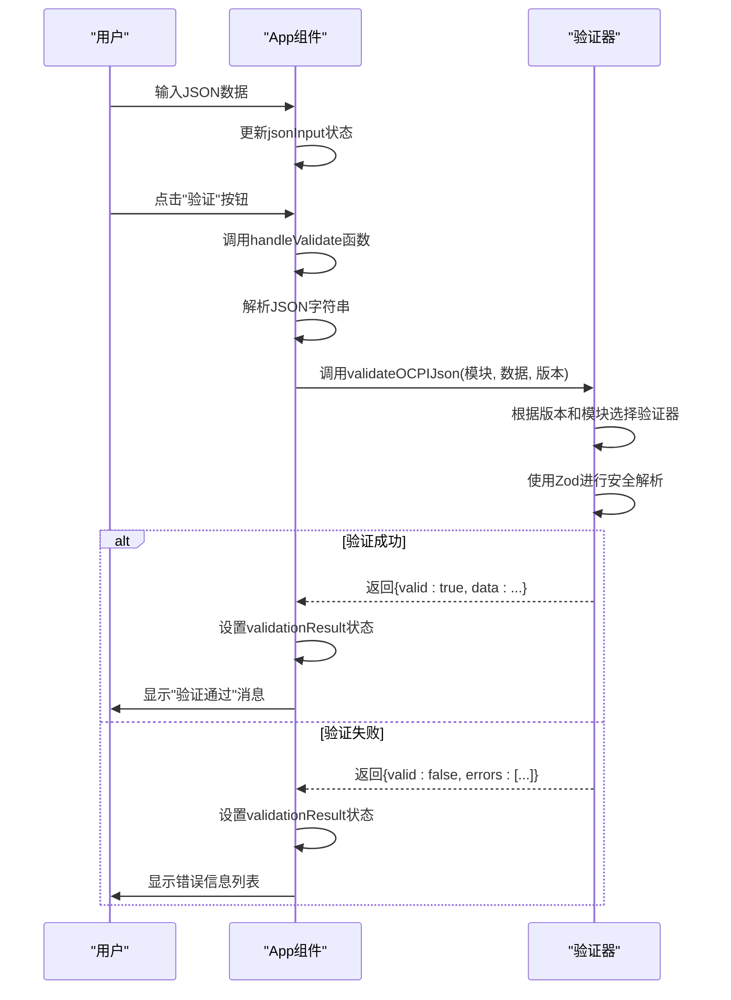
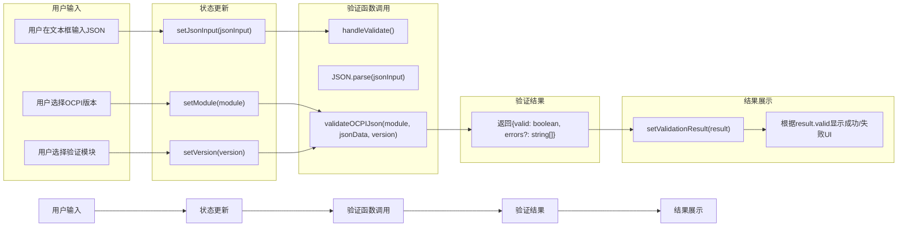
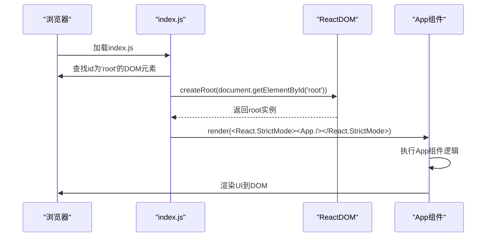

# 代码结构概述

<cite>
**Referenced Files in This Document**  
- [App.js](file://src/App.js)
- [ocpi-validators.js](file://src/ocpi-validators.js)
- [index.js](file://src/index.js)
</cite>

## 目录
1. [项目结构](#项目结构)
2. [核心组件分析](#核心组件分析)
3. [模块间依赖关系](#模块间依赖关系)
4. [状态管理与UI更新机制](#状态管理与ui更新机制)
5. [数据验证流程](#数据验证流程)
6. [文件职责划分](#文件职责划分)
7. [模块间数据流图示](#模块间数据流图示)
8. [入口文件与组件挂载](#入口文件与组件挂载)

## 项目结构

项目采用标准的React应用结构，主要分为`public`和`src`两个目录。`public`目录包含静态资源文件，如HTML模板、manifest配置等；`src`目录则存放所有源代码文件。

**Diagram sources**
- [App.js](file://src/App.js)
- [ocpi-validators.js](file://src/ocpi-validators.js)
- [index.js](file://src/index.js)

**Section sources**
- [App.js](file://src/App.js)
- [ocpi-validators.js](file://src/ocpi-validators.js)
- [index.js](file://src/index.js)

## 核心组件分析

### App组件分析

App组件是整个应用的核心UI组件，负责渲染用户界面并处理用户交互。它使用React Hooks进行状态管理，通过多个useState Hook维护应用的不同状态。

**Diagram sources**
- [App.js](file://src/App.js#L36-L315)

**Section sources**
- [App.js](file://src/App.js#L36-L315)

### 验证器组件分析

ocpi-validators.js文件包含了所有OCPI JSON数据的验证逻辑，使用Zod库定义了针对不同OCPI版本和模块的验证模式。

**Diagram sources**
- [ocpi-validators.js](file://src/ocpi-validators.js#L968-L1004)

**Section sources**
- [ocpi-validators.js](file://src/ocpi-validators.js#L968-L1004)

## 模块间依赖关系

App.js与ocpi-validators.js之间存在明确的依赖关系。App.js作为上层组件，依赖于ocpi-validators.js提供的验证功能。

**Diagram sources**
- [App.js](file://src/App.js)
- [ocpi-validators.js](file://src/ocpi-validators.js)

**Section sources**
- [App.js](file://src/App.js)
- [ocpi-validators.js](file://src/ocpi-validators.js)

## 状态管理与UI更新机制

React组件通过useState Hook实现状态管理，当状态发生变化时，组件会自动重新渲染，从而驱动UI更新。

### 状态管理流程

**Diagram sources**
- [App.js](file://src/App.js#L36-L315)

**Section sources**
- [App.js](file://src/App.js#L36-L315)

## 数据验证流程

数据验证流程从用户输入JSON数据开始，经过解析、验证到结果显示的完整过程。

**Diagram sources**
- [App.js](file://src/App.js#L36-L315)
- [ocpi-validators.js](file://src/ocpi-validators.js#L968-L1004)

**Section sources**
- [App.js](file://src/App.js#L36-L315)
- [ocpi-validators.js](file://src/ocpi-validators.js#L968-L1004)

## 文件职责划分

各文件在项目中承担不同的职责，实现了关注点分离的设计原则。

### App.js职责

App.js文件主要负责UI渲染和用户交互处理：

- **UI渲染**: 使用MUI组件库构建用户界面
- **状态管理**: 通过useState Hook管理应用状态
- **用户交互**: 处理用户的选择、输入和按钮点击等操作
- **数据流控制**: 协调用户输入、验证结果和UI展示之间的关系

### ocpi-validators.js职责

ocpi-validators.js文件专注于数据验证逻辑的封装：

- **模式定义**: 为不同OCPI版本和模块定义Zod验证模式
- **验证逻辑**: 实现validateOCPIJson函数，执行具体的验证操作
- **版本兼容**: 支持OCPI 2.1.1-d2、2.2.1-d2和2.3.0三个版本
- **模块化设计**: 将不同模块的验证器组织在ModuleValidators对象中

**Section sources**
- [App.js](file://src/App.js)
- [ocpi-validators.js](file://src/ocpi-validators.js)

## 模块间数据流图示

以下图示展示了从用户输入到结果展示的完整数据流过程。

**Diagram sources**
- [App.js](file://src/App.js#L36-L315)
- [ocpi-validators.js](file://src/ocpi-validators.js#L968-L1004)

**Section sources**
- [App.js](file://src/App.js#L36-L315)
- [ocpi-validators.js](file://src/ocpi-validators.js#L968-L1004)

## 入口文件与组件挂载

index.js作为应用的入口文件，负责将React组件挂载到DOM中。

### 组件挂载机制

**Diagram sources**
- [index.js](file://src/index.js)

**Section sources**
- [index.js](file://src/index.js)