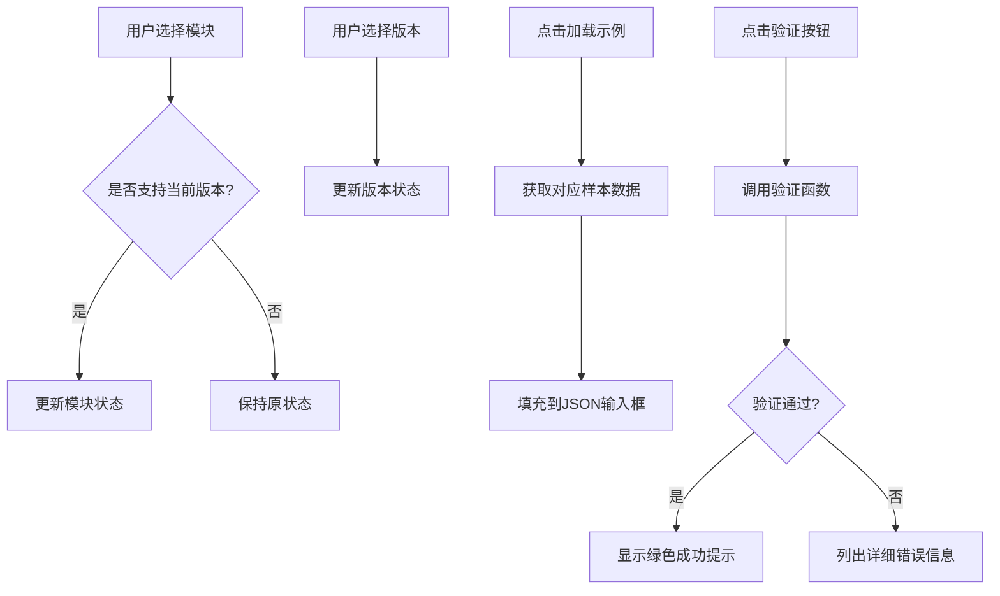
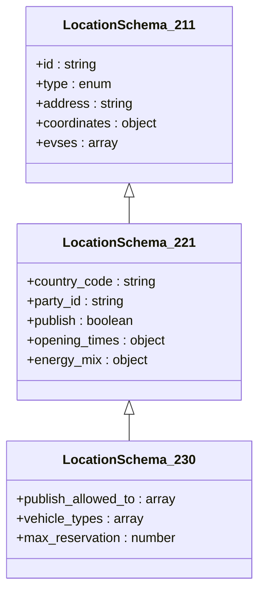

# 开发者指南

<cite>
**本文档中引用的文件**  
- [App.js](file://src/App.js)
- [ocpi-validators.js](file://src/ocpi-validators.js)
- [sample-data.js](file://src/sample-data.js)
</cite>

## 目录
1. [项目结构](#项目结构)  
2. [状态管理与UI逻辑解析](#状态管理与ui逻辑解析)  
3. [Zod验证模式组织结构](#zod验证模式组织结构)  
4. [添加新的OCPI版本支持](#添加新的ocpi版本支持)  
5. [扩展新的验证模块](#扩展新的验证模块)  
6. [代码贡献最佳实践](#代码贡献最佳实践)

## 项目结构

本项目为基于React的应用程序，主要包含以下核心文件：

```
src/
├── App.js                    # 主应用组件，负责UI渲染和状态管理
├── ocpi-validators.js        # OCPI数据验证逻辑，使用Zod定义验证模式
├── sample-data.js            # 各OCPI版本的示例数据
```

该工具旨在为开发者提供一个交互式界面来验证符合OCPI规范的JSON数据。支持多个OCPI版本（2.1.1-d2、2.2.1-d2、2.3.0）以及不同模块（Locations、Sessions、CDRs等）。

**Section sources**
- [App.js](file://src/App.js#L1-L317)
- [ocpi-validators.js](file://src/ocpi-validators.js#L1-L1006)
- [sample-data.js](file://src/sample-data.js#L1-L723)

## 状态管理与UI逻辑解析

`App.js` 文件实现了完整的前端状态管理和用户交互逻辑。通过 React 的 `useState` Hook 管理四个核心状态变量：当前选择的模块 (`module`)、OCPI版本 (`version`)、输入的JSON数据 (`jsonInput`) 和验证结果 (`validationResult`)。

UI组件采用 Material UI 构建，提供了下拉选择器用于切换模块和版本，并根据所选版本动态调整可用选项。例如，在选择 "2.1.1-d2" 版本时，命令类模块将被禁用；而当选择 "2.3.0" 时，Booking 模块才可访问。

关键功能包括：
- **加载示例数据**：调用 `loadSampleData()` 函数自动填充对应版本和模块的有效测试数据。
- **格式化JSON**：使用内置 JSON.stringify 方法美化输入内容。
- **清空输入**：重置所有字段以便重新开始验证。
- **执行验证**：触发 `validateOCPIJson` 函数进行实际校验并展示结果。

整个流程体现了清晰的数据流设计：用户操作 → 状态更新 → 视图响应 → 结果反馈。



**Diagram sources**
- [App.js](file://src/App.js#L1-L317)

**Section sources**
- [App.js](file://src/App.js#L1-L317)

## Zod验证模式组织结构

`ocpi-validators.js` 是本项目的验证核心，利用 Zod 库构建了类型安全的JSON模式。其组织方式遵循“按版本分组”的原则，每个OCPI版本拥有独立的 Schema 定义。

### 公共基础模式
文件开头定义了一些跨模块复用的基础类型：
- `CountryCodeSchema`: 国家代码（2位字符）
- `PartyIdSchema`: 参与方ID（最多3位）
- `DateTimeSchema`: ISO日期时间格式
- `CurrencyCodeSchema`: 货币代码（3位）

这些基础类型通过组合形成更复杂的嵌套结构。

### 版本特定模式
针对不同OCPI版本分别创建了专用 Schema：
- **Location模块**：`LocationSchema_211`, `LocationSchema_221`, `LocationSchema_230`
- **Session模块**：`SessionSchema_211`, `SessionSchema_221`, `SessionSchema_230`
- **其他模块**：如 `CDRSchema_211`, `TokenSchema_211` 等

每个 Schema 都精确映射了对应版本的字段要求，包括最大长度限制、枚举值约束及正则表达式匹配规则。例如，`LocationSchema_230` 新增了 `vehicle_types` 字段以支持重型车辆充电站。

### 验证器注册表
通过三个对象集中管理各版本的验证器引用：
- `ModuleValidators_211`: 映射2.1.1-d2版本的所有模块
- `ModuleValidators_221`: 包含2.2.1-d2新增的Commands模块
- `ModuleValidators_230`: 扩展至Booking模块及其他增强特性

这种设计便于后续扩展新版本或模块。



**Diagram sources**
- [ocpi-validators.js](file://src/ocpi-validators.js#L43-L553)

**Section sources**
- [ocpi-validators.js](file://src/ocpi-validators.js#L1-L1006)

## 添加新的OCPI版本支持

要为本工具添加新的OCPI版本支持（如未来的2.4.0），需完成以下步骤：

### 1. 创建新模式定义
在 `ocpi-validators.js` 中新增一组 Schema 变量，命名遵循 `{模块名}Schema_{主版本号}{次版本号}` 规范。建议从现有最接近的版本复制并修改。

例如，若新增2.4.0版本，则应创建：
- `LocationSchema_240`
- `SessionSchema_240`
- `CDRSchema_240`

确保准确反映新版本的字段变更，如新增必填项、放宽长度限制或引入新枚举值。

### 2. 集成到主验证函数
编辑 `validateOCPIJson` 函数，在版本判断逻辑中加入对新版本的支持：

```javascript
if (version === '2.4.0') {
    validator = ModuleValidators_240[module];
}
```

同时需要定义一个新的验证器映射对象 `ModuleValidators_240`，将各模块与其对应的 Schema 关联起来。

### 3. 更新UI选项列表
打开 `App.js`，修改 `<Select>` 组件中的 MenuItem 列表，添加新版本选项：

```jsx
<MenuItem value="2.4.0">OCPI 2.4.0</MenuItem>
```

此外还需调整 `getVersionSpecificSampleData` 函数，使其能正确返回该版本的示例数据。

### 4. 提供示例数据
在 `sample-data.js` 中添加 `sampleData_240` 对象，包含所有受支持模块的有效实例。这有助于用户快速上手测试。

完成上述步骤后，重启应用即可看到新版本出现在下拉菜单中，并可正常进行验证。

**Section sources**
- [ocpi-validators.js](file://src/ocpi-validators.js#L968-L1004)
- [App.js](file://src/App.js#L1-L317)
- [sample-data.js](file://src/sample-data.js#L1-L723)

## 扩展新的验证模块

除了增加版本支持外，还可以向系统中引入全新的验证模块。以下是具体实现方法：

### 1. 定义新模式
在 `ocpi-validators.js` 中编写新的 Zod Schema。假设我们要添加 "Payments" 模块：

```javascript
export const PaymentSchema_230 = z.object({
    transaction_id: z.string().max(64),
    amount: z.number().positive(),
    currency: CurrencyCodeSchema,
    payment_method: z.enum(['CREDIT_CARD', 'BANK_TRANSFER', 'WALLET']),
    status: z.enum(['PENDING', 'COMPLETED', 'FAILED'])
});
```

### 2. 注册验证器
将新模式添加到相应版本的验证器映射中：

```javascript
export const ModuleValidators_230 = {
    // ...原有模块
    payments: PaymentSchema_230
};
```

### 3. 更新UI界面
在 `App.js` 的模块选择器中加入新条目：

```jsx
<MenuItem value="payments">Payments</MenuItem>
```

同时更新 `sampleDataMap` 和 `getVersionSpecificSampleData` 函数以包含支付相关的示例数据。

### 4. 处理兼容性问题
注意某些模块可能仅适用于特定版本。可在 `validateOCPIJson` 中添加前置检查：

```javascript
if (module === 'payments' && version !== '2.4.0') {
    return { valid: false, errors: ['Payments模块仅在OCPI 2.4.0及以上版本可用'] };
}
```

这样就能安全地扩展系统功能而不影响现有行为。

**Section sources**
- [ocpi-validators.js](file://src/ocpi-validators.js#L949-L961)
- [App.js](file://src/App.js#L1-L317)

## 代码贡献最佳实践

为了保证代码质量和团队协作效率，请遵循以下最佳实践：

### 测试覆盖要求
- **单元测试**：为每个新增 Schema 编写至少两个测试用例——一个有效数据，一个无效数据。
- **集成测试**：验证 `validateOCPIJson` 在各种输入组合下的输出是否符合预期。
- **覆盖率目标**：整体测试覆盖率不得低于90%，可通过 `npm test -- --coverage` 查看报告。

### 样式一致性
- **命名规范**：变量名使用驼峰式（camelCase），常量全大写加下划线（UPPER_CASE）。
- **缩进统一**：采用2个空格缩进，禁止使用Tab。
- **导入顺序**：先外部库，再内部模块，最后本地文件，每组之间留空行。

### 文档注释
- 所有公共函数必须添加JSDoc注释，说明参数类型和返回值含义。
- 复杂逻辑处添加内联注释解释设计意图。
- 修改已有代码时同步更新相关文档。

### 提交规范
- 使用语义化提交消息（Semantic Commit Messages），格式为 `<type>: <description>`。
- 常见类型包括：`feat`（新功能）、`fix`（修复bug）、`refactor`（重构）、`docs`（文档更新）。

通过遵守这些准则，可以确保代码库长期可维护性和稳定性。

**Section sources**
- [ocpi-validators.js](file://src/ocpi-validators.js#L968-L1004)
- [App.js](file://src/App.js#L1-L317)