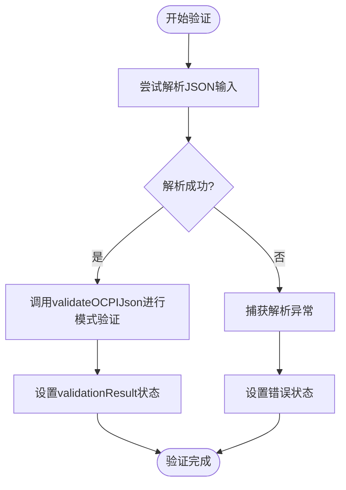
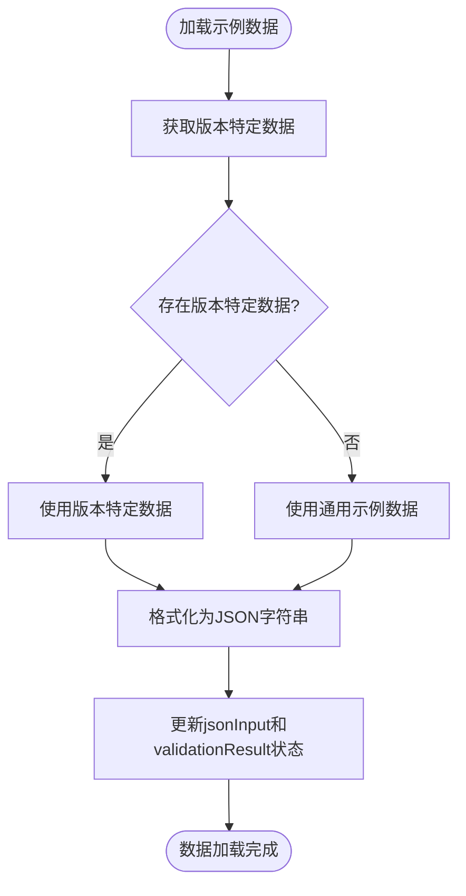
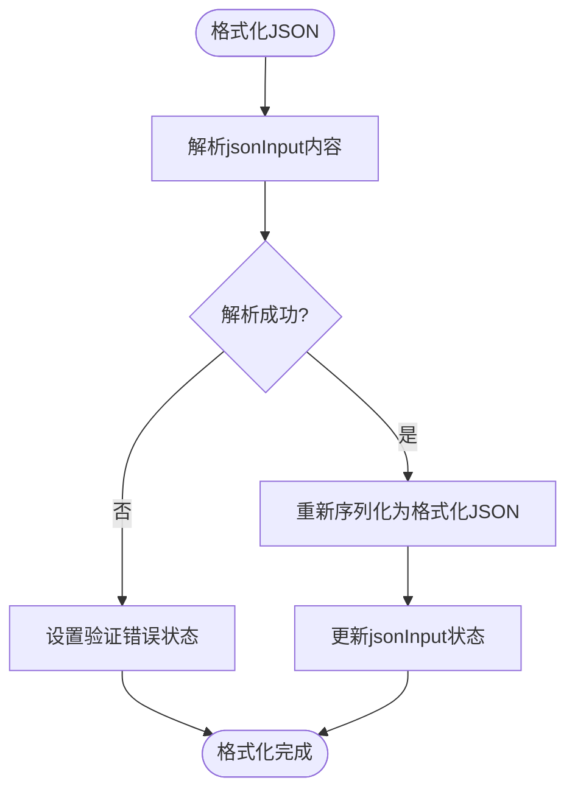
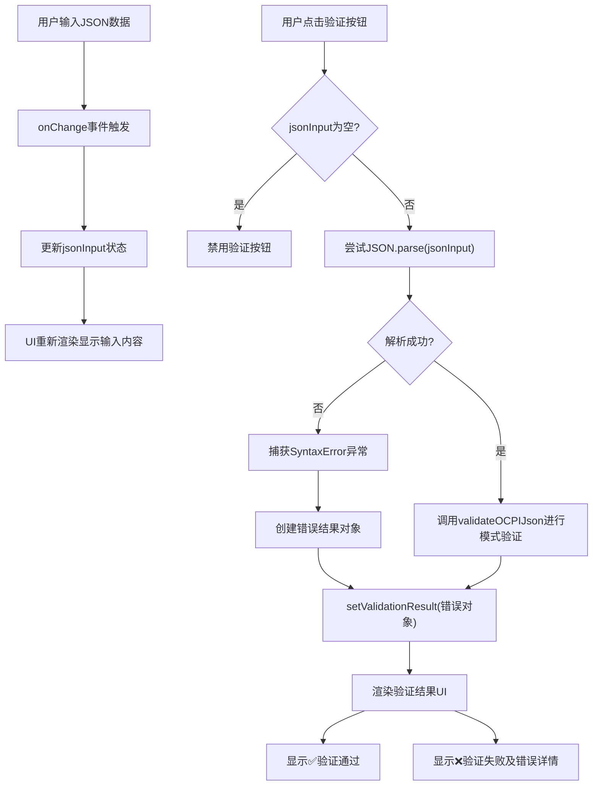
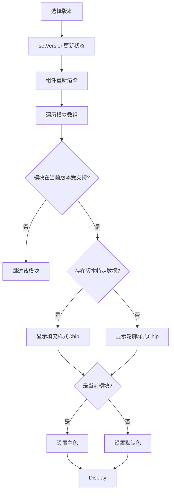
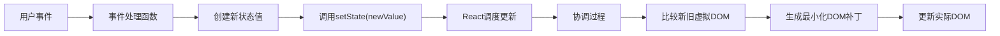

# 状态管理机制

<cite>
**Referenced Files in This Document**   
- [App.js](file://src/App.js)
- [ocpi-validators.js](file://src/ocpi-validators.js)
- [sample-data.js](file://src/sample-data.js)
</cite>

## Table of Contents
1. [状态变量详解](#状态变量详解)
2. [事件处理函数分析](#事件处理函数分析)
3. [JSON解析错误处理流程](#json解析错误处理流程)
4. [条件渲染逻辑](#条件渲染逻辑)
5. [不可变性原则应用](#不可变性原则应用)
6. [常见状态管理陷阱及规避建议](#常见状态管理陷阱及规避建议)

## 状态变量详解

在`App.js`文件中，通过React的`useState` Hook实现了四个核心状态变量：`module`、`version`、`jsonInput`和`validationResult`。这些状态变量构成了应用程序的核心数据流，并直接影响用户界面的呈现。

### module状态变量

`module`状态用于跟踪当前选中的OCPI模块（如Locations、Sessions、CDRs等）。其初始值设置为'locations'，并通过下拉选择器进行更新。该状态直接影响示例数据的加载和验证逻辑。

```javascript
const [module, setModule] = useState('locations');
```

当用户从下拉菜单中选择不同的模块时，`setModule`函数被调用，触发组件重新渲染，从而更新UI以反映当前选择的模块。

**Section sources**
- [App.js](file://src/App.js#L37)

### version状态变量

`version`状态用于管理当前选择的OCPI版本（2.1.1-d2、2.2.1-d2或2.3.0）。不同版本具有不同的数据结构和功能支持，因此该状态对整个应用程序的行为有重要影响。

```javascript
const [version, setVersion] = useState('2.2.1-d2');
```

版本选择的变化会触发UI的相应调整，包括可用模块的显示控制和示例数据的选择。

**Section sources**
- [App.js](file://src/App.js#L38)

### jsonInput状态变量

`jsonInput`状态存储用户输入或加载的JSON数据字符串。它是用户与应用程序交互的主要媒介，所有验证操作都基于此状态的值。

```javascript
const [jsonInput, setJsonInput] = useState('');
```

该状态通过文本输入框进行双向绑定，用户的任何输入都会实时更新此状态，从而实现即时反馈。

**Section sources**
- [App.js](file://src/App.js#L39)

### validationResult状态变量

`validationResult`状态存储JSON验证的结果，包含验证是否成功以及相关的错误信息。它是一个对象类型的状态，初始值为null。

```javascript
const [validationResult, setValidationResult] = useState(null);
```

当执行验证操作时，此状态会被更新，触发UI显示相应的验证结果（成功或失败）。

**Section sources**
- [App.js](file://src/App.js#L40)

## 事件处理函数分析

### handleValidate函数

`handleValidate`函数负责执行JSON数据的验证操作。它尝试解析`jsonInput`状态中的JSON字符串，并使用`validateOCPIJson`函数进行语义验证。



该函数通过`try-catch`块处理JSON解析错误，并将结果存储在`validationResult`状态中，从而触发UI更新。

**Section sources**
- [App.js](file://src/App.js#L112-L120)

### loadSampleData函数

`loadSampleData`函数用于加载与当前模块和版本匹配的示例数据。它优先使用版本特定的数据，如果没有则回退到通用示例数据。



此函数体现了状态管理中的条件逻辑，根据当前应用状态选择合适的数据源。

**Section sources**
- [App.js](file://src/App.js#L125-L133)

### formatJson函数

`formatJson`函数用于格式化用户输入的JSON数据，使其具有良好的可读性。它同样使用`try-catch`来处理无效的JSON输入。



该函数展示了如何通过状态更新来实现UI的响应式变化。

**Section sources**
- [App.js](file://src/App.js#L141-L149)

## JSON解析错误处理流程

当用户输入无效的JSON数据时，系统通过以下流程进行错误处理：



关键代码路径：
- [handleValidate函数中的try-catch块](file://src/App.js#L112-L120)
- [formatJson函数中的错误处理](file://src/App.js#L141-L149)
- [验证结果的条件渲染](file://src/App.js#L281-L317)

**Diagram sources**
- [App.js](file://src/App.js#L112-L120)
- [App.js](file://src/App.js#L141-L149)
- [App.js](file://src/App.js#L281-L317)

## 条件渲染逻辑

应用程序根据版本选择动态控制Commands和Bookings模块的显示，体现了复杂的条件渲染逻辑。

### Commands模块显示控制

Commands模块仅在非2.1.1-d2版本中可用。这一逻辑通过JSX中的条件表达式实现：

```jsx
{version !== '2.1.1-d2' && (
  <>
    <MenuItem value="commands/START_SESSION">Commands - START_SESSION</MenuItem>
    <MenuItem value="commands/STOP_SESSION">Commands - STOP_SESSION</MenuItem>
    {/* 其他Commands选项 */}
  </>
)}
```

### Bookings模块显示控制

Bookings模块仅在2.3.0版本中可用：

```jsx
{version === '2.3.0' && (
  <MenuItem value="bookings">Bookings (2.3.0)</MenuItem>
)}
```

### 版本特定数据可用性指示器

应用程序还通过Chip组件可视化显示各模块在当前版本下的数据可用性：



这种精细化的条件渲染增强了用户体验，让用户清楚地了解当前配置下的功能可用性。

**Section sources**
- [App.js](file://src/App.js#L185-L221)
- [App.js](file://src/App.js#L219-L250)

## 不可变性原则应用

在React状态管理中，不可变性原则至关重要。本应用程序严格遵守这一原则，确保状态更新的可预测性和性能优化。

### 状态更新的不可变性

所有状态更新都通过专门的setter函数（`setModule`、`setVersion`等）进行，而不是直接修改状态变量。这些setter函数接收新值并返回新的状态引用，从而触发React的重新渲染机制。



### 不可变性优势

1. **可预测性**: 每次状态更新都产生一个全新的引用，避免了意外的副作用
2. **性能优化**: React可以高效地比较新旧状态引用，决定是否需要重新渲染
3. **调试友好**: 状态变化历史清晰可追踪，便于调试和测试

尽管本项目未使用Immutable.js或Immer等库，但通过遵循不可变性原则，仍然实现了可靠的状态管理。

**Section sources**
- [App.js](file://src/App.js#L37-L40)
- [App.js](file://src/App.js#L165-L175)

## 常见状态管理陷阱及规避建议

### 陷阱一：直接修改状态

**错误做法**:
```javascript
// ❌ 错误：直接修改状态
jsonInput.push('new data');
```

**正确做法**:
```javascript
// ✅ 正确：使用setter函数
setJsonInput([...jsonInput, 'new data']);
```

### 陷阱二：异步状态更新依赖

**问题**: React的`setState`可能是异步的，直接依赖更新后的状态可能导致bug。

**规避建议**:
```javascript
// ❌ 可能出错
setCount(count + 1);
console.log(count); // 可能不是预期值

// ✅ 使用函数式更新
setCount(prevCount => {
  console.log(prevCount + 1); // 安全访问
  return prevCount + 1;
});
```

### 陷阱三：过度使用状态

**建议**: 仅将需要跨渲染周期保持或影响UI的数据存储在状态中。计算属性应使用`useMemo`或普通函数。

### 陷阱四：状态粒度不当

**建议**: 根据数据的耦合程度合理划分状态。高度相关的数据可以合并为一个对象状态，而独立的数据应分开管理。

### 陷阱五：忽略清理函数

**建议**: 对于有副作用的状态更新（如定时器、订阅等），务必在组件卸载时进行清理。

```javascript
useEffect(() => {
  const timer = setInterval(() => {
    // 更新状态
  }, 1000);
  
  // 清理函数
  return () => clearInterval(timer);
}, []);
```

通过遵循这些最佳实践，可以构建更加健壮和可维护的状态管理系统。

**Section sources**
- [App.js](file://src/App.js)