# 验证逻辑实现

<cite>
**本文档中引用的文件**
- [ocpi-validators.js](file://src/ocpi-validators.js)
</cite>

## 目录
1. [简介](#简介)
2. [核心验证体系架构](#核心验证体系架构)
3. [动态Schema选择机制](#动态schema选择机制)
4. [Zod Schema设计模式分析](#zod-schema设计模式分析)
5. [类型安全检查与错误处理](#类型安全检查与错误处理)
6. [safeParse方法的优势与异常容忍设计](#safeparse方法的优势与异常容忍设计)
7. [自定义验证规则扩展实践](#自定义验证规则扩展实践)
8. [版本演进与模块兼容性](#版本演进与模块兼容性)

## 简介
本文档全面解析`ocpi-validators.js`中的Zod模式验证体系，深入剖析OCPI（开放充电点接口）协议的数据验证机制。该系统通过精心设计的Zod Schema实现了对不同OCPI版本和模块的结构化数据验证，确保了充电基础设施数据交换的准确性和可靠性。文档将详细说明验证函数如何根据模块和版本参数动态选择对应的Schema，并探讨Zod Schema的设计模式、类型安全检查机制以及错误信息提取逻辑。

**Section sources**
- [ocpi-validators.js](file://src/ocpi-validators.js#L1-L100)

## 核心验证体系架构
OCPI验证系统采用分层架构设计，以支持多版本协议和多种业务模块。系统核心由三个主要部分构成：基础Schema库、版本特定验证器集合和主验证函数。基础Schema库定义了跨模块复用的数据结构，如国家代码、时间戳等；版本特定验证器集合按OCPI版本组织，每个版本包含其支持的所有模块的验证Schema；主验证函数`validateOCPIJson`作为入口点，协调整个验证流程。

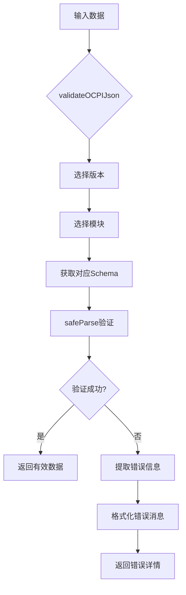

**Diagram sources**
- [ocpi-validators.js](file://src/ocpi-validators.js#L968-L1004)

**Section sources**
- [ocpi-validators.js](file://src/ocpi-validators.js#L1-L100)

## 动态Schema选择机制
### 版本与模块路由逻辑
`validateOCPIJson`函数通过`module`和`version`参数实现动态Schema选择，这是系统灵活性的关键。函数首先根据`version`参数确定使用哪个版本的验证器集合，然后在该集合中查找对应`module`的Schema。对于不支持的模块版本组合，函数会返回明确的错误信息，体现了良好的向后兼容性设计。

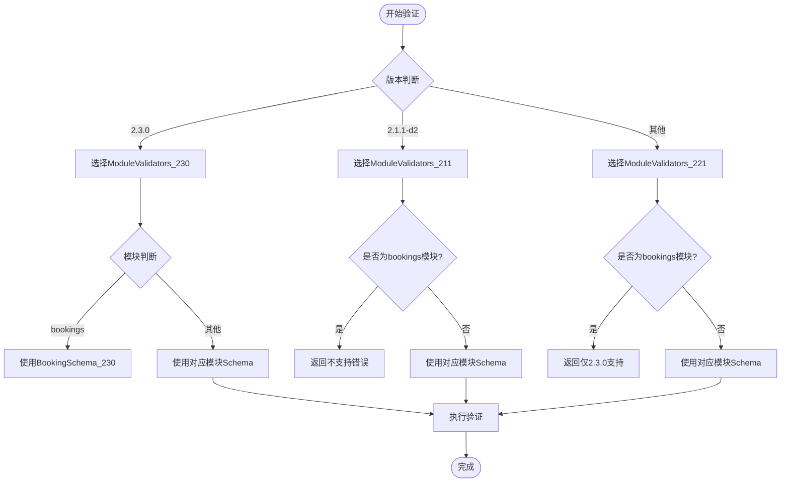

**Diagram sources**
- [ocpi-validators.js](file://src/ocpi-validators.js#L968-L1004)

### 版本特定验证器集合
系统定义了三个主要的验证器集合：`ModuleValidators_211`、`ModuleValidators_221`和`ModuleValidators_230`，分别对应OCPI 2.1.1-d2、2.2.1-d2和2.3.0版本。这些集合采用对象字面量形式，以模块名称为键，Schema为值，实现了清晰的映射关系。这种设计便于扩展和维护，新增版本时只需添加新的验证器集合即可。

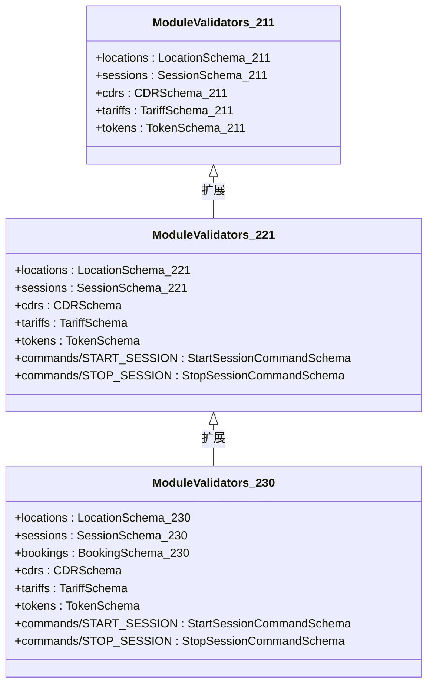

**Diagram sources**
- [ocpi-validators.js](file://src/ocpi-validators.js#L928-L961)

**Section sources**
- [ocpi-validators.js](file://src/ocpi-validators.js#L928-L961)

## Zod Schema设计模式分析
### 嵌套对象验证模式
Zod Schema广泛采用嵌套对象验证模式，通过`z.object()`构建复杂的数据结构。例如，`LocationSchema_230`中包含了`evses`数组，而每个EVSE又包含`connectors`数组，形成了多层次的嵌套结构。这种设计能够精确描述现实世界中充电站的层级关系，从位置到充电桩再到连接器。

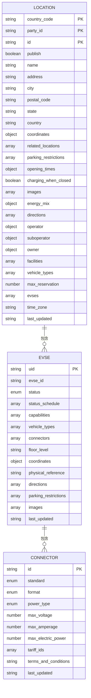

**Diagram sources**
- [ocpi-validators.js](file://src/ocpi-validators.js#L421-L553)

### 可选字段处理策略
系统采用灵活的可选字段处理策略，通过`.optional()`方法标记非必需字段。这种设计既保证了核心数据的完整性，又允许系统适应不同场景下的数据差异。例如，在`BookingSchema_230`中，`connector_id`被标记为可选，因为预订可能针对整个充电桩而非特定连接器。

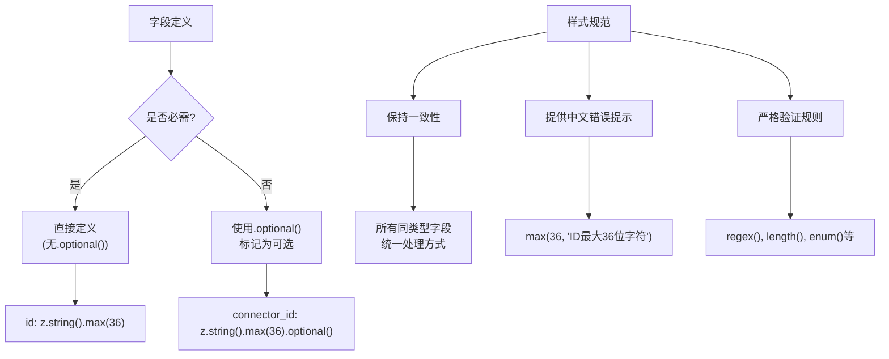

**Diagram sources**
- [ocpi-validators.js](file://src/ocpi-validators.js#L705-L746)

### 数组约束规则实现
数组约束规则通过`z.array()`结合元素Schema实现，支持复杂的嵌套数组结构。系统不仅验证数组存在性，还对数组元素进行严格验证。例如，`charging_periods`数组中的每个元素都必须符合`ChargingPeriodSchema`，确保了充电周期数据的一致性和准确性。

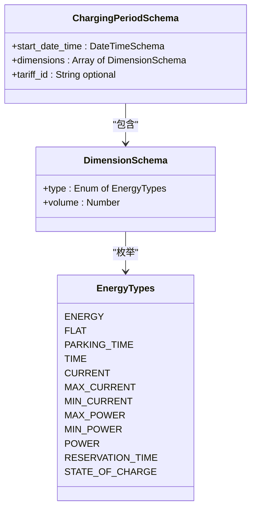

**Diagram sources**
- [ocpi-validators.js](file://src/ocpi-validators.js#L33-L40)

**Section sources**
- [ocpi-validators.js](file://src/ocpi-validators.js#L33-L40)

## 类型安全检查与错误处理
### 验证结果处理流程
系统采用标准的Zod验证结果处理流程，通过`safeParse`方法获得`result`对象，然后检查`success`属性判断验证状态。这种模式避免了异常抛出，使错误处理更加可控和可预测。验证失败时，系统遍历`result.error.issues`数组，将每个问题转换为用户友好的错误消息。

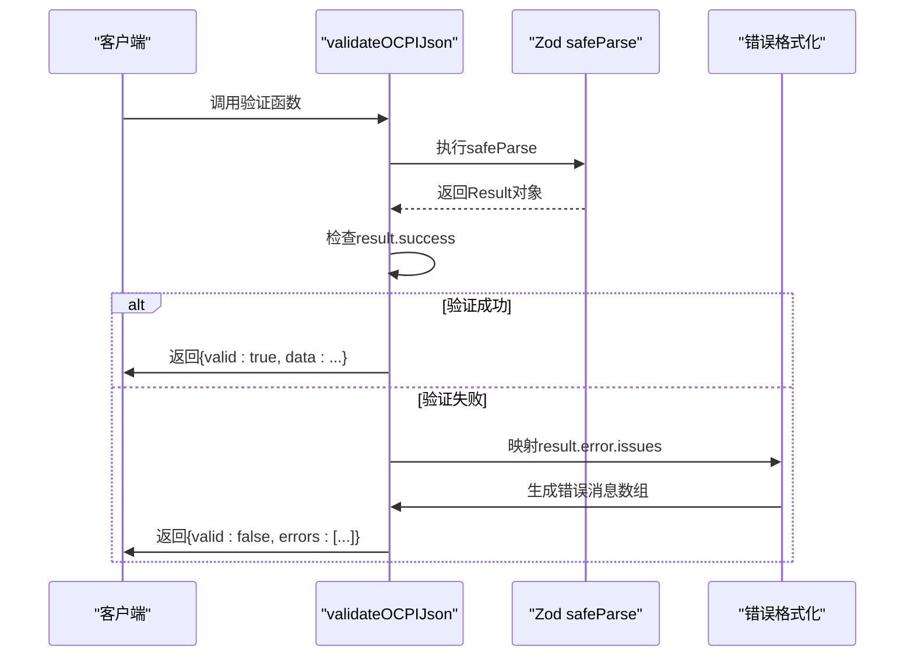

**Diagram sources**
- [ocpi-validators.js](file://src/ocpi-validators.js#L968-L1004)

### 错误信息提取逻辑
错误信息提取逻辑通过`result.error.issues.map()`实现，将Zod原生的验证问题转换为更易理解的格式。每个问题的路径（`issue.path`）和消息（`issue.message`）被组合成"路径: 消息"的形式，便于定位和修复数据问题。这种设计提高了调试效率，特别是在处理复杂嵌套结构时。

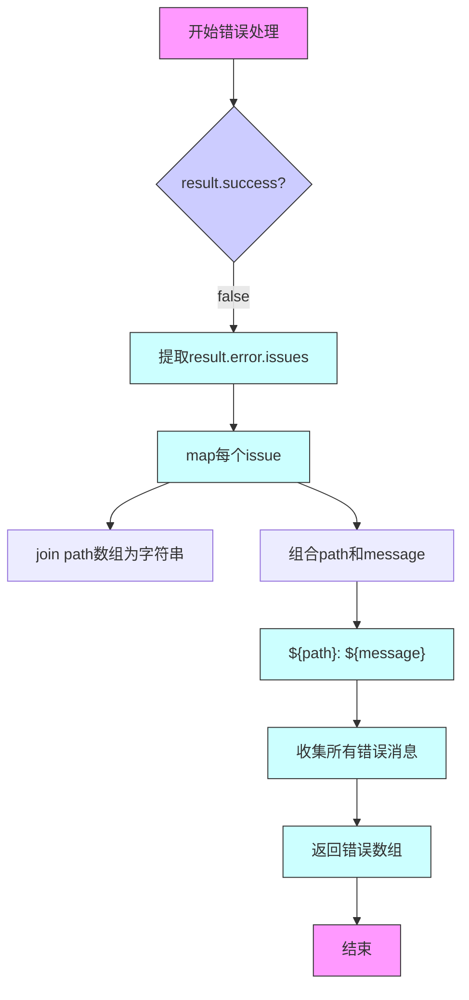

**Diagram sources**
- [ocpi-validators.js](file://src/ocpi-validators.js#L968-L1004)

**Section sources**
- [ocpi-validators.js](file://src/ocpi-validators.js#L968-L1004)

## safeParse方法的优势与异常容忍设计
### 安全解析的优势
`safeParse`方法相比`parse`具有显著优势，它不会抛出异常，而是返回包含`success`标志的结果对象。这种设计使得验证过程更加健壮，避免了因单个数据问题导致整个应用崩溃的风险。在生产环境中，这种异常容忍能力至关重要，确保了系统的稳定性和可用性。

```mermaid
graph LR
A[传统parse] --> B{验证通过?}
B --> |是| C[返回数据]
B --> |否| D[抛出异常]
D --> E[中断执行]
F[safeParse] --> G{验证通过?}
G --> |是| H[返回{success:true, data}]
G --> |否| I[返回{success:false, error}]
I --> J[继续执行]
J --> K[处理错误]
```

**Diagram sources**
- [ocpi-validators.js](file://src/ocpi-validators.js#L968-L1004)

### 异常容忍设计考量
系统的异常容忍设计体现在多个层面：首先，通过`safeParse`避免运行时异常；其次，在版本和模块不匹配时返回结构化的错误信息而非崩溃；最后，对可选字段的灵活处理减少了因缺失非关键数据而导致验证失败的情况。这种多层次的容错机制确保了系统在面对不完美数据时仍能正常工作。

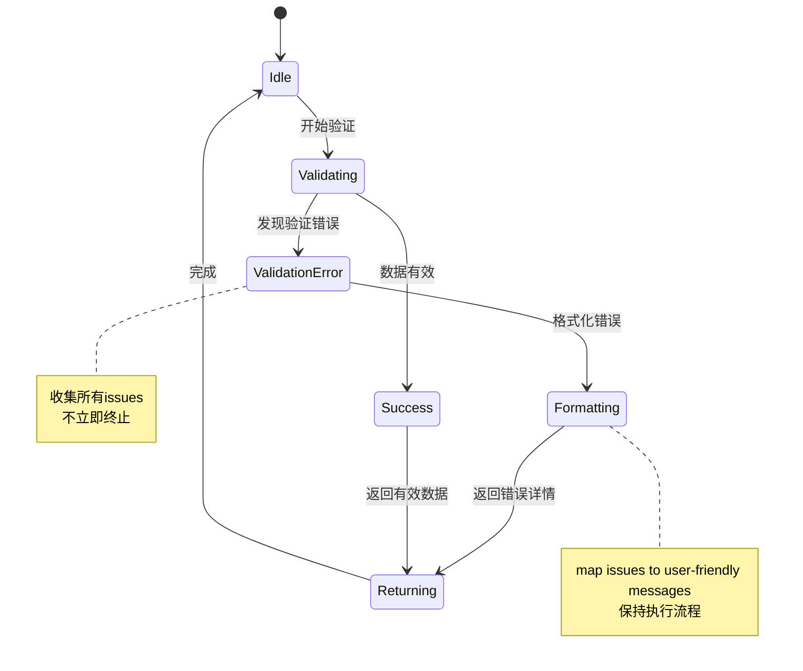

**Diagram sources**
- [ocpi-validators.js](file://src/ocpi-validators.js#L968-L1004)

**Section sources**
- [ocpi-validators.js](file://src/ocpi-validators.js#L968-L1004)

## 自定义验证规则扩展实践
### 扩展基础Schema
系统展示了如何通过定义基础Schema来实现代码复用和一致性。`CountryCodeSchema`、`PartyIdSchema`等基础Schema在多个版本和模块中被重复使用，确保了关键字段验证规则的一致性。这种设计模式便于维护，当需要修改某个通用规则时，只需更新基础Schema即可影响所有使用它的地方。

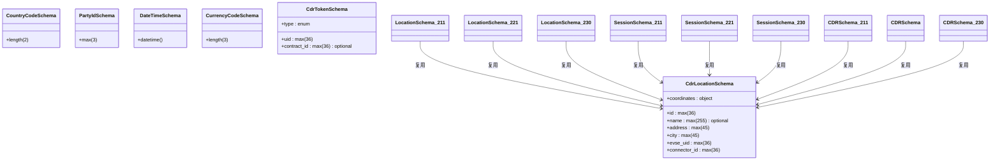

**Diagram sources**
- [ocpi-validators.js](file://src/ocpi-validators.js#L3-L31)

### 新增版本支持的最佳实践
新增版本支持时，应遵循现有模式创建新的验证器集合和Schema。最佳实践包括：保持命名一致性（如`ModuleValidators_XYZ`）、复用已有的基础Schema、在新版本Schema中只添加必要的新字段、为所有字符串字段提供中文错误提示等。这种规范化的方法确保了代码库的整体一致性和可维护性。

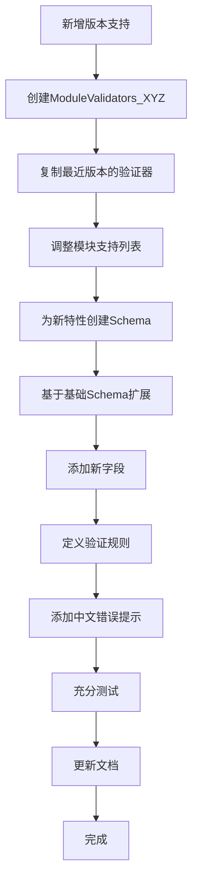

**Section sources**
- [ocpi-validators.js](file://src/ocpi-validators.js#L928-L961)

## 版本演进与模块兼容性
### OCPI版本演进路径
系统支持从OCPI 2.1.1-d2到2.3.0的多个版本，展示了协议的演进路径。每个新版本都在前一版本的基础上进行功能扩展和改进。例如，2.3.0版本引入了`bookings`模块和增强的车辆支持，反映了充电服务从简单充电向综合出行服务的转变。

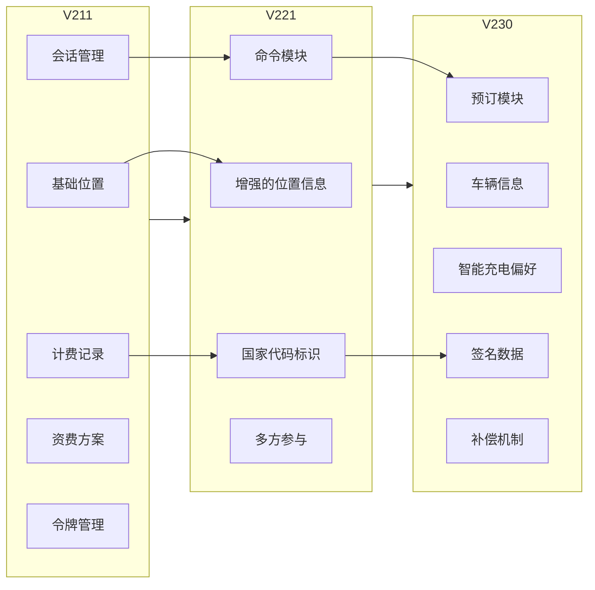

**Diagram sources**
- [ocpi-validators.js](file://src/ocpi-validators.js#L928-L961)

### 模块兼容性矩阵
不同OCPI版本支持的模块存在差异，形成了明确的兼容性矩阵。`bookings`模块仅在2.3.0版本中可用，而命令模块从2.2.1-d2版本开始引入。这种设计既保证了新功能的及时支持，又维护了旧版本的稳定性，体现了良好的版本管理策略。

| 模块 | 2.1.1-d2 | 2.2.1-d2 | 2.3.0 |
|------|----------|----------|-------|
| locations | ✓ | ✓ | ✓ |
| sessions | ✓ | ✓ | ✓ |
| cdrs | ✓ | ✓ | ✓ |
| tariffs | ✓ | ✓ | ✓ |
| tokens | ✓ | ✓ | ✓ |
| bookings | ✗ | ✗ | ✓ |
| commands/START_SESSION | ✗ | ✓ | ✓ |
| commands/STOP_SESSION | ✗ | ✓ | ✓ |
| commands/RESERVE_NOW | ✗ | ✓ | ✓ |
| commands/CANCEL_RESERVATION | ✗ | ✓ | ✓ |
| commands/UNLOCK_CONNECTOR | ✗ | ✓ | ✓ |

**Diagram sources**
- [ocpi-validators.js](file://src/ocpi-validators.js#L928-L961)

**Section sources**
- [ocpi-validators.js](file://src/ocpi-validators.js#L928-L961)