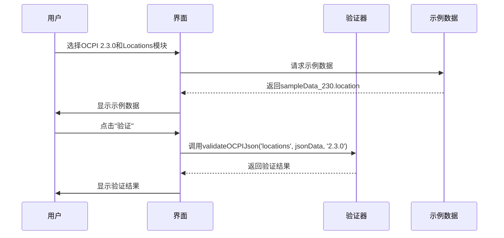

# 快速开始

<cite>
**本文档中引用的文件**
- [README.md](file://README.md)
- [USAGE_GUIDE.md](file://USAGE_GUIDE.md)
- [package.json](file://package.json)
- [src/App.js](file://src/App.js)
- [src/ocpi-validators.js](file://src/ocpi-validators.js)
- [src/sample-data.js](file://src/sample-data.js)
</cite>

## 目录
1. [简介](#简介)
2. [项目结构](#项目结构)
3. [环境搭建与启动](#环境搭建与启动)
4. [界面功能详解](#界面功能详解)
5. [完整验证工作流](#完整验证工作流)
6. [常见问题排查](#常见问题排查)
7. [结论](#结论)

## 简介

OCPI JSON验证工具是一个基于React开发的前端应用，旨在帮助开发者快速验证符合OCPI（Open Charge Point Interface）规范的JSON数据。该工具支持多个OCPI版本（2.1.1-d2、2.2.1-d2和2.3.0），涵盖Locations、Sessions、CDRs、Tariffs、Tokens、Commands和Bookings等核心模块。

本指南将详细介绍如何从零开始使用此工具，包括环境搭建、界面操作、验证流程以及常见问题的解决方案。通过本指南，新用户可以立即上手并高效地进行OCPI JSON数据的验证工作。

**Section sources**
- [README.md](file://README.md#L0-L70)
- [USAGE_GUIDE.md](file://USAGE_GUIDE.md#L0-L230)

## 项目结构

该项目采用标准的React应用结构，主要分为以下几个部分：

- **public/**: 包含静态资源文件，如`index.html`、`manifest.json`等。
- **src/**: 源代码目录，包含应用的核心逻辑和组件。
- **DEPLOYMENT.md**: 部署说明文档。
- **Dockerfile**: Docker镜像构建文件。
- **README.md**: 项目入门指南。
- **USAGE_GUIDE.md**: 使用指南，详细说明了如何使用测试数据和验证功能。
- **package.json**: 项目依赖和脚本配置。

在`src/`目录下，关键文件包括：
- `App.js`: 主应用组件，负责UI渲染和用户交互。
- `ocpi-validators.js`: 包含所有OCPI模块的验证逻辑。
- `sample-data.js`: 提供各版本的示例数据，用于测试和演示。

**Section sources**
- [project_structure](file://#L1-L20)

## 环境搭建与启动

### 1. 克隆仓库

首先，您需要克隆项目的代码库到本地：

```bash
git clone https://github.com/your-repo/test-ocpi.git
cd test-ocpi
```

### 2. 安装依赖

使用npm安装项目所需的依赖包：

```bash
npm install
```

此命令会根据`package.json`文件中的定义下载并安装所有必要的依赖项。`package.json`中列出了项目所使用的库，包括React、Material-UI和Zod等。

**Section sources**
- [package.json](file://package.json#L0-L43)
- [README.md](file://README.md#L8-L13)

### 3. 启动开发服务器

安装完依赖后，启动开发服务器：

```bash
npm start
```

执行上述命令后，应用将在开发模式下运行，并自动打开浏览器窗口，访问地址为[http://localhost:3000](http://localhost:3000)。此时，您可以开始使用OCPI JSON验证工具。

值得注意的是，该工具完全基于前端技术栈实现，无需任何后端服务即可运行。这意味着您可以在离线环境中使用它，非常适合快速验证和调试。

**Section sources**
- [README.md](file://README.md#L8-L13)

## 界面功能详解

当您访问`http://localhost:3000`时，将看到一个简洁直观的用户界面。以下是各个界面元素的功能说明：

### 1. 版本选择

页面顶部提供了两个下拉菜单，分别用于选择OCPI版本和模块。支持的版本包括OCPI 2.1.1-d2、2.2.1-d2和2.3.0。不同版本之间的模块可用性有所不同，例如，Bookings模块仅在2.3.0版本中可用。

### 2. 模块选择

根据所选版本，模块选择菜单会动态更新。例如，在选择2.1.1-d2版本时，Commands和Bookings模块将不可用；而在选择2.3.0版本时，这些模块将被启用。

### 3. 动作按钮

界面上方有一组动作按钮，具体功能如下：
- **加载示例数据**: 自动填充当前模块的示例JSON数据，便于快速测试。
- **格式化JSON**: 对输入的JSON数据进行格式化，使其更易读。
- **清空**: 清除JSON输入区域的内容。
- **验证**: 执行JSON验证，并显示结果。

### 4. JSON输入区

这是一个多行文本框，允许用户手动输入或粘贴JSON数据。您也可以通过“加载示例数据”按钮来填充示例数据。

### 5. 验证结果展示

验证完成后，结果将以卡片形式展示在页面下方。如果验证通过，会显示绿色的“✅ 验证通过！”提示；如果失败，则会列出详细的错误信息，帮助您定位问题。

**Section sources**
- [src/App.js](file://src/App.js#L36-L315)

## 完整验证工作流

以下是一个完整的验证工作流示例，展示了如何使用该工具进行OCPI JSON数据的验证。

### 1. 选择版本和模块

假设我们要验证一个符合OCPI 2.3.0规范的Locations模块数据。首先，在界面上选择“OCPI 2.3.0”作为版本，然后选择“Locations”作为模块。

### 2. 加载示例数据

点击“加载示例数据”按钮，系统会自动填充一个符合2.3.0规范的Locations示例数据。这个数据来自`sample-data.js`文件中的`sampleData_230.location`对象。

### 3. 输入自定义数据

如果您有自己的JSON数据，可以将其粘贴到JSON输入区，或者直接编辑已加载的示例数据。

### 4. 格式化和验证

点击“格式化JSON”按钮，确保数据格式正确。然后点击“验证”按钮，系统会调用`validateOCPIJson`函数对数据进行验证。

### 5. 查看结果

验证结果会在页面下方显示。如果数据符合规范，您会看到“✅ 验证通过！”的消息；否则，会列出具体的错误信息，例如字段缺失或类型不匹配。



**Diagram sources**
- [src/App.js](file://src/App.js#L36-L315)
- [src/ocpi-validators.js](file://src/ocpi-validators.js#L968-L1004)
- [src/sample-data.js](file://src/sample-data.js#L0-L722)

**Section sources**
- [src/App.js](file://src/App.js#L36-L315)
- [src/ocpi-validators.js](file://src/ocpi-validators.js#L968-L1004)
- [src/sample-data.js](file://src/sample-data.js#L0-L722)

## 常见问题排查

在使用过程中，可能会遇到一些常见问题。以下是针对这些问题的解决方案。

### 1. 依赖安装失败

如果在执行`npm install`时出现错误，可能是由于网络问题导致的。您可以尝试以下方法解决：
- 使用国内镜像源，例如淘宝NPM镜像：
  ```bash
  npm config set registry https://registry.npmmirror.com
  ```
- 清除npm缓存并重新安装：
  ```bash
  npm cache clean --force
  npm install
  ```

### 2. 端口占用

默认情况下，开发服务器运行在`localhost:3000`。如果该端口已被其他程序占用，您可以通过修改`package.json`中的`start`脚本来指定其他端口：
```json
"scripts": {
  "start": "PORT=3001 react-scripts start"
}
```
然后重新运行`npm start`。

### 3. 验证失败但示例数据有效

如果使用示例数据进行验证仍然失败，请检查以下几点：
- 确保选择了正确的OCPI版本和模块。
- 检查是否有对示例数据的意外修改。
- 确认JSON格式是否正确，必要时使用“格式化JSON”按钮修复。

### 4. 模块不可用

某些模块（如Commands和Bookings）仅在特定版本中可用。如果发现某个模块无法选择，请确认当前选择的OCPI版本是否支持该模块。

**Section sources**
- [README.md](file://README.md#L8-L13)
- [USAGE_GUIDE.md](file://USAGE_GUIDE.md#L200-L230)

## 结论

OCPI JSON验证工具为开发者提供了一个简单高效的平台，用于验证符合OCPI规范的JSON数据。通过本指南，您已经学会了如何搭建环境、使用界面功能、执行完整的验证流程以及解决常见问题。该工具无需后端服务，完全基于前端技术栈实现，适合在各种环境下快速部署和使用。

未来，您可以进一步探索该工具的高级功能，例如自定义测试数据、集成到自动化测试流程中，或扩展支持更多的OCPI模块。希望本指南能帮助您顺利上手并充分利用这一强大的验证工具。