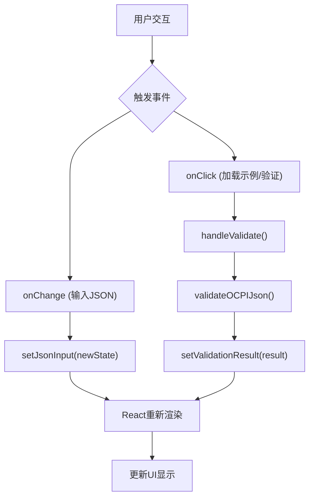
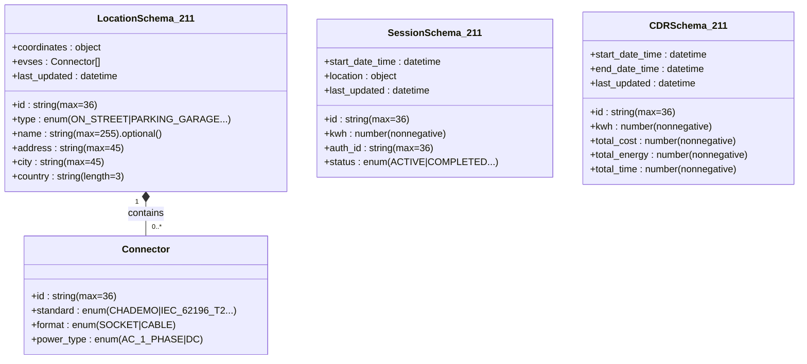

# 技术栈与依赖

<cite>
**Referenced Files in This Document**   
- [package.json](file://package.json)
- [src/ocpi-validators.js](file://src/ocpi-validators.js)
- [src/App.js](file://src/App.js)
- [src/sample-data.js](file://src/sample-data.js)
</cite>

## 目录
1. [技术栈概览](#技术栈概览)
2. [核心依赖项分析](#核心依赖项分析)
3. [React框架在用户界面中的角色](#react框架在用户界面中的角色)
4. [@mui/material组件库与现代化UI设计](#muitablematerial组件库与现代化ui设计)
5. [zod库在OCPI JSON模式验证中的核心地位](#zod库在ocpi-json模式验证中的核心地位)
6. [开发依赖与生产依赖的区别](#开发依赖与生产依赖的区别)
7. [Create React App脚手架的开箱即用体验](#create-react-app脚手架的开箱即用体验)

## 技术栈概览

本项目采用现代JavaScript技术栈构建，旨在为OCPI（开放充电接口）协议提供一个强大的JSON验证工具。其技术架构围绕三大核心支柱构建：React作为前端视图层的基础，@mui/material提供现代化且一致的UI组件，以及zod库实现强大、类型安全的JSON模式验证。这些技术协同工作，共同创建了一个高效、可靠且用户体验优良的Web应用。

项目基于Create React App (CRA) 脚手架搭建，这极大地简化了初始配置和开发流程。CRA内置了Webpack打包器、Babel转译器和开发服务器，为开发者提供了“开箱即用”的开发环境。这种组合不仅确保了代码的兼容性和性能，还通过热重载等功能显著提升了开发效率。

**Section sources**
- [package.json](file://package.json#L1-L44)

## 核心依赖项分析

`package.json`文件清晰地定义了项目所依赖的关键库及其版本约束，这些依赖项是整个应用功能的基石。

### 生产依赖 (dependencies)

生产依赖是应用运行所必需的库，它们会被打包到最终的生产构建中。

- **React (`^19.1.1`) 和 react-dom**: 这是应用的核心。React负责构建可复用的UI组件，而react-dom则处理将这些组件渲染到DOM中的具体操作。
- **@mui/material (`^7.3.2`) 和 @emotion/react, @emotion/styled**: Material UI是一个流行的React UI框架，它实现了Google的Material Design规范。`@mui/material`提供了丰富的预构建组件（如按钮、表单控件、布局容器），而`@emotion`系列库是其底层的CSS-in-JS引擎，用于动态样式化。
- **zod (`^4.1.11`)**: 这是一个TypeScript优先的模式声明和验证库。它被用于定义OCPI 2.1.1-d2、2.2.1-d2和2.3.0等不同版本的复杂JSON数据结构，并对用户输入进行实时验证。
- **react-scripts (`^5.0.1`)**: 这是Create React App的核心包，它封装了所有必要的构建工具（Webpack, Babel, ESLint等），使开发者无需手动配置即可开始开发。

### 开发依赖 (devDependencies)

开发依赖仅在开发和测试阶段需要，不会包含在生产构建中。

该项目的`package.json`中未显式列出`devDependencies`字段，但根据CRA的标准实践，像`@testing-library/*`这样的库通常被视为开发依赖。然而，在此特定的`package.json`中，它们被列在了`dependencies`下，这可能是为了简化或特定的部署需求。

**Section sources**
- [package.json](file://package.json#L6-L28)

## React框架在用户界面中的角色

React是本项目用户界面的构建基础，它通过组件化的方式管理复杂的UI逻辑。

在`App.js`文件中，`App`函数组件是整个应用的入口点。它利用React Hooks（如`useState`）来管理应用的状态，例如当前选择的OCPI模块、版本号、用户输入的JSON文本以及验证结果。这种状态驱动的编程模型使得UI能够根据数据的变化自动更新。

**Diagram sources**
- [src/App.js](file://src/App.js#L36-L315)

当用户执行操作（如点击“验证”按钮）时，会触发相应的事件处理器（如`handleValidate`）。该处理器调用验证逻辑，并使用`setValidationResult`更新状态。React检测到状态变化后，会高效地重新渲染受影响的UI部分，从而向用户展示验证结果。这种单向数据流和声明式渲染的模式，使得应用逻辑清晰且易于维护。

**Section sources**
- [src/App.js](file://src/App.js#L36-L315)

## @mui/material组件库与现代化UI设计

@mui/material是实现现代化、专业级UI设计的关键。它提供了一套遵循Material Design原则的、高度可定制的React组件。

在`App.js`中，可以看到大量MUI组件的应用：
- `TextField` 用于创建多行的JSON输入框。
- `Button`, `FormControl`, `InputLabel`, `Select`, `MenuItem` 用于构建下拉菜单和操作按钮。
- `Box`, `Grid`, `Paper`, `Typography`, `List`, `ListItem`, `ListItemText`, `Chip`, `Divider` 用于页面布局、内容分组和视觉层次的构建。

通过使用这些组件，开发者可以快速构建出美观、响应式且无障碍的界面，而无需从零开始编写复杂的CSS样式。MUI的组件系统确保了整个应用的视觉风格统一，极大地提升了用户体验。

**Section sources**
- [src/App.js](file://src/App.js#L36-L315)

## zod库在OCPI JSON模式验证中的核心地位

zod库是本项目最核心的技术之一，它承担着确保JSON数据符合OCPI协议规范的重任。

在`ocpi-validators.js`文件中，zod被用来定义多个版本的OCPI数据模式。例如，`LocationSchema_211`、`SessionSchema_211`和`CDRSchema_211`都是使用zod的`z.object()`、`z.string()`、`z.array()`等方法构建的复杂模式。这些模式精确地描述了每个JSON字段的类型、长度、枚举值、正则表达式匹配等约束条件。

**Diagram sources**
- [src/ocpi-validators.js](file://src/ocpi-validators.js#L43-L154)
- [src/ocpi-validators.js](file://src/ocpi-validators.js#L157-L196)
- [src/ocpi-validators.js](file://src/ocpi-validators.js#L199-L237)

`validateOCPIJson`函数是验证逻辑的入口。它首先根据用户选择的模块和版本确定应使用的模式（如`ModuleValidators_211`对象），然后调用该模式的`.safeParse()`方法。如果解析成功，返回有效数据；如果失败，则收集详细的错误信息（包括路径和消息），供前端展示给用户。这种基于模式的验证方式比传统的手动检查更加健壮和高效。

**Section sources**
- [src/ocpi-validators.js](file://src/ocpi-validators.js#L968-L1004)

## 开发依赖与生产依赖的区别

尽管`package.json`中没有明确区分，但理解这两类依赖的区别对于项目管理至关重要。

- **生产依赖 (Production Dependencies)**: 如上所述，这些是应用在生产环境中运行所绝对必需的库。移除它们会导致应用崩溃。例如，没有React，UI就无法渲染；没有zod，验证功能将失效。
- **开发依赖 (Development Dependencies)**: 这些库仅在开发过程中使用，例如用于代码格式化（Prettier）、静态类型检查（TypeScript）、单元测试（Jest, Testing Library）和构建工具配置。它们不增加生产包的大小，也不会影响最终用户的体验。

在本项目中，虽然`@testing-library/*`被列为生产依赖，但这并不影响其实际用途——它们主要用于在开发阶段编写和运行测试，以确保代码质量。

## Create React App脚手架的开箱即用体验

Create React App (CRA) 是本项目得以快速启动和高效开发的关键。它通过封装复杂的构建配置，为开发者提供了“开箱即用”的卓越体验。

CRA内置了以下关键工具：
- **Webpack**: 一个强大的模块打包器，负责将所有JavaScript、CSS、图片等资源打包成优化后的静态文件。
- **Babel**: 一个JavaScript编译器，允许开发者使用最新的ES6+语法和React JSX，同时将其转换为浏览器兼容的旧版JavaScript。
- **开发服务器**: 提供一个本地开发服务器，支持热重载（Hot Reloading）。这意味着当开发者修改代码并保存时，浏览器会自动刷新或局部更新，无需手动刷新页面，极大提升了开发迭代速度。

`README.md`文件证实了这一点，它明确指出项目是通过CRA引导的。开发者只需运行`npm start`即可启动开发服务器，`npm run build`即可生成生产级别的优化代码。这种约定优于配置的理念，让开发者能够专注于业务逻辑的实现，而非繁琐的工程配置。