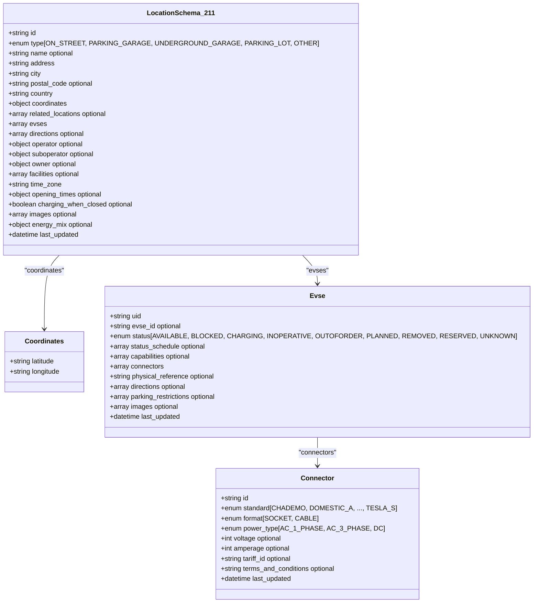
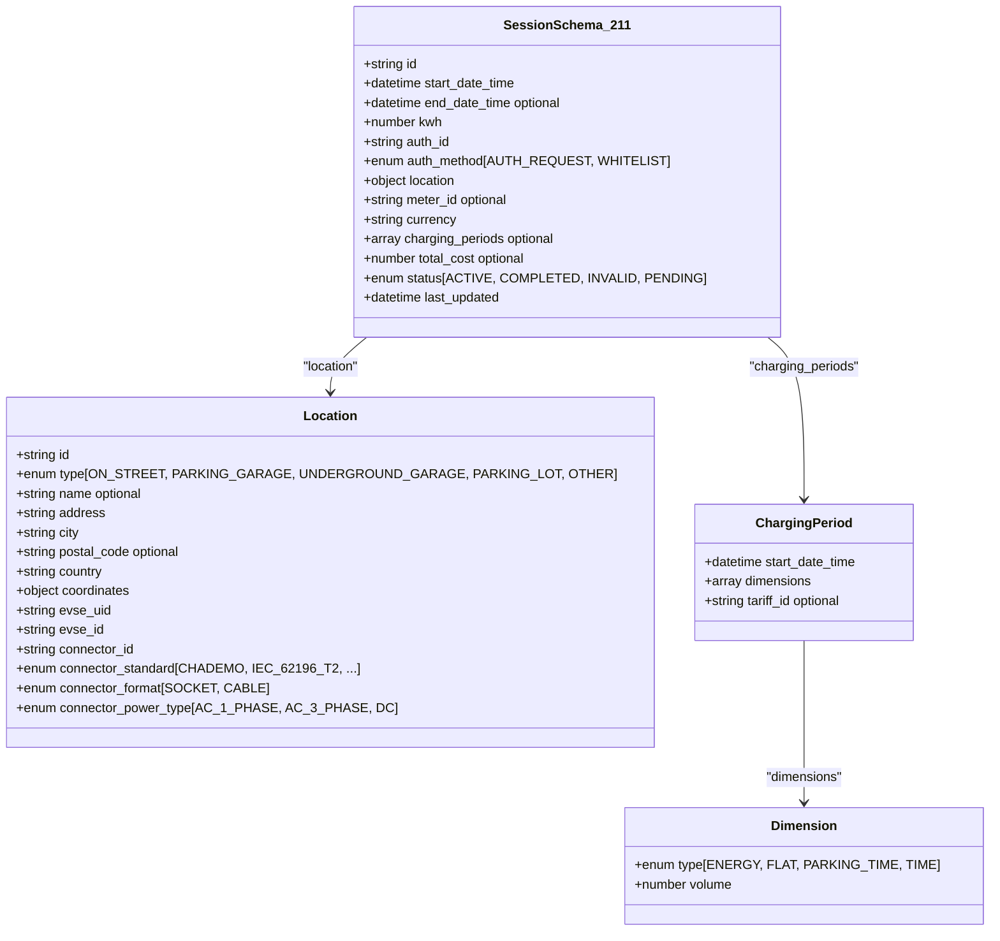
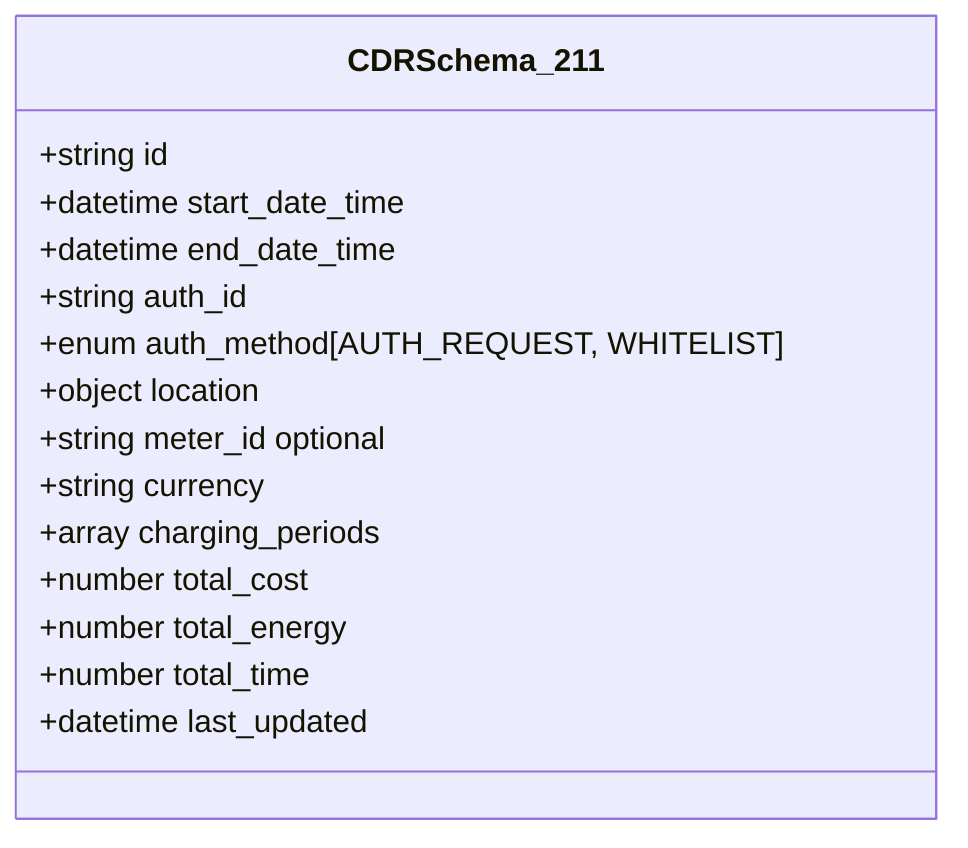
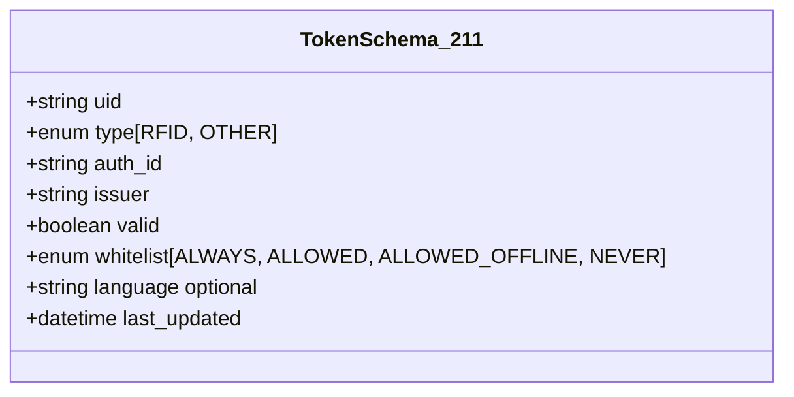
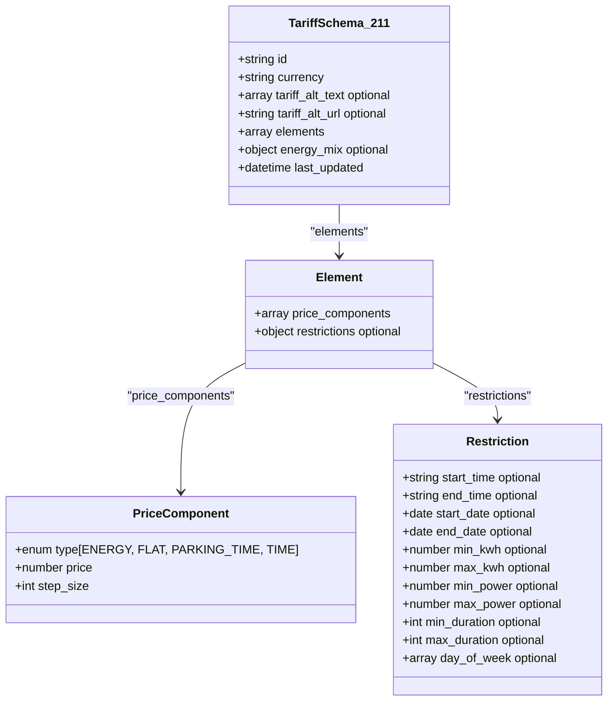

# OCPI 2.1.1-d2 版本支持

<cite>
**本文档引用的文件**
- [ocpi-validators.js](file://src/ocpi-validators.js)
- [sample-data.js](file://src/sample-data.js)
- [USAGE_GUIDE.md](file://USAGE_GUIDE.md)
</cite>

## 目录
1. [简介](#简介)
2. [核心数据结构与验证规则](#核心数据结构与验证规则)
3. [设计决策分析](#设计决策分析)
4. [开发者数据准备建议](#开发者数据准备建议)
5. [常见验证错误解决方案](#常见验证错误解决方案)

## 简介

OCPI（开放充电站接口）2.1.1-d2版本是充电基础设施互操作性协议的一个特定实现，专注于提供基础的充电服务数据交换功能。该版本通过`ocpi-validators.js`文件中的Zod模式定义实现了严格的数据验证机制，确保了不同系统间数据交换的一致性和可靠性。此文档深入分析了2.1.1-d2版本特有的数据结构、字段约束和验证规则，并解释了其关键的设计决策。

**Section sources**
- [ocpi-validators.js](file://src/ocpi-validators.js#L1-L100)

## 核心数据结构与验证规则

### LocationSchema_211 数据结构

`LocationSchema_211`定义了充电站点位置的核心数据模型，包含详细的物理信息、运营细节和能源构成。该模式不包含`country_code`和`party_id`顶层字段，这与后续版本形成显著区别。

**Diagram sources**
- [ocpi-validators.js](file://src/ocpi-validators.js#L43-L154)

**Section sources**
- [ocpi-validators.js](file://src/ocpi-validators.js#L43-L154)

### SessionSchema_211 数据结构

`SessionSchema_211`定义了充电会话的数据模型，记录了用户从开始到结束的整个充电过程。该模式特别限制了认证方式，仅支持`AUTH_REQUEST`和`WHITELIST`两种方法。

**Diagram sources**
- [ocpi-validators.js](file://src/ocpi-validators.js#L157-L196)

**Section sources**
- [ocpi-validators.js](file://src/ocpi-validators.js#L157-L196)

### 其他核心模块数据结构

除了位置和会话，2.1.1-d2版本还定义了其他关键模块的数据结构，包括计费详情记录(CDR)、令牌(Token)和资费(Tariff)。

#### CDRSchema_211 (计费详情记录)

**Diagram sources**
- [ocpi-validators.js](file://src/ocpi-validators.js#L199-L237)

#### TokenSchema_211 (令牌)

**Diagram sources**
- [ocpi-validators.js](file://src/ocpi-validators.js#L240-L249)

#### TariffSchema_211 (资费)

**Diagram sources**
- [ocpi-validators.js](file://src/ocpi-validators.js#L252-L294)

## 设计决策分析

### 缺少顶层country_code和party_id的原因

在`LocationSchema_211`中，`country_code`和`party_id`这两个顶层字段的缺失是一个有意为之的设计决策，反映了2.1.1-d2版本的架构理念。

首先，这种设计简化了API端点的路由逻辑。在更高级的版本中，这些标识符作为URL路径的一部分，用于直接寻址特定运营商在特定国家的资源。而在2.1.1-d2中，由于这些字段内嵌于消息体中或由上下文隐含，API设计可以更加扁平化，降低了客户端的复杂性。

其次，这表明了该版本可能针对的是单一运营商或封闭生态系统内的部署场景。在这种环境中，全局唯一性可以通过`id`字段本身保证，而无需额外的命名空间划分。`country_code`和`party_id`的职责被下放到了更高层的通信协议或配置中，而不是作为每个数据对象的必需属性。

最后，这种设计减少了数据冗余。在一个请求中传输的所有位置对象都属于同一个运营商和国家时，重复携带`country_code`和`party_id`是不必要的。将它们移出顶层可以减小有效载荷大小，提高传输效率。

**Section sources**
- [ocpi-validators.js](file://src/ocpi-validators.js#L43-L154)

### auth_method仅支持AUTH_REQUEST和WHITELIST的原因

`SessionSchema_211`和`CDRSchema_211`中对`auth_method`的枚举限制为`AUTH_REQUEST`和`WHITELIST`，排除了`COMMAND`选项，这揭示了2.1.1-d2版本的功能范围和安全模型。

`AUTH_REQUEST`代表了一种标准的、基于凭证的认证流程，即用户发起一个认证请求，系统返回一个会话。这是最基础也是最通用的认证方式，适用于大多数刷卡或APP扫码启动充电的场景。

`WHITELIST`则代表了一种预授权模式，用户的令牌（如RFID卡）已被预先列入白名单，允许其在指定地点进行充电。这是一种高效的免交互式认证，非常适合车队管理或会员制充电网络。

排除`COMMAND`的原因在于，该认证方式通常与远程命令（如远程启动/停止充电）紧密相关。`COMMAND`意味着CPO（充电点运营商）主动向EMSP（电子移动服务提供商）发送指令来启动一个会话。2.1.1-d2版本很可能尚未实现完整的双向命令控制功能，因此`COMMAND`认证方式不在其支持范围内。这表明该版本主要聚焦于由用户或EMSP发起的、单向的充电会话流程，而非CPO主动干预的场景。

**Section sources**
- [ocpi-validators.js](file://src/ocpi-validators.js#L157-L196)
- [ocpi-validators.js](file://src/ocpi-validators.js#L199-L237)

## 开发者数据准备建议

为了成功与OCPI 2.1.1-d2版本集成，开发者必须严格遵守其数据格式规范。以下是一些关键的准备建议。

### 必填字段清单

| 模块 | 必填字段 |
| :--- | :--- |
| **位置 (Locations)** | `id`, `type`, `address`, `city`, `country`, `coordinates.latitude`, `coordinates.longitude`, `evses.uid`, `evses.status`, `evses.connectors.id`, `evses.connectors.standard`, `evses.connectors.format`, `evses.connectors.power_type`, `time_zone`, `last_updated` |
| **会话 (Sessions)** | `id`, `start_date_time`, `kwh`, `auth_id`, `auth_method`, `location.id`, `location.address`, `location.city`, `location.country`, `location.coordinates.latitude`, `location.coordinates.longitude`, `location.evse_uid`, `location.evse_id`, `location.connector_id`, `location.connector_standard`, `location.connector_format`, `location.connector_power_type`, `currency`, `status`, `last_updated` |
| **计费详情记录 (CDRs)** | `id`, `start_date_time`, `end_date_time`, `auth_id`, `auth_method`, `location.id`, `location.address`, `location.city`, `location.country`, `location.coordinates.latitude`, `location.coordinates.longitude`, `location.evse_uid`, `location.evse_id`, `location.connector_id`, `location.connector_standard`, `location.connector_format`, `location.connector_power_type`, `currency`, `charging_periods.start_date_time`, `charging_periods.dimensions.type`, `charging_periods.dimensions.volume`, `total_cost`, `total_energy`, `total_time`, `last_updated` |
| **令牌 (Tokens)** | `uid`, `type`, `auth_id`, `issuer`, `valid`, `whitelist`, `last_updated` |
| **资费 (Tariffs)** | `id`, `currency`, `elements.price_components.type`, `elements.price_components.price`, `elements.price_components.step_size`, `last_updated` |

**Section sources**
- [ocpi-validators.js](file://src/ocpi-validators.js#L43-L294)

### 格式规范

1.  **日期时间**: 所有日期时间字段必须使用ISO 8601格式（例如：`"2024-01-15T14:30:00Z"`）。
2.  **地理坐标**: 纬度和经度必须是字符串类型，符合正则表达式`/^-?[0-9]{1,2}\.[0-9]{5,7}$/`，即最多两位整数部分和5到7位小数部分。
3.  **数值**: `kwh`, `total_cost`, `total_energy`, `total_time`等数值字段必须为非负数。
4.  **枚举值**: 所有字段必须使用模式中明确定义的枚举值，区分大小写。
5.  **字符串长度**: 严格遵守`max()`和`length()`约束，例如`id`最大36字符，`address`最大45字符。

**Section sources**
- [ocpi-validators.js](file://src/ocpi-validators.js#L43-L294)

## 常见验证错误解决方案

当数据验证失败时，理解错误原因并快速修复至关重要。以下是根据`validateOCPIJson`函数逻辑推断出的常见问题及解决方案。

### 验证错误类型与解决策略

| 错误现象 | 可能原因 | 解决方案 |
| :--- | :--- | :--- |
| **缺少必填字段** | JSON对象中遗漏了`required`字段。 | 使用`sample-data.js`中的示例数据作为模板，确保所有必填字段都存在。 |
| **字段格式错误** | 字段值不符合类型或格式要求（如日期格式不正确、坐标精度不足）。 | 检查日期是否为有效的ISO 8601 UTC时间戳；验证经纬度字符串的小数位数是否在5-7位之间。 |
| **枚举值无效** | 提供的值不在允许的枚举列表中。 | 仔细核对模式定义中的`z.enum([...])`列表，确保输入值完全匹配（包括大小写）。 |
| **数值超出范围** | 数字超出了`min()`或`max()`的限制，或为负数。 | 确保`kwh`、`total_cost`等字段为非负数；检查`step_size`等整数字段是否为整数。 |
| **模块不可用** | 尝试验证2.1.1-d2不支持的模块（如`commands`或`bookings`）。 | 确认您正在使用的模块是`locations`, `sessions`, `cdrs`, `tariffs`, 或 `tokens`之一。 |
| **版本不匹配** | 在调用`validateOCPIJson`时指定了错误的版本号。 | 明确指定`version = '2.1.1-d2'`参数，以确保使用正确的验证器。 |

**Section sources**
- [ocpi-validators.js](file://src/ocpi-validators.js#L968-L1004)
- [sample-data.js](file://src/sample-data.js#L1-L723)