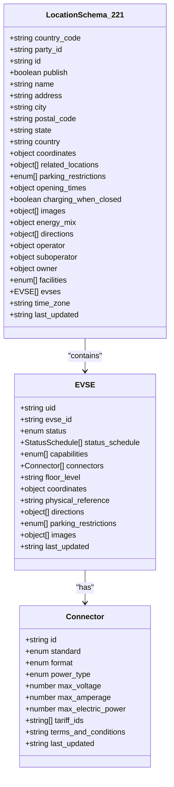
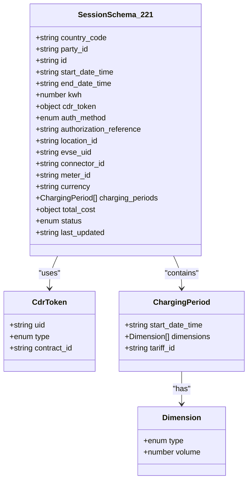
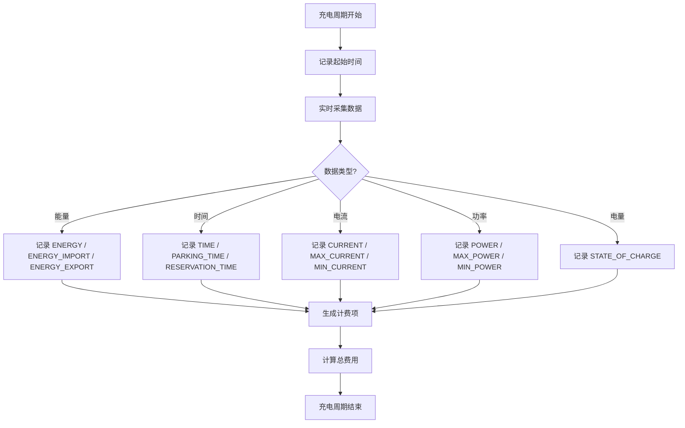

# OCPI 2.2.1-d2 版本支持

<cite>
**Referenced Files in This Document **   
- [ocpi-validators.js](file://src/ocpi-validators.js)
- [sample-data.js](file://src/sample-data.js)
</cite>

## 目录
1. [引言](#引言)
2. [核心演进变化](#核心演进变化)
3. [LocationSchema_221 深度解析](#locationschema_221-深度解析)
4. [SessionSchema_221 深度解析](#sessionschema_221-深度解析)
5. [数据类型统一处理](#数据类型统一处理)
6. [充电周期维度扩展](#充电周期维度扩展)
7. [认证方法新增COMMAND类型](#认证方法新增command类型)
8. [版本兼容性与实际应用](#版本兼容性与实际应用)

## 引言

OCPI（Open Charge Point Interface）协议作为电动汽车充电基础设施互联互通的核心标准，其版本迭代持续推动着充电网络的智能化和标准化进程。本文档聚焦于OCPI 2.2.1-d2版本相较于2.1.1-d2版本的关键技术演进，旨在为开发者提供一份详尽的技术参考。

通过分析`ocpi-validators.js`中的验证模式，我们将深入探讨新版本在顶层标识符、支付能力、数据格式、计量维度以及认证机制等方面的增强特性。这些改进不仅提升了数据模型的精确性和可扩展性，也为实现更复杂的充电场景（如远程命令控制、精细化计费）奠定了坚实基础。

## 核心演进变化

OCPI 2.2.1-d2版本在2.1.1-d2的基础上进行了多项重要升级，主要体现在以下几个方面：

1.  **全局唯一标识符引入**：在`Location`和`Session`等核心对象中，新增了`country_code`和`party_id`两个顶层字段，实现了跨运营商、跨国界的资源全局寻址。
2.  **支付能力显著增强**：`capabilities`枚举中增加了`CONTACTLESS_CARD_PAYABLE`、`DEBIT_CARD_PAYABLE`和`PED_TERMINAL`等新值，支持非接触式银行卡支付和便携式电子设备终端，极大地丰富了用户的支付选择。
3.  **时间戳格式标准化**：将`DateTimeSchema`从字符串正则校验统一为Zod库的`z.string().datetime()`方法，确保了ISO 8601日期时间格式的严格一致性。
4.  **计量维度精细化**：在`charging_periods`中，`dimensions`的`type`枚举从简单的`ENERGY`、`TIME`等扩展至包含`CURRENT`、`POWER`、`MAX_POWER`等在内的十余种类型，支持更精确的能源消耗分析和动态计费。
5.  **认证方式多样化**：`auth_method`新增了`COMMAND`类型，允许通过平台下发的指令来启动或停止充电会话，为远程控制和自动化服务提供了关键支持。

这些变化共同构成了OCPI 2.2.1-d2版本的核心价值，使其能够更好地适应现代充电网络的复杂需求。

**Section sources**
- [ocpi-validators.js](file://src/ocpi-validators.js#L297-L418)
- [ocpi-validators.js](file://src/ocpi-validators.js#L556-L585)

## LocationSchema_221 深度解析

`LocationSchema_221`是OCPI 2.2.1-d2版本中定义充电站点信息的核心数据结构。与2.1.1-d2版本相比，其最显著的变化在于引入了全局上下文标识符。



**Diagram sources **
- [ocpi-validators.js](file://src/ocpi-validators.js#L297-L418)

### 新增顶层标识符

在`LocationSchema_221`中，`country_code`和`party_id`被提升至对象的顶层，位于`id`之前。

*   **`country_code`**: 类型为`z.string().length(2)`，强制要求使用两位字母的国家代码（如"NL"代表荷兰）。这解决了2.1.1-d2版本中仅依赖三位字母的`country`字段（如"NLD"）可能导致的歧义问题，与国际标准ISO 3166-1 alpha-2保持一致。
*   **`party_id`**: 类型为`z.string().max(3)`，用于标识运营该充电站点的商业实体（CPO - Charging Point Operator 或 MSP - Mobility Service Provider）。结合`country_code`和`id`，可以构成一个全球唯一的充电站点标识符（例如：`NL:ABC:LOC123`），这对于跨运营商的数据交换至关重要。

这一设计使得任何OCPI参与者都能准确无误地定位到特定国家、特定运营商下的某个具体充电站点，是实现大规模互联互通的基础。

### 支付能力扩展

`LocationSchema_221`中`evses.capabilities`数组的枚举值得到了显著扩充，以支持更多样化的支付方式：
*   `CONTACTLESS_CARD_PAYABLE`: 表示该充电点支持非接触式银行卡（如Visa PayWave, Mastercard Contactless）支付。
*   `DEBIT_CARD_PAYABLE`: 明确支持借记卡支付。
*   `PED_TERMINAL`: 表示存在便携式电子设备终端，可用于现场交易。

这些新增能力反映了市场对便捷、现代化支付手段的需求，使用户无需依赖专用APP或RFID卡即可完成充电。

**Section sources**
- [ocpi-validators.js](file://src/ocpi-validators.js#L297-L418)
- [sample-data.js](file://src/sample-data.js#L230-L310)

## SessionSchema_221 深度解析

`SessionSchema_221`定义了充电会话的生命周期和相关数据。相较于`SessionSchema_211`，它在身份认证、成本计算和状态管理上都有重要更新。



**Diagram sources **
- [ocpi-validators.js](file://src/ocpi-validators.js#L556-L585)

### 认证令牌（cdr_token）取代旧模式

在`SessionSchema_211`中，会话通过`auth_id`和`auth_method`进行认证。而在`SessionSchema_221`中，这一机制被更强大的`cdr_token`对象所取代。

`cdr_token`是一个包含`uid`、`type`和可选`contract_id`的对象，直接引用了独立的`CdrTokenSchema`。这种设计的优势在于：
1.  **信息完整性**：`cdr_token`本身就是一个完整的凭证对象，包含了所有必要的认证信息。
2.  **灵活性**：`type`枚举扩展为`['RFID', 'APP_USER', 'REMOTE', 'OTHER']`，明确支持通过移动应用（APP_USER）或远程指令（REMOTE）发起的会话。
3.  **合同关联**：`contract_id`字段允许将充电会话与用户的电力购买合同直接关联，便于账单结算。

### 成本结构精细化

`SessionSchema_221`中的`total_cost`字段从一个简单的数值（`z.number()`）变更为一个包含增值税明细的对象：
```javascript
total_cost: z.object({
    excl_vat: z.number().optional(),
    incl_vat: z.number().optional()
})
```
这一变更使得计费系统能够清晰地区分不含税价格和含税总价，满足了不同国家和地区税务合规的要求，为财务结算提供了更精确的数据。

### 状态扩展

`status`枚举新增了`RESERVATION`状态，表明该会话正处于预约阶段，尚未开始充电。这为实现“预约充电”功能提供了数据层面的支持。

**Section sources**
- [ocpi-validators.js](file://src/ocpi-validators.js#L556-L585)
- [ocpi-validators.js](file://src/ocpi-validators.js#L7-L11)
- [sample-data.js](file://src/sample-data.js#L311-L350)

## 数据类型统一处理

在OCPI 2.2.1-d2版本中，日期时间的处理方式得到了统一和规范化。

### DateTimeSchema 的演进

在`ocpi-validators.js`文件的顶部，定义了一个通用的`DateTimeSchema`：
```javascript
const DateTimeSchema = z.string().datetime();
```
这个模式利用Zod库内置的`.datetime()`方法，对字符串进行严格的ISO 8601格式校验（例如：`2024-01-15T14:30:00Z`）。

在`LocationSchema_211`和`SessionSchema_211`中，时间字段（如`start_date_time`）虽然也使用了字符串，但其校验是通过正则表达式`z.string().regex(...)`实现的，这种方式相对宽松且容易出错。

而在`LocationSchema_221`和`SessionSchema_221`中，所有的时间字段都直接使用了`z.string().datetime()`，或者在`ChargingPeriodSchema`中复用了`DateTimeSchema`。这种统一的处理方式确保了整个API接口中日期时间格式的一致性，减少了因格式错误导致的通信失败，提高了系统的健壮性。

**Section sources**
- [ocpi-validators.js](file://src/ocpi-validators.js#L5-L5)
- [ocpi-validators.js](file://src/ocpi-validators.js#L33-L40)

## 充电周期维度扩展

`charging_periods`是记录充电过程中不同时段能耗和费用的核心结构。OCPI 2.2.1-d2版本对其进行了重大扩展。

### Dimensions 枚举的丰富化

在`ChargingPeriodSchema`中，`dimensions.type`的枚举值从2.1.1-d2的`['ENERGY', 'FLAT', 'PARKING_TIME', 'TIME']`大幅扩展至以下列表：
`['CURRENT', 'ENERGY', 'ENERGY_EXPORT', 'ENERGY_IMPORT', 'MAX_CURRENT', 'MIN_CURRENT', 'MAX_POWER', 'MIN_POWER', 'PARKING_TIME', 'POWER', 'RESERVATION_TIME', 'STATE_OF_CHARGE', 'TIME']`

这一扩展具有深远的意义：
*   **电流与功率监控**：`CURRENT`、`POWER`、`MAX_CURRENT`、`MAX_POWER`等维度允许精确记录充电过程中的瞬时和峰值电流/功率，对于电网负荷管理和安全保护至关重要。
*   **双向充电支持**：`ENERGY_EXPORT`和`ENERGY_IMPORT`为V2G（Vehicle-to-Grid）技术提供了数据支持，可以区分车辆向电网供电和从电网取电的不同场景。
*   **电池状态追踪**：`STATE_OF_CHARGE`可以直接记录充电开始和结束时的电池电量百分比，为用户提供更直观的充电体验。
*   **精细化计费**：`RESERVATION_TIME`可以用于计算预约时段的占用费用，而不仅仅是充电时间。

这种多维度的计量能力使得OCPI能够支持更复杂、更智能的充电策略和商业模式。



**Diagram sources **
- [ocpi-validators.js](file://src/ocpi-validators.js#L33-L40)

**Section sources**
- [ocpi-validators.js](file://src/ocpi-validators.js#L33-L40)

## 认证方法新增COMMAND类型

`auth_method`字段的演进是OCPI 2.2.1-d2版本的一个关键创新。

### COMMAND 认证模式的意义

在`SessionSchema_221`中，`auth_method`的枚举值新增了`'COMMAND'`：
```javascript
auth_method: z.enum(['AUTH_REQUEST', 'COMMAND', 'WHITELIST'])
```
这标志着一种全新的会话启动方式——**指令驱动认证**。

*   **`AUTH_REQUEST`**: 用户主动发起请求（如刷卡、扫码）。
*   **`WHITELIST`**: 基于白名单的自动认证。
*   **`COMMAND`**: 由中央平台（eMSP）向充电点（CPO）发送一个“启动会话”的指令来触发充电。

### 实际应用场景

`COMMAND`类型的典型应用场景包括：
1.  **远程启动充电**：用户通过手机APP远程控制家中的充电桩开始充电，无需物理接触。
2.  **车队管理**：物流公司的调度中心可以批量向停放在车场的电动货车发送充电指令，实现集中化、自动化的能源补给。
3.  **智能电网互动**：当电网电价处于低谷期或有大量可再生能源上网时，能源服务商可以向符合条件的用户发送充电指令，实现削峰填谷。

这种模式将充电行为的控制权从用户端部分转移到了服务平台，为构建更加智能、高效的能源生态系统打开了大门。

**Section sources**
- [ocpi-validators.js](file://src/ocpi-validators.js#L556-L585)
- [sample-data.js](file://src/sample-data.js#L311-L350)

## 版本兼容性与实际应用

通过对`sample-data.js`文件的分析，我们可以看到项目如何支持多个OCPI版本。

### 多版本并存

该项目通过导出`sampleData_211`、`sampleData_221`和`sampleData_230`三个命名空间，分别存储了对应版本的示例数据。前端界面（`App.js`）根据用户选择的版本动态加载相应的数据和验证模式，实现了良好的向后兼容性。

### 迁移建议

对于从2.1.1-d2迁移到2.2.1-d2的开发者，建议：
1.  在所有`Location`和`Session`对象中添加`country_code`和`party_id`字段。
2.  将`auth_id`替换为`cdr_token`对象。
3.  更新`total_cost`字段为包含`excl_vat`和`incl_vat`的对象。
4.  审查并更新`capabilities`和`dimensions.type`的枚举值，以利用新功能。
5.  确保所有日期时间字符串符合ISO 8601标准。

通过遵循这些指导原则，可以顺利过渡到更强大、更灵活的OCPI 2.2.1-d2版本。