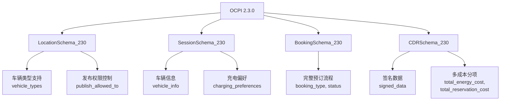

# OCPI 2.3.0 版本支持

<cite>
**Referenced Files in This Document**   
- [ocpi-validators.js](file://src/ocpi-validators.js)
- [sample-data.js](file://src/sample-data.js)
</cite>

## 目录
1. [简介](#简介)
2. [核心创新特性概览](#核心创新特性概览)
3. [LocationSchema_230 深入解析](#locationschema_230-深入解析)
4. [SessionSchema_230 高级功能](#sessionschema_230-高级功能)
5. [BookingSchema_230 数据模型](#bookingschema_230-数据模型)
6. [CDRSchema_230 增强计费能力](#cdrschema_230-增强计费能力)
7. [版本验证与兼容性](#版本验证与兼容性)

## 简介

OCPI（开放充电点接口）2.3.0版本是该标准的最新演进，旨在通过引入多项关键创新来提升电动汽车充电网络的互操作性和智能化水平。本文档基于`ocpi-validators.js`中的具体实现，全面解析了OCPI 2.3.0相较于早期版本的核心改进。重点聚焦于`LocationSchema_230`、`SessionSchema_230`、`BookingSchema_230`和`CDRSchema_230`这四个核心数据模型，详细阐述了新增的车辆类型支持、发布权限控制、智能充电偏好以及精细化成本分项等特性。这些增强功能共同构建了一个更灵活、更安全且用户体验更优的充电生态系统。

**Section sources**
- [ocpi-validators.js](file://src/ocpi-validators.js#L421-L746)

## 核心创新特性概览

OCPI 2.3.0版本在2.2.1-d2的基础上进行了显著的功能扩展，主要体现在以下几个方面：

1.  **精细化车辆支持**：通过在`LocationSchema_230`中引入`vehicle_types`字段，实现了对不同车型（如乘用车、卡车、公交车、重型商用车HDV）的精确管理，使充电站能够根据车辆尺寸和功率需求进行优化。
2.  **细粒度发布控制**：新增的`publish_allowed_to`字段允许运营商将特定充电站的发布权限授予指定的用户或应用，增强了数据共享的安全性和灵活性。
3.  **预订模块（Bookings）**：正式引入了完整的预订功能，支持用户提前预约充电位，有效解决了高峰时段的充电拥堵问题。
4.  **智能会话管理**：`SessionSchema_230`增加了`vehicle_info`和`charging_preferences`字段，使得充电过程可以基于车辆信息和用户偏好进行个性化调整。
5.  **精细化计费与数据完整性**：`CDRSchema_230`不仅支持签名数据以确保交易的不可否认性，还提供了多维度的成本分项（如能源成本、时间成本、停车成本、预约成本），为透明化计费和财务结算提供了坚实基础。

这些特性共同推动了充电服务从简单的“即插即用”模式向智能化、预约化和个性化的方向发展。

**Diagram sources**
- [ocpi-validators.js](file://src/ocpi-validators.js#L421-L746)

## LocationSchema_230 深入解析

`LocationSchema_230`是OCPI 2.3.0中关于充电站点信息的核心数据结构，它在2.2.1-d2版本的基础上进行了重要扩充，以适应更复杂的运营场景。

### 车辆类型支持 (vehicle_types)

此字段是`LocationSchema_230`的关键创新之一。它是一个可选的字符串数组，其取值范围为`['CAR', 'BIKE', 'TRUCK', 'BUS', 'HDV']`。该字段的应用场景非常广泛：
*   **站点层面**：一个充电站可以声明其整体支持的车辆类型。例如，一个位于物流园区的充电站可能将其`vehicle_types`设置为`["TRUCK", "HDV"]`，明确告知系统这是一个专为重型商用车设计的站点。
*   **EVSE层面**：该字段同样存在于每个`evses`对象中，用于定义单个充电设备的适用车型。例如，一个充电站内可能同时拥有为普通轿车设计的AC充电桩（`vehicle_types: ["CAR"]`）和为电动卡车设计的大功率DC快充桩（`vehicle_types: ["TRUCK", "HDV"]`）。这种精细化的描述有助于导航和调度系统为用户精准匹配合适的充电资源。

### 发布权限控制 (publish_allowed_to)

`publish_allowed_to`字段提供了一种强大的访问控制机制。它是一个可选的对象数组，每个对象包含三个属性：
*   `uid`: 用户或应用的唯一标识符。
*   `type`: 标识类型，目前支持`'APP_USER'`或`'RFID'`。
*   `contract_id`: 关联的合同ID。

此功能允许充电站运营商实施“白名单”策略。例如，一个企业停车场内的充电站可以设置`publish_allowed_to`，仅允许该公司员工（通过其APP_USER UID和合同ID识别）在公共地图上看到该充电站的位置。这既保护了私有设施不被滥用，又为授权用户提供了便利。

**Section sources**
- [ocpi-validators.js](file://src/ocpi-validators.js#L421-L553)
- [sample-data.js](file://src/sample-data.js#L589-L688)

## SessionSchema_230 高级功能

`SessionSchema_230`定义了充电会话的生命周期和相关数据，其新增的两个字段极大地丰富了充电体验。

### 车辆信息 (vehicle_info)

`vehicle_info`是一个可选的对象，用于在充电会话期间记录详细的车辆信息，包括：
*   `license_plate`: 车牌号，可用于身份核验和账单关联。
*   `brand` 和 `model`: 车辆品牌和型号，有助于分析车队构成和充电行为。
*   `connector_type`: 车辆使用的连接器类型，对于自动配置充电参数至关重要。
*   `max_charging_power`: 车辆支持的最大充电功率，是动态调节充电速率的关键输入。

**应用场景**：当一辆电动卡车开始充电时，其`vehicle_info`会被上传。充电管理系统可以根据其最大充电功率（如500kW）和当前电池状态，为其分配最优的充电曲线，避免对电网造成冲击。

### 智能充电偏好 (charging_preferences)

`charging_preferences`是实现智能充电的核心。它允许用户或车辆控制系统表达其充电期望，包含以下属性：
*   `departure_time`: 预计离场时间。这是最核心的偏好，系统可以据此计算出最优的充电速度，确保在离场时电量达到目标值，同时尽可能利用低谷电价。
*   `energy_need`: 目标充电量（kWh）。用户可以设定需要充多少电即可，无需充满。
*   `discharge_allowed`: 是否允许车辆向电网放电（V2G）。这为参与电网调峰辅助服务打开了大门。

**应用场景**：一位用户计划第二天早上7点出发，他可以在晚上10点将车接入充电桩，并设置`departure_time`为次日07:00:00Z。充电系统会计算出，只需在凌晨2点到6点之间以中等功率充电即可满足需求，从而避开夜间高电价时段，为用户节省费用。

**Section sources**
- [ocpi-validators.js](file://src/ocpi-validators.js#L588-L636)
- [sample-data.js](file://src/sample-data.js#L690-L718)

## BookingSchema_230 数据模型

`BookingSchema_230`是OCPI 2.3.0中全新的数据模型，专门用于处理充电预约请求，其结构完整地覆盖了预订的整个生命周期。

### 完整的数据结构

该模型包含了预订所需的所有关键信息：
*   **身份与位置**：`country_code`, `party_id`, `id`用于全局唯一标识；`location_id`, `evse_uid`, `connector_id`指明具体的充电设备。
*   **时间窗口**：`start_date_time`和`end_date_time`定义了预约的有效期。
*   **状态机**：`status`字段采用枚举值`['ACCEPTED', 'REJECTED', 'EXPIRED', 'CANCELLED', 'ACTIVE', 'COMPLETED']`，清晰地描述了预订从创建到完成的各个阶段。
*   **车辆详情**：与`SessionSchema_230`类似，`vehicle_details`字段允许在预约时就提交车辆信息，便于提前准备。
*   **业务规则**：`cancellation_policy`定义了取消预约的费用和免费取消时限，`booking_restrictions`则可以设置如`'HDV_ONLY'`或`'FAST_CHARGING_ONLY'`等限制条件。

### 业务价值

引入预订模块的业务价值巨大：
*   **提升用户体验**：用户可以提前锁定充电位，消除到达后无桩可用的焦虑。
*   **优化资源利用率**：运营商可以通过预约数据预测负荷，合理调配运维人员和电力资源。
*   **创造新的商业模式**：可以针对预约服务收取一定的溢价，或为VIP用户提供优先预约权。

**Section sources**
- [ocpi-validators.js](file://src/ocpi-validators.js#L705-L746)
- [sample-data.js](file://src/sample-data.js#L690-L718)

## CDRSchema_230 增强计费能力

`CDRSchema_230`（充电明细记录）是计费和结算的基础，其增强功能确保了交易的透明、安全和准确。

### 签名数据支持 (signed_data)

`signed_data`字段是保障交易完整性和不可否认性的关键技术。它包含：
*   `encoding_method`: 数据编码方式（如BASE64）。
*   `public_key`: 用于验证签名的公钥。
*   `signed_values`: 包含原始数据(`plain_data`)和对应签名(`signed_data`)的数组，通常会对关键字段（如能量消耗、时间戳）进行签名。
*   `url`: 可能指向在线验证服务。

**业务价值**：在发生计费争议时，签名数据可以作为法律证据，证明该笔交易记录未被篡改，极大地增强了各方之间的信任。

### 多成本分项

`CDRSchema_230`将总成本分解为多个独立的组成部分，提供了前所未有的计费透明度：
*   `total_energy_cost`: 电能本身的费用。
*   `total_time_cost`: 基于充电时长的服务费。
*   `total_parking_cost`: 占用停车位的费用。
*   `total_reservation_cost`: 预约服务的费用。

**业务价值**：
1.  **透明化**：用户收到的账单不再是单一的总额，而是清晰地列出了各项费用的构成，提升了服务的可信度。
2.  **精细化定价**：运营商可以灵活制定不同的收费策略，例如对预约用户收取较低的停车费，或对超时占用的用户收取高额的时间费。
3.  **财务结算**：对于跨运营商结算，多成本分项使得收入分成更加公平和精确。

**Section sources**
- [ocpi-validators.js](file://src/ocpi-validators.js#L639-L702)
- [sample-data.js](file://src/sample-data.js#L720-L722)

## 版本验证与兼容性

项目通过`validateOCPIJson`函数实现了对不同OCPI版本的验证逻辑。该函数接收`module`、`jsonData`和`version`作为参数，根据指定的版本选择对应的验证器（如`ModuleValidators_230`）进行校验。这确保了系统既能支持最新的2.3.0功能，又能向后兼容旧版本的数据格式，为平稳过渡提供了技术保障。

**Section sources**
- [ocpi-validators.js](file://src/ocpi-validators.js#L949-L1004)