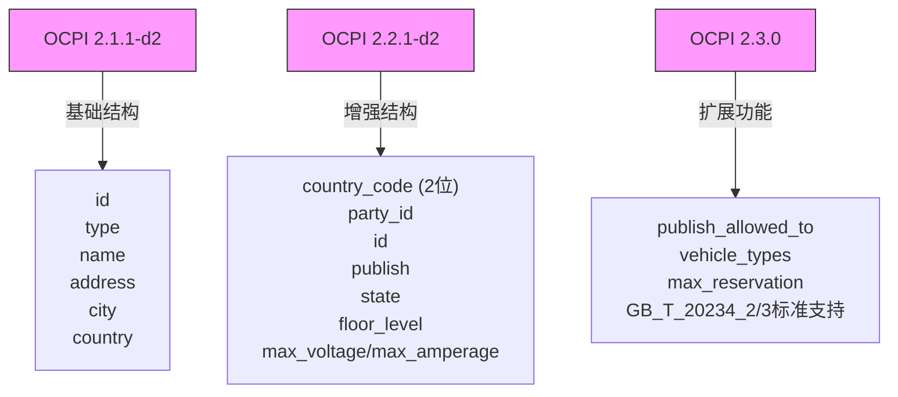
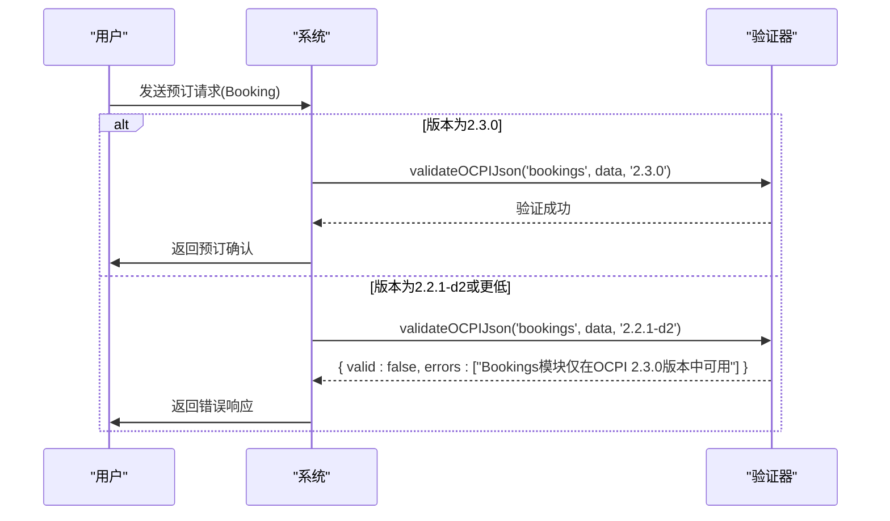
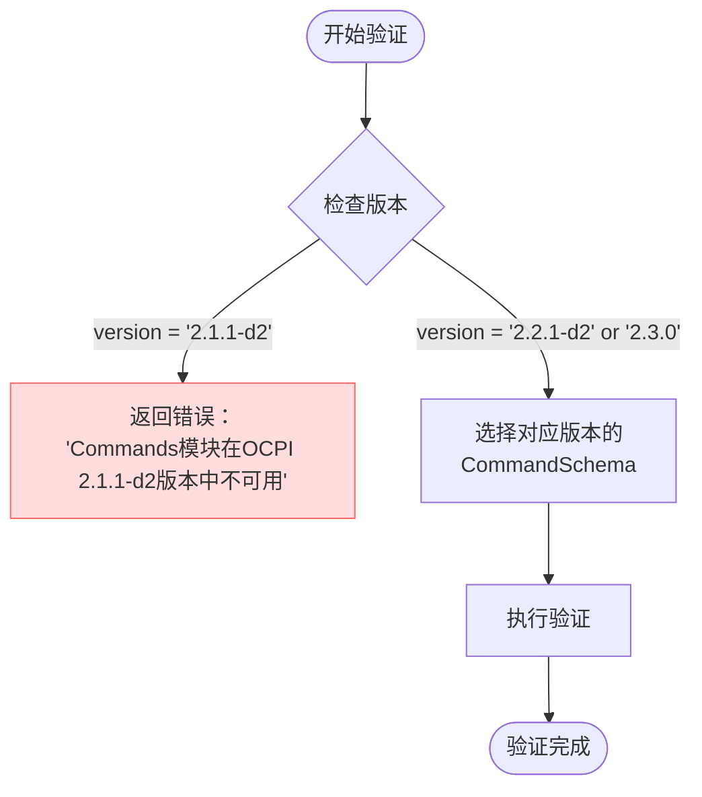
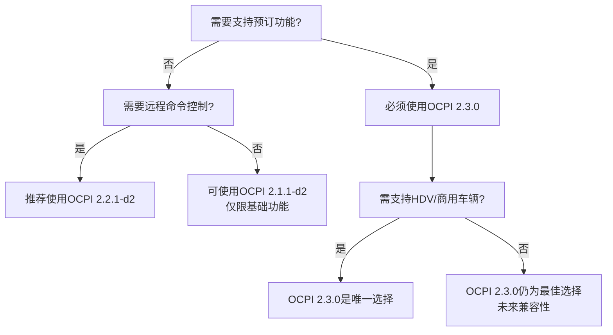

# 支持的OCPI版本

<cite>
**本文档引用文件**  
- [ocpi-validators.js](file://src/ocpi-validators.js)
- [sample-data.js](file://src/sample-data.js)
- [USAGE_GUIDE.md](file://USAGE_GUIDE.md)
</cite>

## 目录
1. [简介](#简介)
2. [核心数据结构演进](#核心数据结构演进)
3. [模块可用性分析](#模块可用性分析)
4. [验证规则差异对比](#验证规则差异对比)
5. [Commands命令集兼容性](#commands命令集兼容性)
6. [版本选择建议](#版本选择建议)

## 简介
本技术文档深入分析OCPI协议三个关键版本（2.1.1-d2、2.2.1-d2和2.3.0）在数据结构、字段要求和验证规则方面的具体差异。基于`ocpi-validators.js`中的Zod模式定义，详细阐述了各版本间的演进变化，解释了特定模块（如Bookings）的版本限制原因，并提供了Commands命令集的兼容性处理策略。为开发者提供清晰的版本选择指导，帮助其根据目标部署环境确定合适的验证标准。

**Section sources**
- [ocpi-validators.js](file://src/ocpi-validators.js#L1-L50)
- [USAGE_GUIDE.md](file://USAGE_GUIDE.md#L1-L20)

## 核心数据结构演进
OCPI协议的核心数据结构在不同版本中经历了显著的演进，主要体现在Location和Session等关键对象上。

### Location结构演进
Location结构从2.1.1-d2到2.3.0版本发生了根本性变化，引入了更严格的标识符和丰富的功能。



**Diagram sources**
- [ocpi-validators.js](file://src/ocpi-validators.js#L43-L154)
- [ocpi-validators.js](file://src/ocpi-validators.js#L297-L418)
- [ocpi-validators.js](file://src/ocpi-validators.js#L421-L553)

#### 关键变化点
- **标识符体系**：2.1.1-d2仅使用`id`，而2.2.1-d2及更高版本引入了`country_code`（2位）和`party_id`作为全局唯一标识的基础。
- **发布控制**：2.3.0版本新增`publish_allowed_to`字段，允许指定哪些用户或设备组可以访问该位置信息。
- **车辆支持**：2.3.0版本在Location和EVSE级别都增加了`vehicle_types`数组，明确支持的车辆类型（CAR, BIKE, TRUCK, BUS, HDV）。
- **连接器能力**：2.2.1-d2将`voltage`和`amperage`升级为`max_voltage`和`max_amperage`，并新增`max_electric_power`以支持大功率充电场景。

**Section sources**
- [ocpi-validators.js](file://src/ocpi-validators.js#L43-L553)

### Session结构演进
Session结构的演进反映了计费精度和智能充电需求的增长。

```mermaid
classDiagram
class Session_211 {
+string id
+string start_date_time
+string end_date_time
+number kwh
+string auth_id
+enum auth_method[AUTH_REQUEST, WHITELIST]
+object location
+number total_cost
}
class Session_221 {
+string country_code
+string party_id
+string id
+string start_date_time
+string end_date_time
+number kwh
+object cdr_token
+enum auth_method[AUTH_REQUEST, COMMAND, WHITELIST]
+string authorization_reference
+string location_id
+object total_cost{excl_vat, incl_vat}
}
class Session_230 {
+string country_code
+string party_id
+string id
+string start_date_time
+string end_date_time
+number kwh
+object cdr_token
+enum auth_method[AUTH_REQUEST, COMMAND, WHITELIST]
+string authorization_reference
+string location_id
+object total_cost{excl_vat, incl_vat}
+enum vehicle_type[CAR, BIKE, TRUCK, BUS, HDV]
+object vehicle_info
+object charging_preferences
}
Session_211 <|-- Session_221 : "继承并扩展"
Session_221 <|-- Session_230 : "继承并扩展"
```

**Diagram sources**
- [ocpi-validators.js](file://src/ocpi-validators.js#L157-L196)
- [ocpi-validators.js](file://src/ocpi-validators.js#L556-L585)
- [ocpi-validators.js](file://src/ocpi-validators.js#L588-L636)

#### 关键变化点
- **认证方式**：2.2.1-d2引入了`COMMAND`认证方法，支持通过远程命令启动会话。
- **成本结构**：2.1.1-d2的`total_cost`是简单数值，而2.2.1-d2及以上版本将其拆分为`excl_vat`和`incl_vat`对象，支持增值税计算。
- **车辆信息**：2.3.0版本新增`vehicle_type`和`vehicle_info`对象，包含车牌、品牌、型号和最大充电功率。
- **充电偏好**：2.3.0版本引入`charging_preferences`，支持设置离场时间、所需电量和是否允许放电。

**Section sources**
- [ocpi-validators.js](file://src/ocpi-validators.js#L157-L636)

## 模块可用性分析
不同OCPI版本对模块的支持存在明显差异，这直接影响了系统的功能范围。

### 模块支持矩阵
| 模块 | OCPI 2.1.1-d2 | OCPI 2.2.1-d2 | OCPI 2.3.0 |
| :--- | :---: | :---: | :---: |
| Locations | ✓ | ✓ | ✓ |
| Sessions | ✓ | ✓ | ✓ |
| CDRs | ✓ | ✓ | ✓ |
| Tokens | ✓ | ✓ | ✓ |
| Tariffs | ✓ | ✓ | ✓ |
| Commands | ✗ | ✓ | ✓ |
| Bookings | ✗ | ✗ | ✓ |

**Section sources**
- [ocpi-validators.js](file://src/ocpi-validators.js#L928-L961)

### Bookings模块的版本限制
Bookings模块仅在OCPI 2.3.0版本中可用，这是由其复杂的业务逻辑和数据模型决定的。



**Diagram sources**
- [ocpi-validators.js](file://src/ocpi-validators.js#L705-L746)
- [ocpi-validators.js](file://src/ocpi-validators.js#L949-L961)

**Section sources**
- [ocpi-validators.js](file://src/ocpi-validators.js#L705-L746)

## 验证规则差异对比
各版本在验证规则上的差异主要体现在字段必填性、枚举值范围和数据格式上。

### 字段要求演变
- **2.1.1-d2**: 字段要求相对宽松，例如`location.type`是必需的，但许多现代字段（如`country_code`）不存在。
- **2.2.1-d2**: 引入了更严格的全球标识符要求，`country_code`和`party_id`成为所有核心对象的必需字段。
- **2.3.0**: 进一步增强了数据完整性，例如`publish_allowed_to`虽然可选，但若存在则其内部字段必须完整。

### 枚举值扩展
- **Connector Standard**: 2.3.0版本在原有基础上增加了`GB_T_20234_2`和`GB_T_20234_3`，以支持中国国家标准的充电接口。
- **Auth Method**: 2.2.1-d2将`auth_method`从`['AUTH_REQUEST', 'WHITELIST']`扩展为`['AUTH_REQUEST', 'COMMAND', 'WHITELIST']`，支持命令式认证。

### 数据格式强化
- **日期时间**：所有版本均使用`z.string().datetime()`，确保ISO 8601格式。
- **地理坐标**：所有版本均使用正则表达式`/^-?[0-9]{1,2}\.[0-9]{5,7}$/`，强制要求高精度（5-7位小数）的经纬度。

**Section sources**
- [ocpi-validators.js](file://src/ocpi-validators.js#L1-L1006)

## Commands命令集兼容性
Commands命令集的处理策略体现了向后兼容的设计思想。

### 兼容性处理流程


**Diagram sources**
- [ocpi-validators.js](file://src/ocpi-validators.js#L876-L925)
- [ocpi-validators.js](file://src/ocpi-validators.js#L936-L947)

### 命令集实现
所有版本的Commands命令集（START_SESSION, STOP_SESSION等）共享相同的模式定义，确保了跨版本的语义一致性。这些模式在`ModuleValidators_221`和`ModuleValidators_230`中被引用，但在`ModuleValidators_211`中完全缺失。

**Section sources**
- [ocpi-validators.js](file://src/ocpi-validators.js#L876-L925)

## 版本选择建议
根据不同的应用场景，推荐以下版本选择策略：

### 推荐决策树


### 详细建议
- **新项目开发**：强烈建议直接采用**OCPI 2.3.0**。它包含了最完整的功能集，支持智能充电、车辆识别和高级预订，具有最佳的未来兼容性。
- **现有系统集成**：如果对方系统仅支持2.2.1-d2，则使用该版本。它在功能和普及度之间取得了良好平衡，支持Commands但不强制要求Bookings。
- **遗留系统对接**：仅在必须与非常旧的系统对接时才考虑2.1.1-d2。此版本缺乏现代功能，且可能在未来被淘汰。

**Section sources**
- [ocpi-validators.js](file://src/ocpi-validators.js#L968-L1004)
- [USAGE_GUIDE.md](file://USAGE_GUIDE.md#L1-L231)