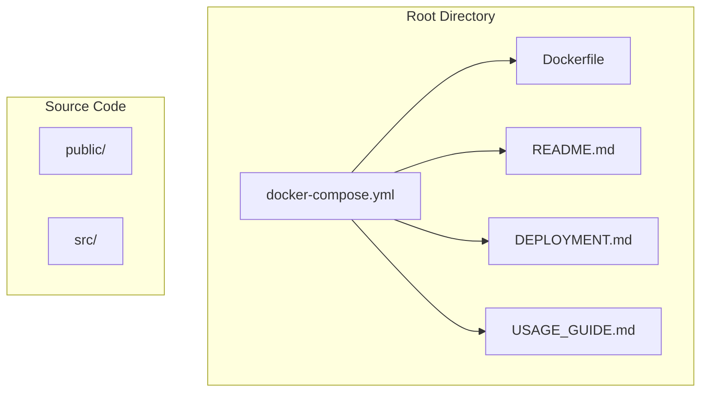
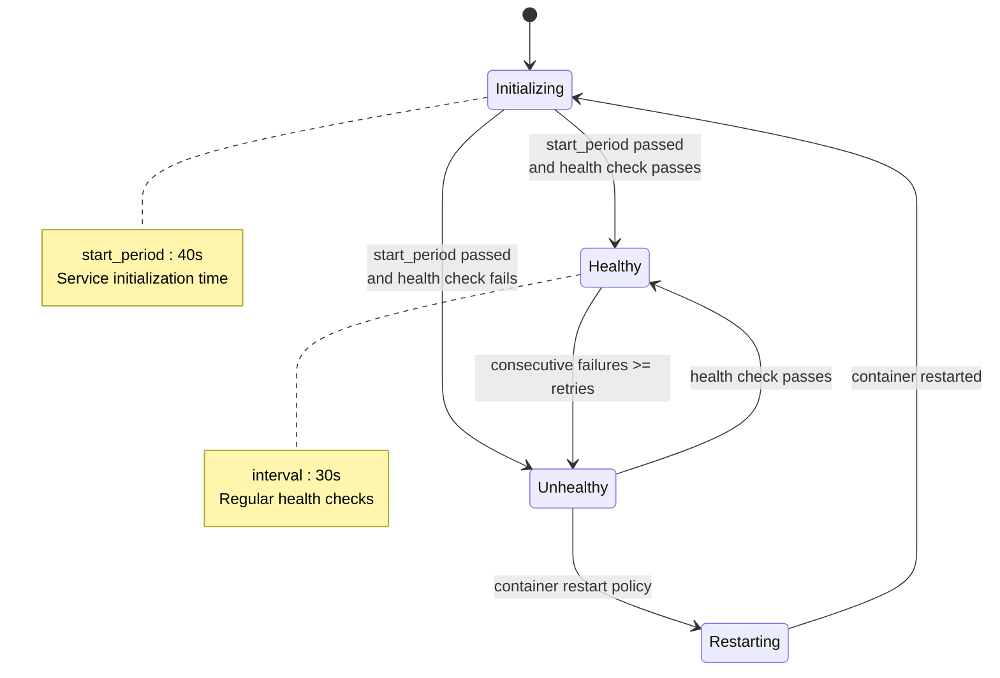
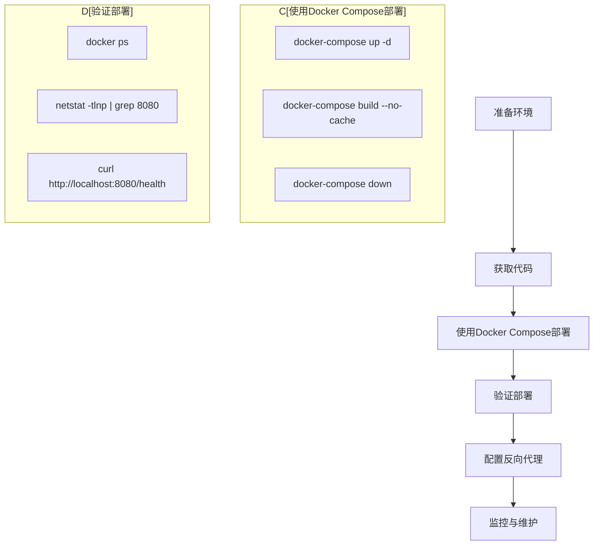

# Docker Compose编排

<cite>
**Referenced Files in This Document**   
- [docker-compose.yml](file://docker-compose.yml)
- [DEPLOYMENT.md](file://DEPLOYMENT.md)
- [README.md](file://README.md)
- [USAGE_GUIDE.md](file://USAGE_GUIDE.md)
</cite>

## 目录
1. [简介](#简介)
2. [项目结构](#项目结构)
3. [Docker Compose版本兼容性](#docker-compose版本兼容性)
4. [ocpi-validator服务配置详解](#ocpi-validator服务配置详解)
5. [健康检查机制解析](#健康检查机制解析)
6. [Traefik反向代理集成](#traefik反向代理集成)
7. [部署流程与最佳实践](#部署流程与最佳实践)
8. [故障排除指南](#故障排除指南)
9. [结论](#结论)

## 简介
本文档详细说明了基于`docker-compose.yml`文件的Docker Compose服务编排方案，重点解析ocpi-validator服务的各项配置。文档涵盖了version: '3.8'的兼容性要求、端口映射、重启策略、环境变量设置、健康检查机制以及Traefik反向代理集成等核心内容，并提供了完整的部署操作流程和最佳实践。

## 项目结构
本项目采用标准的React应用结构，结合Docker容器化部署方案。核心目录包括：
- `public/`: 静态资源文件
- `src/`: 源代码目录
- 根目录包含Docker相关配置文件和文档

关键配置文件位于根目录，包括`docker-compose.yml`、`Dockerfile`以及各类说明文档。



**Diagram sources**
- [docker-compose.yml](file://docker-compose.yml#L1-L25)

## Docker Compose版本兼容性
`docker-compose.yml`文件中指定的`version: '3.8'`具有重要的兼容性意义：

- **Docker Engine兼容性**：需要Docker Engine 19.03.0及以上版本
- **Compose文件格式特性**：支持3.x系列的所有功能，包括网络、卷、部署约束等高级特性
- **向后兼容性**：与Docker Swarm模式完全兼容，可无缝迁移至Swarm集群
- **稳定性保证**：'3.8'是3.x系列的稳定版本，经过充分测试和验证

该版本选择确保了配置的现代性和稳定性，同时保持了良好的向后兼容性。

**Section sources**
- [docker-compose.yml](file://docker-compose.yml#L1)

## ocpi-validator服务配置详解
ocpi-validator服务在`docker-compose.yml`中进行了全面配置，各参数具有明确的功能定位。

### 基本配置
服务通过`build: .`指令从当前目录的Dockerfile构建镜像，确保使用最新的代码进行部署。

### 容器命名
`container_name: ocpi-validator`指定了容器的名称，便于后续管理命令的执行，如日志查看、启动停止等操作。

### 端口映射
`ports: - "8080:8080"`实现了主机与容器之间的端口映射：
- 主机端口8080映射到容器内部8080端口
- 允许外部通过`http://your-vm-ip:8080`访问应用
- 当主机nginx已占用80端口时，此配置提供替代访问方案

### 重启策略
`restart: unless-stopped`策略确保：
- 容器意外退出时自动重启
- 只有当容器被明确停止时才不会自动重启
- 提高服务的可用性和稳定性

### 环境变量
`environment: - NODE_ENV=production`设置：
- 将Node.js运行环境设为生产模式
- 启用生产环境优化（如代码压缩、错误隐藏等）
- 禁用开发模式下的调试功能

**Section sources**
- [docker-compose.yml](file://docker-compose.yml#L4-L14)

## 健康检查机制解析
健康检查配置是确保服务可靠性的关键组件，各项参数协同工作以准确判断服务状态。



**Diagram sources**
- [docker-compose.yml](file://docker-compose.yml#L15-L21)

### 健康检查参数详解
#### test
`test: ["CMD", "curl", "-f", "http://localhost:8080/health"]`
- 使用curl命令检测本地健康端点
- `-f`标志确保HTTP错误码返回非零退出码
- 直接验证应用内部可达性

#### interval
`interval: 30s`
- 健康检查的执行间隔为30秒
- 平衡检测频率与系统负载
- 避免过于频繁的检查影响性能

#### timeout
`timeout: 10s`
- 单次健康检查的超时时间为10秒
- 防止检查过程无限等待
- 快速识别响应缓慢的服务实例

#### retries
`retries: 3`
- 连续3次检查失败才判定为不健康
- 避免临时网络波动导致误判
- 提供适当的容错能力

#### start_period
`start_period: 40s`
- 容器启动后的初始化宽限期为40秒
- 允许应用充分初始化
- 防止在应用尚未准备好时进行健康检查

这些参数共同构成了一个稳健的健康检查机制，既能及时发现故障，又能避免误报。

**Section sources**
- [docker-compose.yml](file://docker-compose.yml#L15-L21)

## Traefik反向代理集成
通过labels配置实现了与Traefik反向代理的无缝集成，提供了现代化的服务暴露方案。

### 集成配置
```yaml
labels:
  - "traefik.enable=true"
  - "traefik.http.routers.ocpi-validator.rule=Host(`ocpi-validator.localhost`)"
  - "traefik.http.services.ocpi-validator.loadbalancer.server.port=8080"
```

### 配置项解析
#### traefik.enable
`traefik.enable=true`
- 显式启用Traefik对当前服务的管理
- 覆盖可能存在的全局禁用设置
- 确保服务被正确发现和路由

#### 路由规则
`traefik.http.routers.ocpi-validator.rule=Host(`ocpi-validator.localhost`)`
- 基于主机名的路由规则
- 将ocpi-validator.localhost的请求路由到此服务
- 支持虚拟主机部署，允许多个服务共享同一IP地址

#### 负载均衡端口
`traefik.http.services.ocpi-validator.loadbalancer.server.port=8080`
- 明确指定容器内部的服务端口
- 确保Traefik将流量正确转发到8080端口
- 避免端口探测错误

这种集成方式提供了灵活的路由能力和现代化的边缘网关功能，优于传统的直接端口暴露。

**Section sources**
- [docker-compose.yml](file://docker-compose.yml#L22-L24)

## 部署流程与最佳实践
基于`DEPLOYMENT.md`文档，以下是推荐的部署流程和最佳实践。

### 推荐部署流程


**Diagram sources**
- [DEPLOYMENT.md](file://DEPLOYMENT.md#L12-L18)

### 完整操作流程
1. **基础部署**
   ```bash
   docker-compose up -d
   ```
   - 在后台启动所有服务
   - 自动构建镜像（如果不存在）
   - 创建必要的网络和卷

2. **更新部署**
   ```bash
   docker-compose down
   docker-compose build --no-cache
   docker-compose up -d
   ```
   - 停止并移除现有容器
   - 重新构建镜像，忽略缓存确保最新代码
   - 重新启动服务

3. **状态验证**
   ```bash
   docker ps
   curl http://localhost:8080/health
   ```

### 最佳实践
#### 构建优化
- 使用`.dockerignore`文件排除不必要的文件
- 分层构建减少重建时间
- 多阶段构建减小最终镜像大小

#### 安全考虑
- 容器以非root用户运行
- 仅暴露必要端口
- 配置适当的安全头信息

#### 监控与日志
- 定期检查容器日志
- 实施集中式日志收集
- 设置健康检查告警

#### 性能优化
- 合理设置健康检查参数
- 监控容器资源使用情况
- 根据负载调整重启策略

**Section sources**
- [DEPLOYMENT.md](file://DEPLOYMENT.md#L12-L93)

## 故障排除指南
根据`DEPLOYMENT.md`中的故障排除建议，常见问题及解决方案如下：

### 常见问题
#### 端口冲突
**症状**：容器无法启动，提示端口已被占用  
**解决方案**：
- 修改`docker-compose.yml`中的端口映射，如`"8081:8080"`
- 停止占用8080端口的其他进程

#### 容器无法启动
**症状**：容器立即退出或处于重启循环  
**解决方案**：
- 查看日志：`docker logs ocpi-validator`
- 检查依赖服务是否正常运行
- 验证Dockerfile构建过程

#### 应用无法访问
**症状**：无法通过浏览器或curl访问应用  
**解决方案**：
- 确认容器正在运行：`docker ps`
- 验证端口是否开放：`netstat -tlnp | grep 8080`
- 检查防火墙设置

#### 健康检查失败
**症状**：容器状态显示为unhealthy  
**解决方案**：
- 检查应用是否在容器内正常运行
- 验证健康端点`/health`是否返回正确响应
- 调整`start_period`以适应较长的初始化时间

**Section sources**
- [DEPLOYMENT.md](file://DEPLOYMENT.md#L85-L93)

## 结论
本文档全面解析了ocpi-validator服务的Docker Compose编排配置，从版本兼容性到具体参数设置，再到部署流程和故障排除，提供了完整的实践指导。通过合理配置健康检查、Traefik集成和重启策略，确保了服务的高可用性和易维护性。推荐使用`docker-compose up -d`进行部署，并遵循文档中的最佳实践，以实现稳定可靠的生产环境部署。