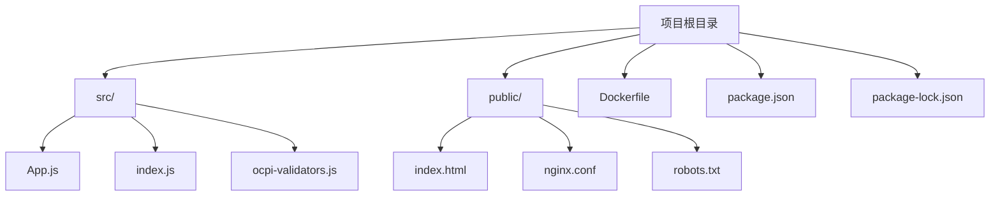
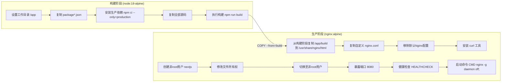
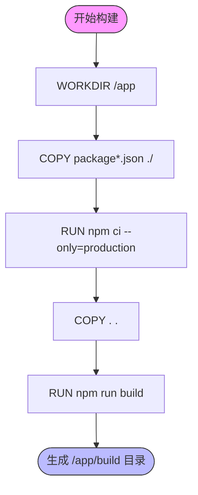
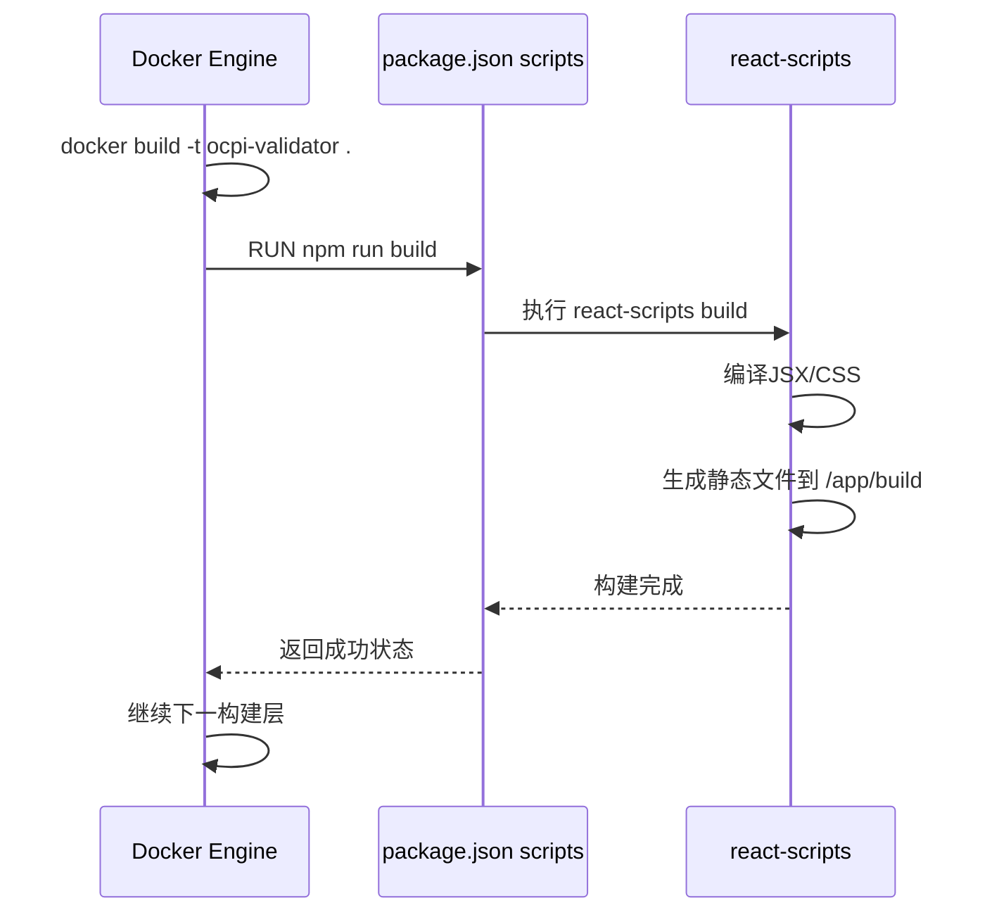
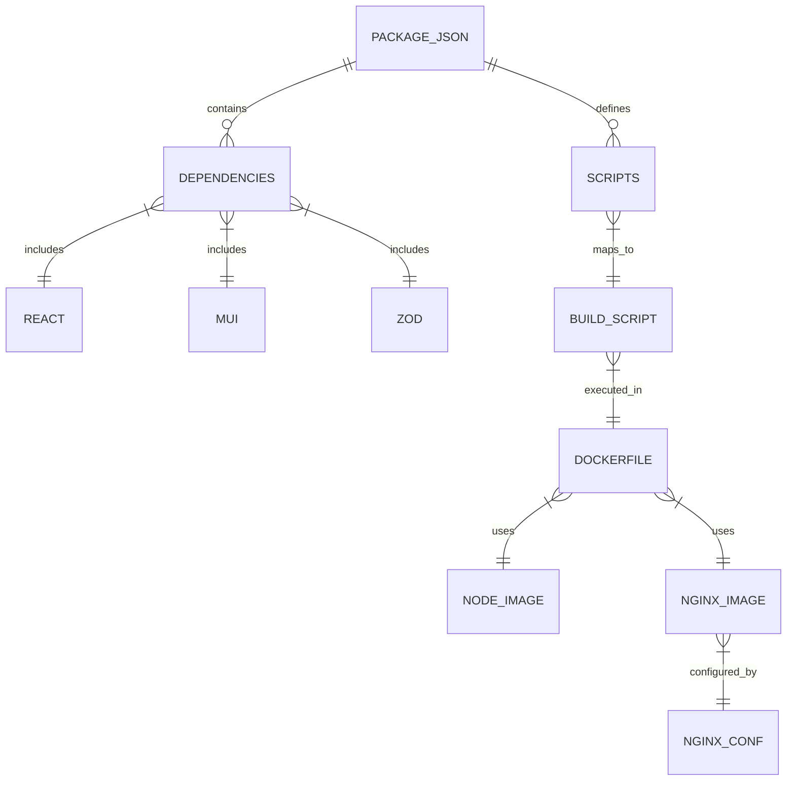

# Docker镜像构建

<cite>
**本文档引用文件**  
- [Dockerfile](file://Dockerfile)
- [package.json](file://package.json)
- [public/nginx.conf](file://public/nginx.conf)
</cite>

## 目录
1. [简介](#简介)
2. [项目结构](#项目结构)
3. [核心组件](#核心组件)
4. [架构概述](#架构概述)
5. [详细组件分析](#详细组件分析)
6. [依赖分析](#依赖分析)
7. [性能考虑](#性能考虑)
8. [故障排除指南](#故障排除指南)
9. [结论](#结论)

## 简介

本文档详细说明了`test-ocpi`项目的Docker多阶段镜像构建流程。该构建过程采用最佳实践，通过分离构建与运行环境来优化镜像大小、安全性和构建效率。文档将深入解析Dockerfile的每一层指令，解释其作用和设计原理，并结合package.json中的脚本定义说明完整的构建链条。

## 项目结构

该项目是一个基于React的前端应用，使用现代JavaScript工具链进行开发和打包。项目结构清晰地划分了源代码、静态资源和配置文件。



**Diagram sources**
- [Dockerfile](file://Dockerfile#L1-L52)
- [package.json](file://package.json#L1-L44)

**Section sources**
- [Dockerfile](file://Dockerfile#L1-L52)
- [package.json](file://package.json#L1-L44)

## 核心组件

本项目的核心构建组件包括：用于应用编译的Node.js基础镜像、Nginx作为生产服务器、以及由npm脚本驱动的构建流程。这些组件协同工作，实现从源码到可部署容器镜像的转换。

**Section sources**
- [Dockerfile](file://Dockerfile#L1-L52)
- [package.json](file://package.json#L1-L44)

## 架构概述

该Docker构建采用了多阶段（multi-stage）架构，有效分离了开发构建环境与生产运行环境。



**Diagram sources**
- [Dockerfile](file://Dockerfile#L1-L52)

## 详细组件分析

### 多阶段构建流程分析

#### 构建阶段（Build Stage）

构建阶段使用`node:18-alpine`作为基础镜像，这是一个轻量级的Node.js运行环境，适合CI/CD和容器化部署。



此阶段的关键优化在于先复制`package*.json`文件再安装依赖，这样可以充分利用Docker的层缓存机制。只有当`package.json`或`package-lock.json`发生变化时，才会重新安装依赖，从而加速后续构建。

**Diagram sources**
- [Dockerfile](file://Dockerfile#L3-L18)
- [package.json](file://package.json#L1-L44)

#### 生产阶段（Production Stage）

生产阶段使用`nginx:alpine`作为基础镜像，仅包含运行Web服务所需的最小组件。

```mermaid
classDiagram
class NginxConfig {
+server_name localhost
+listen 8080
+root /usr/share/nginx/html
+gzip on
+security headers
+location / {try_files}
+location ~* \\.(js|css|png)$ {expires 1y}
+location /health {return 200}
}
class SecuritySetup {
+addgroup nodejs (gid=1001)
+adduser nextjs (uid=1001)
+chown -R nextjs : nodejs directories
+USER nextjs
}
class RuntimeConfig {
+EXPOSE 8080
+HEALTHCHECK curl -f http : //localhost : 8080/health
+CMD ["nginx", "-g", "daemon off;"]
}
NginxConfig --> SecuritySetup : 配置后执行
SecuritySetup --> RuntimeConfig : 设置后启动
```

**Diagram sources**
- [Dockerfile](file://Dockerfile#L21-L52)
- [public/nginx.conf](file://public/nginx.conf#L1-L50)

### 构建脚本与流程集成

构建过程通过`package.json`中的`scripts`字段与Dockerfile紧密集成。



**Diagram sources**
- [Dockerfile](file://Dockerfile#L16)
- [package.json](file://package.json#L15-L18)

**Section sources**
- [Dockerfile](file://Dockerfile#L1-L52)
- [package.json](file://package.json#L1-L44)

## 依赖分析

该项目的依赖关系清晰地分为开发依赖和生产依赖。由于使用了`react-scripts`，大部分构建工具（如Webpack、Babel）已被封装，开发者无需直接管理复杂配置。



**Diagram sources**
- [package.json](file://package.json#L1-L44)
- [Dockerfile](file://Dockerfile#L1-L52)
- [public/nginx.conf](file://public/nginx.conf#L1-L50)

**Section sources**
- [package.json](file://package.json#L1-L44)
- [Dockerfile](file://Dockerfile#L1-L52)

## 性能考虑

### 构建缓存优化

Docker构建缓存策略是提升CI/CD效率的关键。本项目通过以下方式优化缓存：

1. **分层复制策略**：先复制`package*.json`再安装依赖，确保依赖不变时跳过安装步骤
2. **使用npm ci**：相比`npm install`，`npm ci`提供更可预测和更快的安装速度
3. **Alpine镜像**：使用轻量级基础镜像减少下载时间和存储占用

### 运行时性能

Nginx配置中启用了Gzip压缩和静态资源缓存，显著提升前端性能：

- JavaScript、CSS、图片等静态资源设置1年过期时间
- 启用Gzip压缩减少传输体积
- SPA路由支持确保客户端路由正常工作

**Section sources**
- [Dockerfile](file://Dockerfile#L1-L52)
- [public/nginx.conf](file://public/nginx.conf#L1-L50)

## 故障排除指南

### 常见构建问题

- **依赖安装失败**：检查`package-lock.json`是否最新，或尝试清除npm缓存
- **构建脚本未找到**：确认`package.json`中存在`build`脚本
- **权限错误**：确保Docker有足够权限读取项目文件

### 运行时问题

- **页面无法访问**：检查容器是否暴露正确端口（8080）
- **静态资源404**：验证`/app/build`目录是否正确复制到Nginx根目录
- **健康检查失败**：确认`/health`路径在`nginx.conf`中正确定义

**Section sources**
- [Dockerfile](file://Dockerfile#L1-L52)
- [public/nginx.conf](file://public/nginx.conf#L1-L50)

## 结论

本Docker构建方案采用了行业最佳实践，实现了安全、高效、可维护的容器化部署流程。通过多阶段构建，最终镜像仅包含必要的运行时文件，避免了将开发工具和源码暴露在生产环境中。建议的构建命令为：

```bash
docker build -t ocpi-validator .
```

其中标签`ocpi-validator`遵循简洁明了的命名规范，便于识别和管理。整个流程充分考虑了缓存优化、安全性（非root用户运行）和可观测性（健康检查），适合在生产环境中使用。