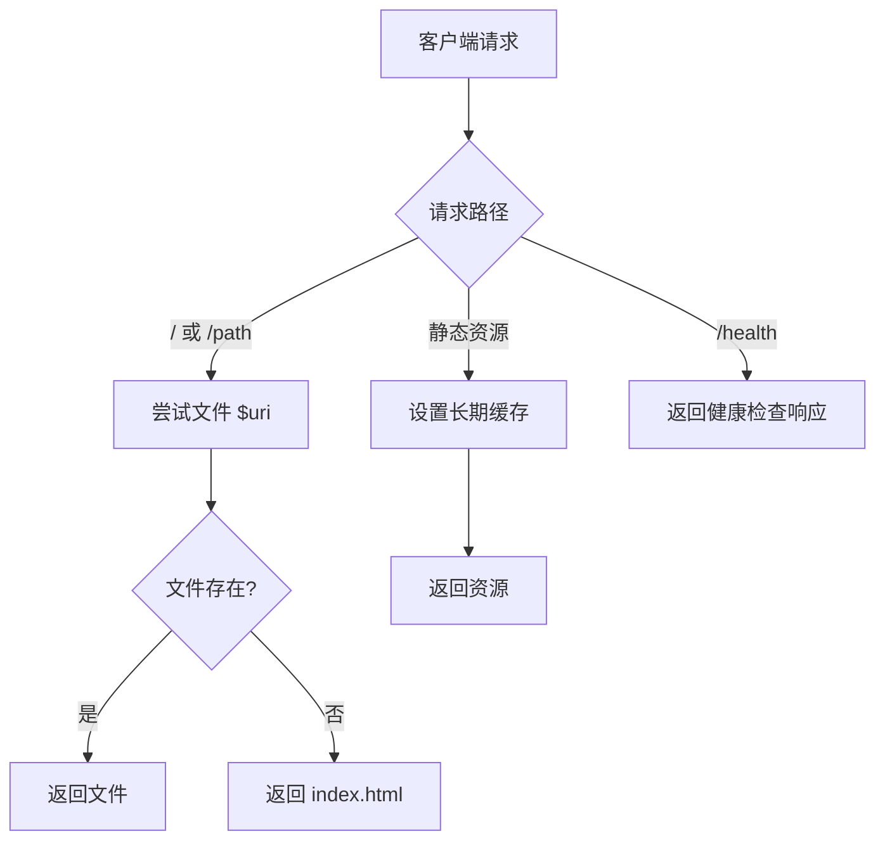
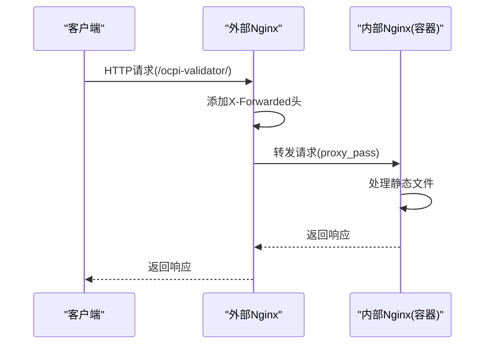

# Nginx反向代理配置

<cite>
**Referenced Files in This Document **  
- [nginx.conf](file://public/nginx.conf)
- [DEPLOYMENT.md](file://DEPLOYMENT.md)
</cite>

## 目录
1. [简介](#简介)
2. [项目结构与部署上下文](#项目结构与部署上下文)
3. [Nginx配置文件详解](#nginx配置文件详解)
4. [核心代理指令分析](#核心代理指令分析)
5. [与现有Nginx服务器集成](#与现有nginx服务器集成)
6. [安全重载配置](#安全重载配置)
7. [故障排除指南](#故障排除指南)

## 简介

本文档深入分析`public/nginx.conf`文件，详细说明如何通过自定义Nginx配置实现对OCPI验证器应用的HTTP服务暴露。文档将解释关键的代理指令及其在代理链中的作用，并提供与现有Nginx服务器集成的具体指导。

## 项目结构与部署上下文

本项目是一个基于React的OCPI JSON验证器应用，通过Docker容器化部署。Nginx作为前端服务器，负责静态资源服务和反向代理功能。应用默认监听8080端口，可通过Docker或Docker Compose运行。

**Section sources**
- [DEPLOYMENT.md](file://DEPLOYMENT.md#L1-L93)

## Nginx配置文件详解

`public/nginx.conf`文件定义了完整的Nginx服务器配置，包括监听端口、根目录、压缩设置、安全头和路由规则。该配置专为单页应用（SPA）优化，支持React Router的客户端路由。

### 服务器基本配置

配置定义了服务器监听8080端口，设置根目录为`/usr/share/nginx/html`，并指定索引文件。Gzip压缩已启用，针对不同类型的响应内容进行优化压缩。

### 安全头配置

配置中包含多项重要的安全头：
- `X-Frame-Options`: 防止点击劫持攻击
- `X-XSS-Protection`: 启用浏览器XSS过滤
- `X-Content-Type-Options`: 阻止MIME类型嗅探
- `Content-Security-Policy`: 定义内容安全策略

这些安全头增强了应用的安全性，防止常见的Web攻击。

### 静态资源缓存

配置通过正则表达式匹配常见的静态资源文件扩展名（js, css, png等），并设置一年的过期时间。这显著提高了性能，减少了重复请求。



**Diagram sources **
- [nginx.conf](file://public/nginx.conf#L1-L50)

**Section sources**
- [nginx.conf](file://public/nginx.conf#L1-L50)

## 核心代理指令分析

虽然当前`nginx.conf`主要用于直接服务静态文件，但其设计为未来API代理预留了扩展能力。理解代理指令对于集成到现有Nginx服务器至关重要。

### proxy_pass指令

`proxy_pass`指令是反向代理的核心，它将客户端请求转发到后端服务器。在集成场景中，它将外部请求映射到本地运行的OCPI验证器容器。

### proxy_set_header指令

此指令用于修改或添加转发到后端的HTTP头，确保后端应用能正确识别原始客户端信息：

#### X-Forwarded-For头

该头记录了请求经过的代理服务器IP地址链，格式为逗号分隔的IP列表。最左边的是最初的客户端IP，后续是各代理服务器的IP。这对于日志记录和访问控制至关重要。

#### X-Forwarded-Proto头

该头指示原始请求使用的协议（http或https）。当Nginx作为SSL终止点时，后端应用需要此头来生成正确的绝对URL。

#### 其他重要头

- `Host $host`: 保持原始主机头，确保虚拟主机正确工作
- `X-Real-IP $remote_addr`: 传递真实的客户端IP地址
- `Upgrade $http_upgrade`: 支持WebSocket升级



**Diagram sources **
- [DEPLOYMENT.md](file://DEPLOYMENT.md#L50-L70)
- [nginx.conf](file://public/nginx.conf#L1-L50)

**Section sources**
- [DEPLOYMENT.md](file://DEPLOYMENT.md#L50-L70)

## 与现有Nginx服务器集成

要将OCPI验证器集成到现有的Nginx服务器中，需在主Nginx配置中添加特定的location块。

### 集成配置示例

```nginx
location /ocpi-validator/ {
    proxy_pass http://localhost:8080/;
    proxy_http_version 1.1;
    proxy_set_header Upgrade $http_upgrade;
    proxy_set_header Connection 'upgrade';
    proxy_set_header Host $host;
    proxy_set_header X-Real-IP $remote_addr;
    proxy_set_header X-Forwarded-For $proxy_add_x_forwarded_for;
    proxy_set_header X-Forwarded-Proto $scheme;
    proxy_cache_bypass $http_upgrade;
}
```

### 配置要点说明

1. **路径映射**: 使用`/ocpi-validator/`作为子路径，避免与其他服务冲突
2. **协议版本**: 指定HTTP/1.1以支持WebSocket
3. **连接升级**: 正确处理WebSocket连接升级
4. **头信息传递**: 确保所有必要的代理头都被正确设置

集成后，应用可通过`http://your-vm-ip/ocpi-validator/`访问。

**Section sources**
- [DEPLOYMENT.md](file://DEPLOYMENT.md#L50-L70)

## 安全重载配置

修改Nginx配置后，必须安全地重新加载配置以避免服务中断。

### 重载命令

```bash
sudo nginx -t && sudo systemctl reload nginx
```

### 命令执行流程

1. `nginx -t`: 测试配置文件语法正确性
   - 如果语法错误，命令失败，不会继续执行
   - 如果语法正确，返回成功状态码

2. `systemctl reload nginx`: 重新加载配置
   - 发送SIGHUP信号给Nginx主进程
   - 主进程启动新工作进程使用新配置
   - 旧工作进程处理完现有连接后自动退出
   - 实现零停机时间的配置更新

### 最佳实践

- 始终先测试配置再重载
- 在低峰时段进行配置变更
- 监控重载后的服务状态
- 准备回滚计划

**Section sources**
- [DEPLOYMENT.md](file://DEPLOYMENT.md#L68-L70)

## 故障排除指南

### 常见问题及解决方案

#### 端口冲突
如果8080端口已被占用，可在`docker-compose.yml`中修改端口映射，如使用`"8081:8080"`。

#### 容器无法启动
检查容器日志：`docker logs ocpi-validator`
验证容器内Nginx配置：`docker exec ocpi-validator nginx -t`

#### 应用无法访问
确认容器正在运行：`docker ps`
检查端口是否开放：`netstat -tlnp | grep 8080`
验证Nginx配置语法：`sudo nginx -t`

#### 代理配置问题
确保所有`proxy_set_header`指令正确设置
检查`proxy_pass`目标地址可达性
验证路径重写规则是否正确

**Section sources**
- [DEPLOYMENT.md](file://DEPLOYMENT.md#L85-L93)