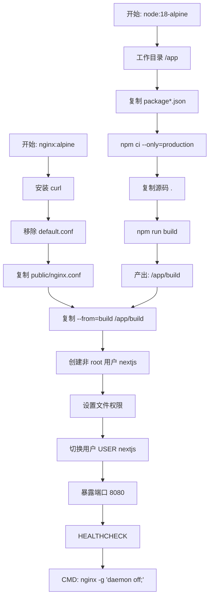
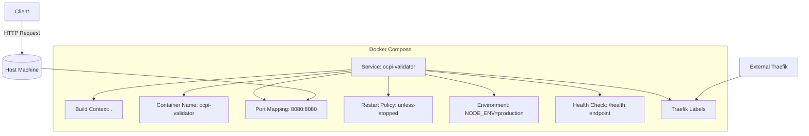

# 部署指南

<cite>
**本文档引用文件**  
- [DEPLOYMENT.md](file://DEPLOYMENT.md)
- [Dockerfile](file://Dockerfile)
- [docker-compose.yml](file://docker-compose.yml)
- [public/nginx.conf](file://public/nginx.conf)
</cite>

## 目录
1. [简介](#简介)
2. [项目结构](#项目结构)
3. [核心部署组件](#核心部署组件)
4. [多阶段构建详解](#多阶段构建详解)
5. [Docker Compose 服务编排](#docker-compose-服务编排)
6. [Nginx 反向代理配置](#nginx-反向代理配置)
7. [生产环境最佳实践](#生产环境最佳实践)
8. [性能优化建议](#性能优化建议)
9. [运维管理命令](#运维管理命令)
10. [安全与故障排查](#安全与故障排查)

## 简介

本部署文档详细说明了如何将 OCPI Validator 应用程序容器化并部署到生产环境。文档基于 `DEPLOYMENT.md` 中的操作步骤，深入解析了使用根目录 `Dockerfile` 构建镜像、通过 `docker-compose.yml` 编排服务以及 `nginx.conf` 在反向代理中的作用。同时提供了端口映射、卷挂载、资源限制等生产环境部署的最佳实践，并阐述了多阶段构建的优势和性能优化策略。

## 项目结构

以下是项目的整体目录结构：

```
.
├── public
│   ├── Dockerfile
│   ├── index.html
│   ├── manifest.json
│   ├── nginx.conf
│   └── robots.txt
├── src
│   ├── App.css
│   ├── App.js
│   ├── index.css
│   ├── index.js
│   ├── ocpi-validators.js
│   ├── sample-data.js
│   └── setupTests.js
├── DEPLOYMENT.md
├── Dockerfile
├── README.md
├── USAGE_GUIDE.md
├── docker-compose.yml
├── package-lock.json
└── package.json
```

该结构表明这是一个基于 Node.js 和 React 的前端应用，其部署依赖于 Docker 容器化技术。

**Section sources**
- [DEPLOYMENT.md](file://DEPLOYMENT.md#L1-L93)
- [Dockerfile](file://Dockerfile#L1-L52)
- [docker-compose.yml](file://docker-compose.yml#L1-L24)
- [public/nginx.conf](file://public/nginx.conf#L1-L49)

## 核心部署组件

OCPI Validator 的部署由三个核心文件构成：`Dockerfile` 负责定义镜像构建过程；`docker-compose.yml` 用于服务编排和运行时配置；`public/nginx.conf` 提供 Nginx 服务器的定制化配置，包括安全头、静态资源缓存和健康检查。

**Section sources**
- [Dockerfile](file://Dockerfile#L1-L52)
- [docker-compose.yml](file://docker-compose.yml#L1-L24)
- [public/nginx.conf](file://public/nginx.conf#L1-L49)

## 多阶段构建详解

`Dockerfile` 采用多阶段构建（multi-stage build）策略，分为两个主要阶段：

1. **构建阶段（Build Stage）**：
   - 基于 `node:18-alpine` 镜像，安装生产依赖并执行 `npm run build` 生成静态资源。
   - 此阶段专注于编译和打包，不包含运行时所需的 Web 服务器。

2. **生产阶段（Production Stage）**：
   - 使用轻量级 `nginx:alpine` 镜像作为基础。
   - 将上一阶段生成的 `/app/build` 目录复制到 Nginx 的默认 HTML 目录 `/usr/share/nginx/html`。
   - 应用自定义的 `nginx.conf` 配置文件，移除默认配置以避免冲突。
   - 创建非 root 用户 `nextjs` 并设置相应权限，提升安全性。
   - 暴露端口 8080 并配置健康检查命令，确保容器状态可监控。

多阶段构建的优势在于显著减小最终镜像体积，仅包含运行所需文件，提高安全性和部署效率。



**Diagram sources**
- [Dockerfile](file://Dockerfile#L1-L52)

**Section sources**
- [Dockerfile](file://Dockerfile#L1-L52)

## Docker Compose 服务编排

`docker-compose.yml` 文件定义了服务的运行时配置，实现了声明式的容器编排。

### 服务配置说明

| 配置项 | 值 | 说明 |
|--------|----|------|
| `build` | `.` | 指定构建上下文为当前目录，使用根目录 Dockerfile |
| `container_name` | `ocpi-validator` | 指定容器名称 |
| `ports` | `"8080:8080"` | 将主机 8080 端口映射到容器 8080 端口 |
| `restart` | `unless-stopped` | 容器自动重启策略 |
| `environment.NODE_ENV` | `production` | 设置生产环境变量 |
| `healthcheck.test` | `curl -f http://localhost:8080/health` | 自定义健康检查命令 |
| `labels` | Traefik 配置 | 支持与 Traefik 反向代理集成 |

该配置确保了服务的高可用性、可监控性和可扩展性。



**Diagram sources**
- [docker-compose.yml](file://docker-compose.yml#L1-L24)

**Section sources**
- [docker-compose.yml](file://docker-compose.yml#L1-L24)

## Nginx 反向代理配置

`public/nginx.conf` 是 Nginx 的核心配置文件，部署时会被复制到容器内的 `/etc/nginx/conf.d/` 目录。

### 主要功能模块

1. **监听配置**：
   - 监听 IPv4 和 IPv6 的 8080 端口，避免与主机 80 端口冲突。

2. **Gzip 压缩**：
   - 启用 Gzip 压缩，对 JSON、JS、CSS 等文本类型进行压缩，减少传输体积。

3. **安全头设置**：
   - 配置 `X-Frame-Options`, `X-XSS-Protection`, `Content-Security-Policy` 等安全头，增强应用安全性。

4. **单页应用（SPA）路由支持**：
   - 使用 `try_files $uri $uri/ /index.html;` 实现 React Router 的客户端路由。

5. **静态资源缓存**：
   - 对 JS、CSS、图片等静态资源设置一年过期时间，并标记为不可变，极大提升加载性能。

6. **健康检查端点**：
   - `/health` 路径返回纯文本 "healthy"，供 Docker 和外部系统进行健康检查。

```mermaid
flowchart LR
A["请求到达 Nginx"] --> B{路径匹配}
B --> |/health| C["返回 200 healthy"]
B --> |/.(js\|css\|png...)$| D["设置缓存头 Expires: 1y"]
B --> |/api/| E["代理到后端服务 (预留)"]
B --> |其他路径| F["try_files $uri $uri/ /index.html"]
style C fill:#d4edda,stroke:#c3e6cb
style D fill:#d1ecf1,stroke:#bee5eb
style F fill:#fff3cd,stroke:#ffeaa7
```

**Diagram sources**
- [public/nginx.conf](file://public/nginx.conf#L1-L49)

**Section sources**
- [public/nginx.conf](file://public/nginx.conf#L1-L49)

## 生产环境最佳实践

### 端口映射
- 使用非标准端口（如 8080）避免与主机已有服务冲突。
- 可通过修改 `docker-compose.yml` 中的 `ports` 配置灵活调整。

### 卷挂载（Volume Mounts）
- 当前配置未使用卷挂载，所有静态资源在构建时已嵌入镜像。
- 如需动态更新配置或日志持久化，可添加：
  ```yaml
  volumes:
    - ./logs:/var/log/nginx
    - ./config/nginx.conf:/etc/nginx/conf.d/nginx.conf
  ```

### 资源限制
- 建议在 `docker-compose.yml` 中添加资源限制以防止资源耗尽：
  ```yaml
  deploy:
    resources:
      limits:
        cpus: '0.5'
        memory: 512M
  ```

### 重启策略
- `restart: unless-stopped` 确保容器在意外退出时自动重启，但允许手动停止。

**Section sources**
- [docker-compose.yml](file://docker-compose.yml#L1-L24)
- [Dockerfile](file://Dockerfile#L1-L52)

## 性能优化建议

1. **利用浏览器缓存**：
   - `nginx.conf` 已对静态资源设置长期缓存，确保 CDN 或代理层正确传递缓存头。

2. **启用 Gzip 压缩**：
   - 已配置合理的 Gzip 类型和最小长度，平衡压缩率与 CPU 开销。

3. **镜像精简**：
   - 使用 Alpine Linux 基础镜像，大幅减小镜像体积，加快拉取和启动速度。

4. **健康检查优化**：
   - 健康检查间隔合理（30秒），避免过于频繁影响性能。

5. **未来扩展**：
   - 可考虑使用 CDN 托管静态资源，进一步减轻服务器负载。

**Section sources**
- [Dockerfile](file://Dockerfile#L1-L52)
- [public/nginx.conf](file://public/nginx.conf#L1-L49)

## 运维管理命令

### 常用 Docker 命令
```bash
# 查看日志
docker logs ocpi-validator

# 停止容器
docker stop ocpi-validator

# 启动容器
docker start ocpi-validator

# 删除容器
docker rm ocpi-validator
```

### 更新应用流程
```bash
docker-compose down
docker-compose build --no-cache
docker-compose up -d
```

此流程确保每次更新都重新构建镜像，避免缓存导致的问题。

**Section sources**
- [DEPLOYMENT.md](file://DEPLOYMENT.md#L60-L75)

## 安全与故障排查

### 安全措施
- 容器以内置非 root 用户 `nextjs` 运行，降低权限风险。
- Nginx 配置了多项安全头，防范常见 Web 攻击。
- 仅暴露必要端口，遵循最小权限原则。

### 常见问题及解决方案
1. **端口冲突**：
   - 修改 `docker-compose.yml` 中的端口映射，例如 `"8081:8080"`。

2. **容器无法启动**：
   - 检查日志：`docker logs ocpi-validator`
   - 验证 Nginx 配置：`docker exec ocpi-validator nginx -t`

3. **应用无法访问**：
   - 确认容器运行中：`docker ps`
   - 检查主机端口是否开放：`netstat -tlnp | grep 8080`

4. **与现有 Nginx 集成**：
   - 在主机 Nginx 配置中添加反向代理规则，将 `/ocpi-validator/` 路径转发至 `http://localhost:8080/`。

**Section sources**
- [DEPLOYMENT.md](file://DEPLOYMENT.md#L77-L93)
- [Dockerfile](file://Dockerfile#L1-L52)
- [public/nginx.conf](file://public/nginx.conf#L1-L49)