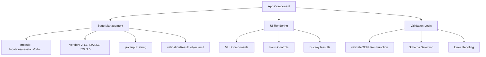
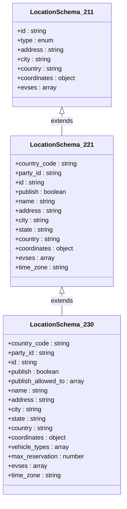
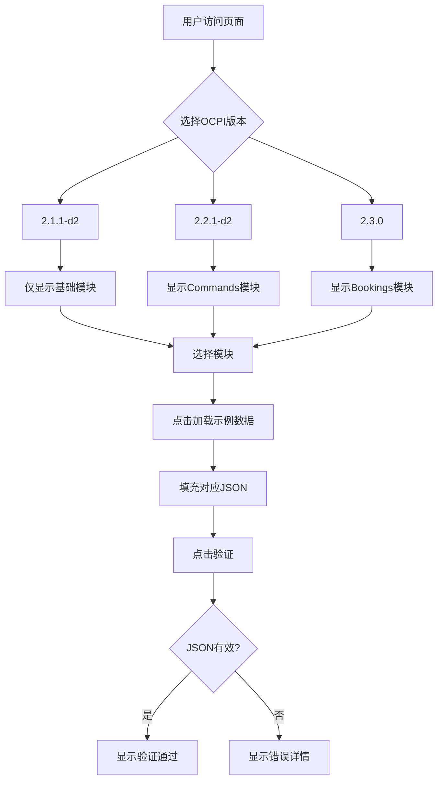
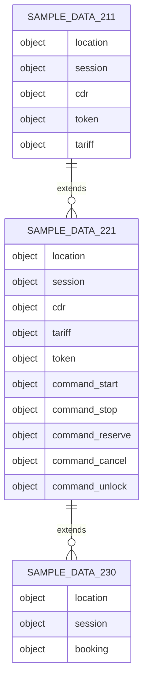

# 项目概述

<cite>
**Referenced Files in This Document**   
- [README.md](file://README.md)
- [package.json](file://package.json)
- [src/App.js](file://src/App.js)
- [src/ocpi-validators.js](file://src/ocpi-validators.js)
- [src/sample-data.js](file://src/sample-data.js)
- [USAGE_GUIDE.md](file://USAGE_GUIDE.md)
</cite>

## 目录
1. [简介](#简介)
2. [项目结构](#项目结构)
3. [核心功能与价值](#核心功能与价值)
4. [技术架构与实现](#技术架构与实现)
5. [版本兼容性分析](#版本兼容性分析)
6. [用户界面与交互设计](#用户界面与交互设计)
7. [验证逻辑与数据管理](#验证逻辑与数据管理)
8. [开发环境搭建](#开发环境搭建)
9. [使用场景与最佳实践](#使用场景与最佳实践)
10. [结论](#结论)

## 简介

`test-ocpi`项目是一个专为电动汽车充电基础设施开发者设计的OCPI协议JSON数据验证工具。该项目基于React框架构建，旨在帮助开发者快速验证其OCPI（开放充电点接口）数据是否符合特定版本的规范要求。通过提供直观的用户界面和强大的验证功能，该工具显著降低了OCPI协议实施的复杂性。

本项目支持多个OCPI协议版本，包括2.1.1-d2、2.2.1-d2和2.3.0，覆盖了从基础模块到高级特性的广泛功能集。对于初学者而言，这是一个学习OCPI数据结构的理想平台；对于高级用户，则提供了精确的验证能力和灵活的测试选项。

**Section sources**
- [README.md](file://README.md#L1-L70)
- [USAGE_GUIDE.md](file://USAGE_GUIDE.md#L1-L230)

## 项目结构

`test-ocpi`项目的文件组织遵循标准的React应用结构，清晰地分离了前端代码、静态资源和配置文件。项目根目录包含关键的配置文件如`package.json`、`Dockerfile`和`README.md`，而源代码则集中存放在`src`目录中。

```
.
├── public                  # 静态资源文件
│   ├── Dockerfile          # Docker构建配置
│   ├── index.html          # 主HTML模板
│   └── ...
├── src                     # 源代码目录
│   ├── App.js              # 主应用程序组件
│   ├── ocpi-validators.js  # OCPI验证逻辑
│   ├── sample-data.js      # 示例数据集合
│   └── ...
├── DEPLOYMENT.md           # 部署指南
├── README.md               # 项目说明文档
├── USAGE_GUIDE.md          # 使用指南
└── package.json            # 项目依赖和脚本配置
```

这种结构化的布局使得新加入的开发者能够快速理解项目架构，并轻松找到相关功能的实现位置。`public`目录存放所有不会被Webpack处理的静态文件，而`src`目录则包含了所有可编译的JavaScript代码。

**Section sources**
- [package.json](file://package.json#L1-L43)
- [src/App.js](file://src/App.js#L1-L317)

## 核心功能与价值

`test-ocpi`项目的核心目的是为电动汽车充电网络的开发者提供一个可靠的OCPI协议数据验证解决方案。其主要价值体现在以下几个方面：

首先，它解决了OCPI协议实施过程中的数据格式一致性问题。通过严格的模式验证，确保生成的JSON数据完全符合官方规范，避免因格式错误导致的系统集成失败。这对于跨运营商的数据交换至关重要。

其次，项目提供了丰富的示例数据，涵盖了Locations、Sessions、CDRs、Tariffs、Tokens等多个核心模块。这些预定义的测试用例不仅展示了正确的数据结构，还作为学习OCPI协议的实用教材。

再者，工具支持多版本验证，允许开发者在不同OCPI版本之间进行平滑过渡。特别是对最新版本2.3.0的支持，包括Bookings模块等新特性，使开发者能够提前适应未来的协议演进。

最后，直观的Web界面大大降低了使用门槛。无需编写任何代码，用户即可完成复杂的验证任务，这对于非技术背景的利益相关者尤其有价值。

**Section sources**
- [README.md](file://README.md#L1-L70)
- [USAGE_GUIDE.md](file://USAGE_GUIDE.md#L1-L230)

## 技术架构与实现

### 前端架构特点

`test-ocpi`项目采用现代React架构，充分利用函数式组件和Hooks API来管理状态和副作用。整个应用围绕`App.js`中的主组件构建，通过`useState` Hook维护模块选择、版本控制、JSON输入和验证结果等核心状态。



**Diagram sources **
- [src/App.js](file://src/App.js#L36-L315)

### 组件交互模式

应用的架构体现了清晰的分层设计：用户界面层负责展示和收集数据，验证逻辑层执行实际的模式检查，而示例数据管理层提供测试素材。这三层通过事件驱动的方式紧密协作。

当用户点击"加载示例数据"按钮时，触发`loadSampleData`函数，该函数根据当前选择的模块和版本动态决定使用哪个数据源。随后，`handleValidate`函数调用验证器对输入的JSON进行检查，并将结果反馈给UI层进行可视化呈现。

这种解耦的设计不仅提高了代码的可维护性，还便于未来扩展新的功能模块或支持更多的OCPI版本。

**Section sources**
- [src/App.js](file://src/App.js#L36-L315)
- [src/ocpi-validators.js](file://src/ocpi-validators.js#L968-L1004)

## 版本兼容性分析

`test-ocpi`项目精心设计以支持多个OCPI协议版本，每个版本都有其独特的数据结构和约束条件。这种多版本支持是通过一组专门的Zod模式实现的，这些模式精确地反映了各个版本的规范要求。

### OCPI 2.1.1-d2 兼容性

这是最基础的版本，支持Locations、Sessions、CDRs、Tokens和Tariffs等核心模块。然而，它不支持Commands和Bookings等高级功能。在实现上，项目使用独立的模式如`LocationSchema_211`和`SessionSchema_211`来确保与旧版规范的一致性。

### OCPI 2.2.1-d2 兼容性

此版本引入了Commands模块，允许远程启动/停止充电会话、预约充电位等操作。相应的，验证器包含了`StartSessionCommandSchema`等一系列命令模式，同时对现有模块进行了增强，例如增加了`country_code`和`party_id`字段。

### OCPI 2.3.0 兼容性

最新版本带来了重大改进，特别是新增的Bookings模块，支持更复杂的预订场景。`BookingSchema_230`模式包含了详细的预订信息，如车辆类型、预计能耗和取消政策。此外，Session模块也得到了增强，加入了车辆信息和充电偏好设置。



**Diagram sources **
- [src/ocpi-validators.js](file://src/ocpi-validators.js#L1-L799)
- [src/ocpi-validators.js](file://src/ocpi-validators.js#L800-L1005)

**Section sources**
- [src/ocpi-validators.js](file://src/ocpi-validators.js#L1-L1005)
- [USAGE_GUIDE.md](file://USAGE_GUIDE.md#L1-L230)

## 用户界面与交互设计

`test-ocpi`的用户界面设计注重用户体验和功能性平衡。基于Material-UI (MUI) 组件库构建，界面呈现出专业且现代化的外观，同时保证了良好的可用性。

### 主要界面元素

1. **版本和模块选择器**：两个下拉菜单分别用于选择OCPI版本和要验证的模块。这种设计允许用户灵活组合不同的测试场景。
2. **操作按钮组**：提供"加载示例数据"、"格式化JSON"、"清空"和"验证"四个核心功能按钮，布局合理，易于操作。
3. **JSON输入区域**：一个大型文本框用于输入或粘贴待验证的JSON数据，支持多行编辑。
4. **验证结果显示区**：使用卡片式布局展示验证结果，成功时显示绿色勾号，失败时列出详细的错误信息。

### 动态交互特性

界面具有智能的动态行为。例如，当选择OCPI 2.1.1-d2版本时，Commands和Bookings模块会自动禁用，因为它们不受该版本支持。同样，"加载示例数据"按钮的状态会根据当前选择的模块是否有可用示例数据而变化。



**Diagram sources **
- [src/App.js](file://src/App.js#L36-L315)

**Section sources**
- [src/App.js](file://src/App.js#L36-L315)
- [USAGE_GUIDE.md](file://USAGE_GUIDE.md#L1-L230)

## 验证逻辑与数据管理

### 验证引擎实现

验证功能的核心是`validateOCPIJson`函数，它采用策略模式根据输入的模块和版本选择合适的验证器。这个函数首先确定使用哪个Zod模式，然后执行安全解析（safeParse），最后返回结构化的验证结果。

```javascript
export const validateOCPIJson = (module, jsonData, version = '2.2.1-d2') => {
    let validator;
    
    // 根据版本选择验证器
    if (version === '2.3.0') {
        validator = ModuleValidators_230[module];
    } else if (version === '2.1.1-d2') {
        validator = ModuleValidators_211[module];
    } else {
        validator = ModuleValidators_221[module];
    }
    
    // 执行验证
    const result = validator.safeParse(jsonData);
    if (!result.success) {
        const errors = result.error.issues.map(issue => 
            `${issue.path.join('.')}: ${issue.message}`
        );
        return { valid: false, errors };
    }
    return { valid: true, data: result.data, version };
};
```

**Section sources**
- [src/ocpi-validators.js](file://src/ocpi-validators.js#L968-L1004)

### 示例数据管理

项目通过`sample-data.js`文件集中管理所有示例数据，按照版本组织成`sampleData_211`、`sampleData_221`和`sampleData_230`三个对象。这种结构化的方法确保了数据的可维护性和一致性。

为了向后兼容，项目还导出了`sampleLocation`、`sampleSession`等别名，这些默认指向2.2.1-d2版本的数据。这种方法既保持了API的稳定性，又支持了新版本的扩展。



**Diagram sources **
- [src/sample-data.js](file://src/sample-data.js#L1-L722)

**Section sources**
- [src/ocpi-validators.js](file://src/ocpi-validators.js#L968-L1004)
- [src/sample-data.js](file://src/sample-data.js#L1-L722)

## 开发环境搭建

### 基础环境要求

要运行`test-ocpi`项目，需要以下基本工具：
- Node.js (建议16.x或更高版本)
- npm 或 yarn 包管理器
- 现代浏览器（Chrome、Firefox、Safari等）

### 启动步骤

1. **克隆仓库**：
   ```bash
   git clone https://github.com/your-repo/test-ocpi.git
   cd test-ocpi
   ```

2. **安装依赖**：
   ```bash
   npm install
   ```

3. **启动开发服务器**：
   ```bash
   npm start
   ```

4. **访问应用**：
   打开浏览器并导航到 `http://localhost:3000`

### 构建生产版本

当需要部署应用时，可以使用以下命令生成优化的生产构建：
```bash
npm run build
```
这将在`build`目录中创建一个最小化的、适合部署的版本。

**Section sources**
- [README.md](file://README.md#L1-L70)
- [package.json](file://package.json#L1-L43)

## 使用场景与最佳实践

### 典型使用场景

1. **数据格式验证**：在开发过程中，开发者可以使用此工具验证他们生成的OCPI JSON数据是否符合规范。通过复制粘贴数据到输入框并点击"验证"，可以立即获得反馈。

2. **示例数据学习**：初学者可以通过加载不同模块的示例数据来学习OCPI的数据结构。这比阅读文档更加直观和高效。

3. **结果分析**：当验证失败时，详细的错误信息可以帮助开发者精确定位问题所在。错误消息通常包含字段路径和具体原因，如"`country_code: 国家代码必须为2位字符`"。

### 最佳实践

- **从示例开始**：建议新用户先加载示例数据，观察正确的数据格式，然后再尝试修改或创建自己的数据。
- **逐步验证**：对于复杂的数据结构，建议先验证基本字段，然后逐步添加更多属性，这样可以更容易发现和修复问题。
- **利用格式化功能**：使用"格式化JSON"按钮可以让凌乱的JSON数据变得整洁易读，有助于人工检查。
- **多版本测试**：如果计划支持多个OCPI版本，应该在每个目标版本上都进行验证测试，确保兼容性。

**Section sources**
- [USAGE_GUIDE.md](file://USAGE_GUIDE.md#L1-L230)
- [src/App.js](file://src/App.js#L36-L315)

## 结论

`test-ocpi`项目成功地将复杂的OCPI协议验证任务简化为一个直观易用的Web工具。通过结合React的现代前端技术和Zod的强大模式验证能力，该项目为电动汽车充电基础设施开发者提供了一个不可或缺的开发辅助工具。

其多版本支持特性使其不仅适用于当前的开发需求，还能帮助团队为未来的协议升级做好准备。清晰的代码结构和详尽的文档使得该项目既适合直接使用，也适合作为学习OCPI协议的参考实现。

随着电动汽车行业的持续发展，像`test-ocpi`这样的工具将在确保不同系统之间的互操作性方面发挥越来越重要的作用。其设计理念——将复杂的技术规范转化为简单易用的界面——值得在其他领域推广应用。