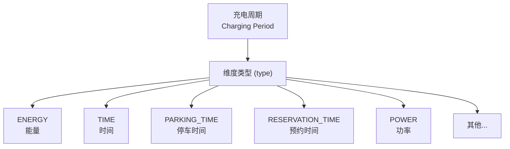
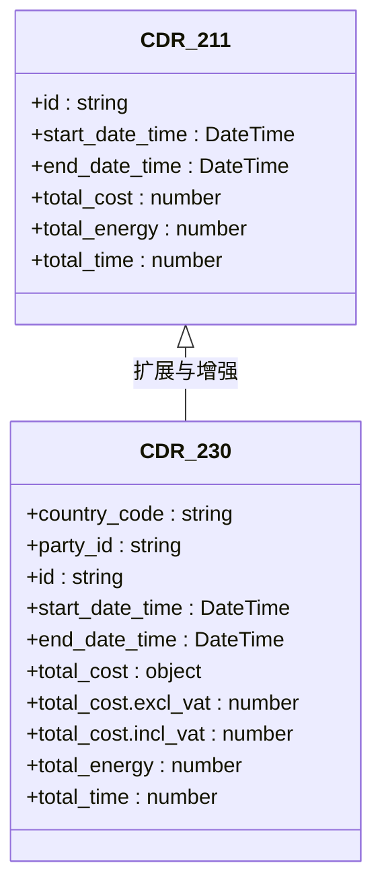
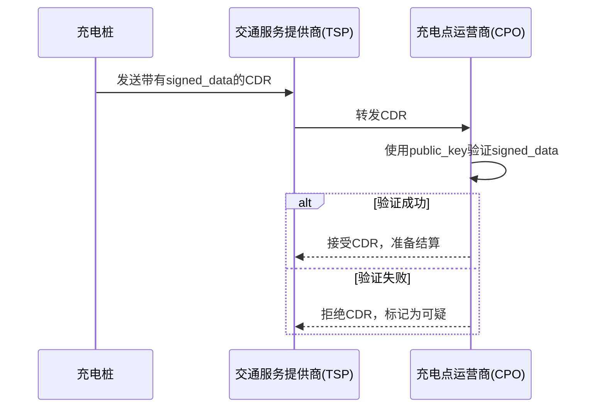

# CDRs模块

<cite>
**Referenced Files in This Document **  
- [ocpi-validators.js](file://src/ocpi-validators.js)
- [sample-data.js](file://src/sample-data.js)
</cite>

## 目录
1. [CDR数据结构概览](#cdr数据结构概览)
2. [核心计费维度解析](#核心计费维度解析)
3. [版本演进与增值税处理](#版本演进与增值税处理)
4. [签名数据与完整性验证](#签名数据与完整性验证)
5. [关联验证逻辑](#关联验证逻辑)

## CDR数据结构概览

CDRs（充电明细记录）模块是OCPI协议中用于记录和结算充电会话的核心组件。该模块通过`ocpi-validators.js`文件中的Zod Schema定义了不同版本的数据结构规范，并在`sample-data.js`中提供了符合规范的示例数据。

从2.1.1到2.3.0版本，CDR结构经历了显著的演进。早期版本如`CDRSchema_211`主要关注基础的充电信息，包括开始和结束时间、认证方式、位置详情以及总费用和能耗。随着标准的发展，`CDRSchema_230`引入了更丰富的字段，以支持复杂的商业场景和更高的数据安全性。

一个完整的CDR记录不仅包含充电事件的基本元数据，还详细描述了充电过程中的计量细节。`charging_periods`数组是其核心，它将整个充电过程分解为多个时间段，每个时间段都精确记录了在此期间内按不同维度（如能量、时间）消耗的量。此外，`total_cost`、`total_energy`等聚合字段提供了会话级别的汇总信息，便于快速结算和分析。

**Section sources**
- [ocpi-validators.js](file://src/ocpi-validators.js#L199-L237)
- [ocpi-validators.js](file://src/ocpi-validators.js#L639-L702)
- [sample-data.js](file://src/sample-data.js#L4-L246)
- [sample-data.js](file://src/sample-data.js#L382-L588)

## 核心计费维度解析

### 计量维度类型

CDR的计费基础在于`charging_periods`数组中的`dimensions`对象。每个`dimension`代表一种计量单位，其`type`字段定义了具体的计量类型。根据`ChargingPeriodSchema`的定义，系统支持多种维度：

- **ENERGY**: 以千瓦时(kWh)为单位的能量消耗，这是最直接的计费依据。
- **TIME**: 以秒(s)为单位的充电时长，常用于收取服务费或停车费。
- **PARKING_TIME**: 专指车辆停放在充电桩上的时间，可能独立于实际充电时间计费。
- **RESERVATION_TIME**: 预留充电位的时间，用户为此支付预留费用。
- **POWER**: 瞬时功率，可用于动态费率计算。
- **CURRENT, MAX_CURRENT, MIN_CURRENT**: 电流相关维度，用于监控和特定计费策略。
- **ENERGY_EXPORT, ENERGY_IMPORT**: 区分充放电方向，支持V2G（Vehicle-to-Grid）场景。

**Diagram sources **
- [ocpi-validators.js](file://src/ocpi-validators.js#L33-L40)

### 计量方式与应用

在`sampleData_211`的示例中，一个充电周期同时记录了`ENERGY`（22.5 kWh）和`TIME`（3600秒）。这表明计费系统可以采用复合计价模式：一部分费用基于消耗的电量，另一部分则基于占用充电设施的时间。这种灵活性允许运营商设计出更精细的定价策略，例如“基础电费+超时占用费”。

`volume`字段是一个数值，表示该维度的实际消耗量。在实现上，这些数据通常由充电桩的电表和内部时钟实时采集，并在会话结束后汇总生成CDR。`tariff_id`字段的存在将`charging_periods`与具体的资费方案（Tariff）关联起来，确保了计费的透明性和可追溯性。

**Section sources**
- [ocpi-validators.js](file://src/ocpi-validators.js#L33-L40)
- [sample-data.js](file://src/sample-data.js#L4-L246)

## 版本演进与增值税处理

### 从单一成本到精细化税务

CDR结构在`total_cost`字段上的变化是版本演进的一个关键标志。在`CDRSchema_211`中，`total_cost`被定义为一个简单的非负数，代表最终的总费用。这种方式虽然简洁，但无法满足需要区分税前和税后金额的复杂财务需求。

到了`CDRSchema_230`，`total_cost`被重构为一个对象，明确区分了不含增值税（excl_vat）和含增值税（incl_vat）的金额。这一改进极大地提升了数据的财务价值。例如，在`sampleCDR`样本中，`total_cost`显示为`{"excl_vat": 10.21, "incl_vat": 12.35}`，清晰地揭示了增值税的具体数额（2.14），这对于跨国运营商的账务处理和税务申报至关重要。

**Diagram sources **
- [ocpi-validators.js](file://src/ocpi-validators.js#L199-L237)
- [ocpi-validators.js](file://src/ocpi-validators.js#L639-L702)

### 分项成本核算

`CDRSchema_230`进一步将总成本拆解为多个组成部分，如`total_energy_cost`、`total_time_cost`、`total_parking_cost`等。每个分项成本同样包含`excl_vat`和`incl_vat`。这种粒度化的成本核算使得账单更加透明，用户可以清楚地看到每一笔费用的构成，同时也方便运营商进行收入分析和成本控制。

**Section sources**
- [ocpi-validators.js](file://src/ocpi-validators.js#L639-L702)
- [sample-data.js](file://src/sample-data.js#L598-L641)

## 签名数据与完整性验证

### 增强型签名数据（signed_data）

为了确保CDR数据的完整性和防篡改性，`CDRSchema_230`引入了`signed_data`字段。这是一个可选但强烈推荐的安全特性。`signed_data`对象包含了对CDR关键部分进行数字签名所需的所有信息。

其结构包括：
- `encoding_method`: 指定编码方法，目前仅支持BASE64。
- `public_key`: 提供用于验证签名的公钥。
- `signed_values`: 一个数组，每个元素包含`nature`（数据性质）、`plain_data`（原始数据）和`signed_data`（签名后的数据）。
- `url`: 可能指向外部签名服务或证书的URL。

这个机制允许接收方（如运营商或平台）验证CDR自生成以来未被修改，从而建立信任链。

**Diagram sources **
- [ocpi-validators.js](file://src/ocpi-validators.js#L639-L702)

**Section sources**
- [ocpi-validators.js](file://src/ocpi-validators.js#L639-L702)

## 关联验证逻辑

### Tariffs数组与Location信息的关联

CDR的有效性不仅依赖于其自身的结构，还取决于与其他实体的关联验证。`CDRSchema_230`中的`tariffs`数组是一个关键的关联点。它列出了本次充电所依据的一个或多个资费方案的ID。验证时，必须检查这些ID是否真实存在，并且其内容（如价格、限制条件）与`charging_periods`中的`tariff_id`相匹配。

同时，`cdr_location`字段嵌入了详细的地理位置和设备信息。验证逻辑需要确保该位置信息与`location`模块中的记录一致，特别是`evse_uid`和`connector_id`，以确认充电发生在正确的物理设备上。此外，`auth_method`和`cdr_token`的组合必须与用户的认证状态相符。

通过结合`sampleTariff`和`sampleCDR`的数据，可以构建一个完整的验证流程：首先，用`sampleTariff`中的`price_components`来核对`sampleCDR`中`charging_periods`的`volume`，计算预期费用；然后，将计算结果与`sampleCDR`中的`total_cost`进行比对，从而验证计费的准确性。

**Section sources**
- [ocpi-validators.js](file://src/ocpi-validators.js#L639-L702)
- [sample-data.js](file://src/sample-data.js#L598-L641)
- [sample-data.js](file://src/sample-data.js#L643-L656)