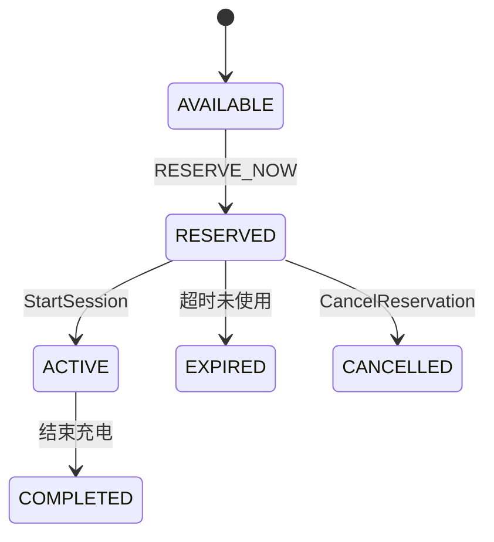

# RESERVE_NOW指令

<cite>
**Referenced Files in This Document **  
- [sample-data.js](file://src/sample-data.js)
- [ocpi-validators.js](file://src/ocpi-validators.js)
</cite>

## 目录
1. [简介](#简介)  
2. [核心字段解析](#核心字段解析)  
3. [充电桩资源预占机制](#充电桩资源预占机制)  
4. [请求示例与使用模式](#请求示例与使用模式)  
5. [配置建议](#配置建议)  
6. [故障排除指南](#故障排除指南)

## 简介

RESERVE_NOW指令是OCPI（开放充电点接口）协议中用于实现远程预约充电功能的核心命令之一。该指令允许电动汽车用户或车队管理平台提前锁定特定充电桩的使用权，确保在到达充电站时能够立即开始充电，避免因设备繁忙而造成的等待。

本技术文档基于`sample-data.js`中的`sampleReserveNowCommand`示例，深入解析RESERVE_NOW指令的技术规范、关键字段含义、工作原理及典型应用场景。通过分析`ocpi-validators.js`中的数据验证规则和相关架构定义，全面阐述了充电桩资源预占机制的设计逻辑与实现细节。

**Section sources**  
- [sample-data.js](file://src/sample-data.js#L688-L703)  
- [ocpi-validators.js](file://src/ocpi-validators.js#L297-L553)

## 核心字段解析

RESERVE_NOW指令包含多个关键字段，每个字段都承担着特定的功能并受到严格的约束条件限制。以下是对各核心字段的详细说明：

### reservation_id（预约ID）
- **意义**：唯一标识一次预约请求的字符串，由发起方生成并在整个预约生命周期内保持不变。
- **约束条件**：
  - 最大长度为36个字符
  - 必须全局唯一，以防止冲突
  - 在后续取消预约（CANCEL_RESERVATION）等操作中作为引用标识
- **来源依据**：该字段在`BookingSchema_230`中被明确定义，并应用于所有支持预约功能的版本。

**Section sources**  
- [ocpi-validators.js](file://src/ocpi-validators.js#L707-L708)

### expiry_date（有效期）
- **意义**：指定本次预约的有效截止时间。超过此时间后，若用户未启动充电，则系统将自动释放该资源供其他用户使用。
- **约束条件**：
  - 必须符合ISO 8601标准的时间格式（如"2024-01-15T16:30:00Z"）
  - 时间必须晚于当前时间
  - 不得超出运营商设定的最大预约时长（可通过`max_reservation`字段配置）
- **业务价值**：有效防止资源长期被占用而不使用，提升充电桩的整体利用率。

**Section sources**  
- [ocpi-validators.js](file://src/ocpi-validators.js#L715-L716)

### token（认证令牌）
- **意义**：代表用户的认证凭证，用于身份验证和权限校验。通常对应一张RFID卡、移动应用账户或其他形式的身份标识。
- **结构组成**：
  - `uid`：令牌唯一标识符
  - `type`：令牌类型（如RFID、APP_USER等）
  - `auth_id`：关联的认证ID
  - `issuer`：发行机构名称
  - `valid`：有效性状态
  - `whitelist`：白名单状态（ALLOWED表示允许访问）
- **约束条件**：
  - `uid`最大长度36字符
  - `type`必须属于预定义枚举值
  - `auth_id`最大长度36字符
  - `issuer`最大长度64字符
- **安全考量**：确保只有经过授权的用户才能进行预约操作，防止恶意抢占资源。

**Section sources**  
- [sample-data.js](file://src/sample-data.js#L690-L696)  
- [ocpi-validators.js](file://src/ocpi-validators.js#L709-L713)

### location_id（位置ID）
- **意义**：目标充电站点的唯一标识符，用于定位具体的物理位置。
- **约束条件**：
  - 最大长度36字符
  - 必须对应一个真实存在的充电站
  - 需与`evse_uid`共同作用以精确定位到具体设备
- **上下文依赖**：该字段需结合`LocationSchema_221`或`LocationSchema_230`中的位置信息进行验证，确保其有效性。

**Section sources**  
- [ocpi-validators.js](file://src/ocpi-validators.js#L717-L718)

### evse_uid（充电设备唯一ID）
- **意义**：充电设备（EVSE）的唯一标识符，用于精确指定要预约的具体充电桩。
- **约束条件**：
  - 最大长度36字符
  - 必须属于指定`location_id`下的有效设备
  - 设备必须具备`RESERVABLE`能力（见下文说明）
- **精准控制**：相较于仅预约整个站点，指定`evse_uid`可实现更精细化的资源调度。

**Section sources**  
- [ocpi-validators.js](file://src/ocpi-validators.js#L719-L720)

## 充电桩资源预占机制

充电桩资源预占机制是一套完整的状态管理和并发控制系统，旨在保障预约功能的可靠性与公平性。其工作原理如下：

### 有效期管理
系统通过`expiry_date`字段对每次预约设置明确的生命期。一旦创建预约记录，后台服务会启动一个定时任务或事件监听器，在接近过期时间时检查该预约的状态：
- 若用户已在有效期内成功启动充电，则预约自动转为“已使用”状态，不再受有效期限制
- 若用户未在有效期内启动充电，则系统自动将其状态更新为“EXPIRED”，并释放对应的充电桩资源
- 运营商可通过`max_reservation`字段（位于`LocationSchema_230`）统一配置最长可预约时长，例如最多允许提前48小时预约

这种机制既保证了用户体验，又避免了资源的无限期锁定。

### 并发控制
为防止多个用户同时预约同一充电桩导致资源冲突，系统采用乐观锁或分布式锁机制进行并发控制：
- 当收到新的RESERVE_NOW请求时，系统首先查询目标`evse_uid`的当前状态
- 只有当设备状态为`AVAILABLE`且无其他有效预约时，才允许创建新预约
- 所有状态变更操作均在数据库事务中完成，确保原子性和一致性
- 使用`reservation_id`作为唯一索引，防止重复提交造成的数据异常

### 状态同步
由于OCPI涉及多个CPO（充电点运营商）和eMSP（电动出行服务提供商）之间的交互，状态同步至关重要：
- 每次预约状态变化（创建、激活、过期、取消）都会触发状态推送（via response_url）
- 接收方可通过异步回调确认接收结果，形成闭环通信
- 所有状态均遵循`BookingSchema_230`中定义的枚举值：ACCEPTED、REJECTED、EXPIRED、CANCELLED、ACTIVE、COMPLETED



**Diagram sources **  
- [ocpi-validators.js](file://src/ocpi-validators.js#L721-L722)  
- [ocpi-validators.js](file://src/ocpi-validators.js#L733-L734)

**Section sources**  
- [ocpi-validators.js](file://src/ocpi-validators.js#L705-L746)  
- [ocpi-validators.js](file://src/ocpi-validators.js#L421-L553)

## 请求示例与使用模式

### 完整请求样例
根据`sampleReserveNowCommand`提供的示例，一个标准的RESERVE_NOW请求如下所示：

```json
{
  "response_url": "https://example.com/response",
  "token": {
    "uid": "TOK123",
    "type": "RFID",
    "auth_id": "AUTH123",
    "issuer": "Sample Company",
    "valid": true,
    "whitelist": "ALLOWED",
    "last_updated": "2024-01-15T14:30:00Z"
  },
  "expiry_date": "2024-01-15T16:30:00Z",
  "reservation_id": "RES123",
  "location_id": "LOC123",
  "evse_uid": "EVS123"
}
```

### 典型使用模式
1. **个人用户远程预约**
   - 用户通过手机App选择目的地附近的充电站
   - App调用RESERVE_NOW指令锁定目标充电桩
   - 到达现场后，插入充电枪即可自动开始计费

2. **车队管理系统批量调度**
   - 物流公司为长途货运车辆规划路线时，提前数小时预约沿途高速服务区的快充桩
   - 系统根据车辆型号匹配支持大功率充电的HDV专用设备
   - 实现无缝衔接的高效补能

3. **高峰时段优先保障**
   - 商业园区在下班高峰期为VIP用户提供预约特权
   - 通过`publish_allowed_to`字段限制某些优质资源仅对特定群体开放

这些模式显著提升了充电体验的确定性与便捷性。

**Section sources**  
- [sample-data.js](file://src/sample-data.js#L688-L703)

## 配置建议

为了充分发挥RESERVE_NOW指令的功能并确保系统的稳定运行，建议从以下几个方面进行合理配置：

### 合理设置最大预约时长
- 对于城市公共充电桩，建议设置较短的预约窗口（如2小时），提高周转率
- 对于高速公路休息区或长途运输枢纽，可适当延长至6-12小时，满足长途行车需求
- 通过`LocationSchema_230`中的`max_reservation`字段进行统一配置

### 启用RESERVABLE能力标识
- 在`evses.capabilities`数组中明确添加`RESERVABLE`标志
- 示例：`["CHARGING_PROFILE_CAPABLE", "REMOTE_START_STOP_CAPABLE", "RESERVABLE"]`
- 此标识是判断设备是否支持预约功能的关键依据

### 强化令牌验证机制
- 确保`TokenSchema_211`中的`whitelist`字段严格校验
- 对于`NEVER`状态的令牌应拒绝所有预约请求
- 定期同步令牌黑名单，防范被盗用风险

### 提供清晰的反馈路径
- `response_url`必须指向一个稳定的HTTP端点
- 接收方应及时返回处理结果（成功/失败），避免发送方超时重试
- 建议启用HTTPS加密传输，保障通信安全

**Section sources**  
- [ocpi-validators.js](file://src/ocpi-validators.js#L72)  
- [ocpi-validators.js](file://src/ocpi-validators.js#L382)  
- [ocpi-validators.js](file://src/ocpi-validators.js#L515)  
- [sample-data.js](file://src/sample-data.js#L29)  
- [sample-data.js](file://src/sample-data.js#L453)

## 故障排除指南

### 预约失败：设备不支持
- **现象**：返回错误码422 Unprocessable Entity
- **原因**：目标`evse_uid`未声明`RESERVABLE`能力
- **解决方案**：
  1. 检查该设备的capabilities列表
  2. 在`LocationSchema_221`或`230`中确认是否包含`RESERVABLE`
  3. 如需支持，请升级固件或修改配置

### 预约失败：令牌无效
- **现象**：返回403 Forbidden
- **原因**：`token.valid`为false或`whitelist`为`NEVER`
- **解决方案**：
  1. 验证`TokenSchema_211`规则
  2. 检查令牌发行方（issuer）是否可信
  3. 确认用户账户状态正常

### 预约失败：资源已被占用
- **现象**：返回409 Conflict
- **原因**：同一`evse_uid`已存在有效预约且未过期
- **解决方案**：
  1. 查询当前预约状态（可通过GET /reservations接口）
  2. 建议用户选择其他空闲设备
  3. 或等待原预约过期后再试

### 回调失败：响应URL不可达
- **现象**：发送方长时间未收到确认
- **原因**：`response_url`无法访问或返回非2xx状态码
- **解决方案**：
  1. 检查网络连通性
  2. 确保服务器正确处理POST请求
  3. 添加日志监控，及时发现异常

以上问题均可通过遵循`ocpi-validators.js`中的验证逻辑进行预防和诊断。

**Section sources**  
- [ocpi-validators.js](file://src/ocpi-validators.js#L240-L249)  
- [ocpi-validators.js](file://src/ocpi-validators.js#L297-L418)  
- [ocpi-validators.js](file://src/ocpi-validators.js#L421-L553)