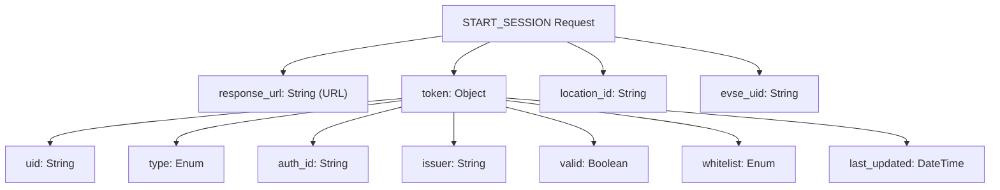
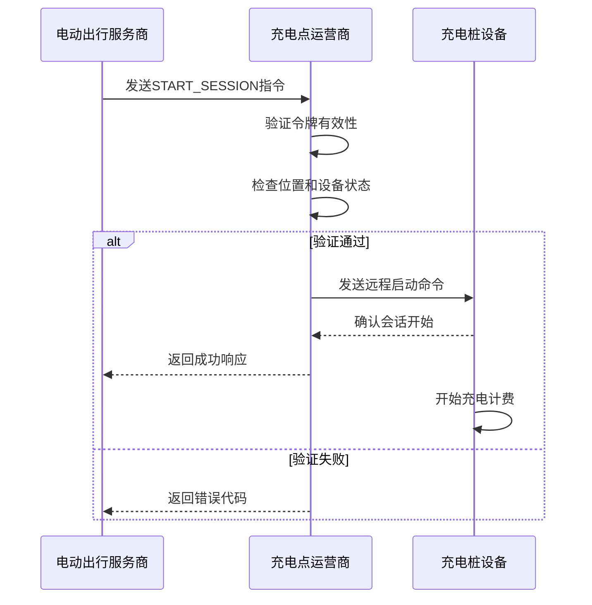

# START_SESSION指令

<cite>
**Referenced Files in This Document **   
- [sample-data.js](file://src/sample-data.js)
- [ocpi-validators.js](file://src/ocpi-validators.js)
</cite>

## 目录
1. [简介](#简介)
2. [请求参数详解](#请求参数详解)
3. [合法请求JSON结构](#合法请求json结构)
4. [参数验证规则](#参数验证规则)
5. [充电会话启动流程](#充电会话启动流程)
6. [CPO系统处理机制](#cpo系统处理机制)
7. [实际使用案例](#实际使用案例)
8. [常见错误排查](#常见错误排查)

## 简介

START_SESSION远程指令是OCPI（开放充电点接口）协议中的关键命令，用于通过中央系统远程启动电动汽车充电会话。该指令允许第三方平台（如车队管理系统、移动应用或能源管理平台）在特定充电点为授权用户启动充电过程，而无需物理接触充电设备。

此功能特别适用于企业车队管理、共享汽车服务和智能充电调度场景。基于`sample-data.js`文件中定义的`sampleStartSessionCommand`示例，本文档详细说明了该指令的技术规范、业务含义及实施细节。

**Section sources**
- [sample-data.js](file://src/sample-data.js#L668-L681)

## 请求参数详解

### response_url
`:response_url`字段指定CPO（充电点运营商）系统在处理完START_SESSION请求后应发送响应的位置。这是一个必需的字符串类型URL，采用HTTPS协议确保通信安全。该端点必须能够接收POST请求并处理JSON格式的响应数据。

业务上，`response_url`建立了eMSP（电动出行服务提供商）与CPO之间的异步通信通道，使eMSP能够获知充电会话是否成功启动以及任何相关状态信息。

### token
`:token`对象包含用于身份验证和授权的凭证信息，是启动充电会话的关键安全要素。其内部字段具有以下业务和技术含义：

- `:uid`：令牌的唯一标识符，在系统内全局唯一
- `:type`：令牌类型，如"RFID"表示射频识别卡，"APP_USER"表示移动应用用户
- `:auth_id`：认证ID，关联到用户账户或车辆
- `:issuer`：发行方名称，标识发卡机构
- `:valid`：布尔值，指示令牌当前有效性状态
- `:whitelist`：白名单状态，决定授权级别（"ALLOWED"表示允许充电）

### location_id
`:location_id`标识目标充电站的唯一编号。该ID必须与CPO系统中注册的充电位置记录相匹配。在OCPI协议中，每个充电站都有一个由运营商分配的唯一标识符，确保精确路由到正确的物理位置。

技术要求方面，`location_id`通常为不超过36个字符的字符串，遵循CPO的命名约定，并在整个网络中保持唯一性。

### evse_uid
`:evse_uid`（Electric Vehicle Supply Equipment Unique ID）指定充电站内具体的充电桩单元。一个充电站可能包含多个EVSE设备，此字段确保指令被正确路由到特定的物理充电点。

该字段与`:location_id`共同构成充电资源的完整寻址方案，实现从"站点→设备"的精确导航。在验证过程中，系统会检查指定的EVSE是否存在于给定位置且当前处于可用状态。

**Section sources**
- [sample-data.js](file://src/sample-data.js#L668-L681)
- [ocpi-validators.js](file://src/ocpi-validators.js#L200-L205)

## 合法请求JSON结构

符合OCPI规范的START_SESSION指令应遵循以下JSON结构：

```json
{
  "response_url": "https://example.com/response",
  "token": {
    "uid": "TOK123",
    "type": "RFID",
    "auth_id": "AUTH123",
    "issuer": "Sample Company",
    "valid": true,
    "whitelist": "ALLOWED",
    "last_updated": "2024-01-15T14:30:00Z"
  },
  "location_id": "LOC123",
  "evse_uid": "EVS123"
}
```

此结构基于`sampleStartSessionCommand`示例构建，体现了OCPI 2.2.1及以上版本的数据模型。所有字段均为必需项，缺失任何关键参数将导致请求被拒绝。

**Diagram sources **
- [sample-data.js](file://src/sample-data.js#L668-L681)



## 参数验证规则

根据`ocpi-validators.js`中的Zod模式定义，各参数需满足严格的验证规则：

| 字段 | 数据类型 | 长度限制 | 格式要求 | 必需性 |
|------|--------|---------|--------|-------|
| `:response_url` | 字符串 | - | 有效HTTPS URL | 是 |
| `:token.uid` | 字符串 | ≤36字符 | - | 是 |
| `:token.type` | 枚举 | - | "RFID", "APP_USER", "REMOTE", "OTHER"之一 | 是 |
| `:token.auth_id` | 字符串 | ≤36字符 | - | 是 |
| `:token.valid` | 布尔值 | - | true/false | 是 |
| `:token.whitelist` | 枚举 | - | "ALWAYS", "ALLOWED", "ALLOWED_OFFLINE", "NEVER"之一 | 是 |
| `:location_id` | 字符串 | ≤36字符 | - | 是 |
| `:evse_uid` | 字符串 | ≤36字符 | - | 是 |

这些规则通过Zod库在运行时强制执行，确保数据完整性。例如，`LocationSchema_221`和`SessionSchema_221`等验证模式明确规定了字段约束条件。

**Section sources**
- [ocpi-validators.js](file://src/ocpi-validators.js#L200-L205)
- [ocpi-validators.js](file://src/ocpi-validators.js#L490-L505)

## 充电会话启动流程

START_SESSION指令在整体充电流程中扮演着触发器角色，其作用贯穿于会话生命周期的初始阶段：



**Diagram sources **
- [sample-data.js](file://src/sample-data.js#L668-L681)
- [ocpi-validators.js](file://src/ocpi-validators.js#L490-L505)

该指令的核心作用包括：
- 实现无卡启动充电，提升用户体验
- 支持自动化充电调度和能源管理
- 建立跨运营商平台的互操作性
- 提供审计跟踪和安全控制机制

## CPO系统处理机制

当CPO系统接收到START_SESSION请求时，按照以下步骤进行处理：

1. **请求解析**：解析JSON负载，提取关键参数
2. **签名验证**：验证请求来源的合法性（如适用）
3. **令牌验证**：查询数据库确认令牌有效性和白名单状态
4. **资源检查**：验证指定的`location_id`和`evse_uid`是否存在且可用
5. **冲突检测**：检查目标EVSE是否已被其他会话占用
6. **指令转发**：通过OICP或其他协议向现场设备发送启动命令
7. **状态更新**：在本地系统创建新的充电会话记录
8. **异步响应**：向`response_url`发送处理结果

处理成功后，CPO返回包含会话ID的状态确认；若失败，则返回标准化错误码（如"OUT_OF_SERVICE"、"LOCATION_NOT_FOUND"等），便于eMSP进行故障排除。

**Section sources**
- [ocpi-validators.js](file://src/ocpi-validators.js#L490-L505)

## 实际使用案例

### 车队管理系统远程启动
某物流公司使用START_SESSION指令为其电动货车队自动安排夜间充电：

```javascript
const startCharging = async (vehicleId, scheduleTime) => {
  const token = await getTokenForVehicle(vehicleId);
  const { location_id, evse_uid } = await findAvailableCharger();
  
  const command = {
    response_url: "https://fleet-system.example.com/charging-response",
    token,
    location_id,
    evse_uid
  };
  
  await sendCommandToCPO("START_SESSION", command);
};
```

### 移动应用即插即充增强
移动应用结合物理连接与远程指令，实现无缝体验：
1. 用户将充电枪插入车辆
2. 应用检测到连接事件
3. 自动向CPO发送START_SESSION指令
4. CPO验证用户令牌并启动充电
5. 用户收到"充电已开始"通知

这种混合模式既保留了即插即充的便利性，又增加了远程控制的安全层。

**Section sources**
- [sample-data.js](file://src/sample-data.js#L668-L681)

## 常见错误排查

### 错误代码与解决方案

| 错误现象 | 可能原因 | 解决方法 |
|--------|--------|--------|
| `INVALID_TOKEN` | 令牌无效或过期 | 检查`token.valid`字段，刷新认证状态 |
| `LOCATION_NOT_FOUND` | 位置ID不存在 | 验证`location_id`拼写，同步最新位置数据 |
| `EVSE_IN_USE` | 充电桩已被占用 | 查询EVSE实时状态，选择其他空闲设备 |
| `NOT_ALLOWED` | 白名单拒绝 | 检查`token.whitelist`状态，联系运营商授权 |
| `NETWORK_ERROR` | 响应URL不可达 | 验证HTTPS配置，检查防火墙设置 |

### 调试建议
- 使用`sampleStartSessionCommand`作为基准测试用例
- 在沙箱环境中验证请求格式
- 监控`response_url`的接收日志
- 对比`ocpi-validators.js`中的模式定义进行自我验证
- 确保时间戳使用UTC格式并精确到秒

通过系统化的错误处理和日志记录，可以快速定位并解决部署过程中的问题。

**Section sources**
- [sample-data.js](file://src/sample-data.js#L668-L681)
- [ocpi-validators.js](file://src/ocpi-validators.js#L200-L205)