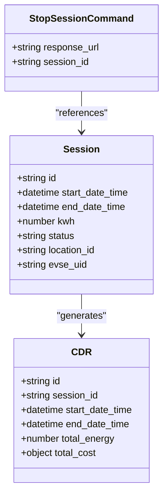
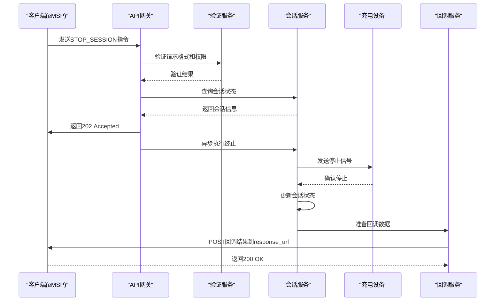
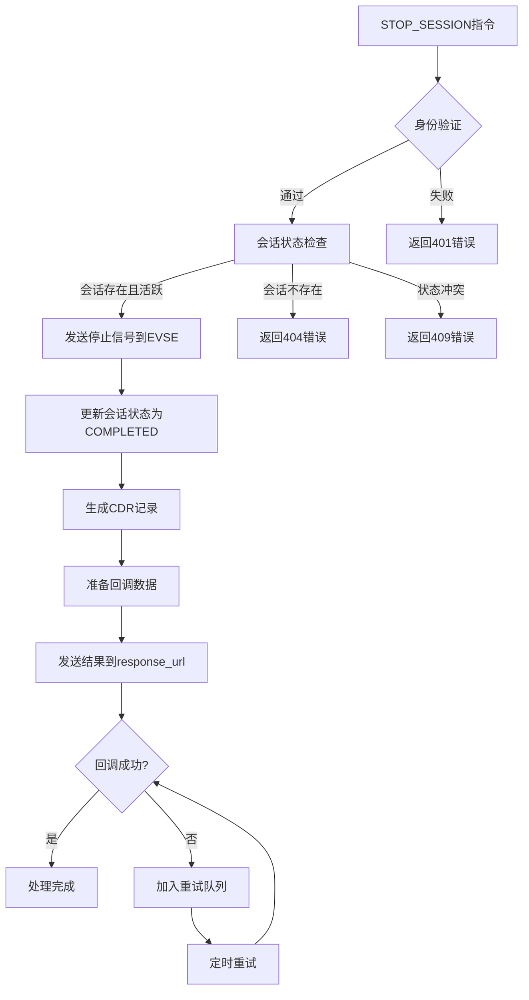

# STOP_SESSION指令

<cite>
**Referenced Files in This Document**  
- [sample-data.js](file://src/sample-data.js)
- [ocpi-validators.js](file://src/ocpi-validators.js)
- [App.js](file://src/App.js)
</cite>

## 目录
1. [STOP_SESSION指令概述](#stop_session指令概述)
2. [参数机制解析](#参数机制解析)
3. [业务流程说明](#业务流程说明)
4. [请求格式示例](#请求格式示例)
5. [错误状态码与解决方案](#错误状态码与解决方案)
6. [模块交互关系](#模块交互关系)

## STOP_SESSION指令概述

STOP_SESSION远程指令是OCPI（开放充电点接口）协议中用于终止正在进行的充电会话的关键命令。该指令允许CPO（充电点运营商）或eMSP（电子移动服务提供商）通过远程方式停止特定的充电会话，实现对充电过程的灵活控制。

在本系统中，STOP_SESSION指令的设计遵循OCPI 2.2.1-d2和2.3.0版本规范，不支持较早的2.1.1-d2版本。该指令主要用于当用户需要提前结束充电、发生异常情况或达到充电目标时，由授权方发起会话终止请求。

**Section sources**
- [ocpi-validators.js](file://src/ocpi-validators.js#L924-L927)
- [App.js](file://src/App.js#L85-L86)

## 参数机制解析

### session_id参数

`session_id`参数是STOP_SESSION指令的核心标识符，用于精确指定需要终止的充电会话。该参数在系统中的作用机制如下：

- **唯一性标识**：每个活动的充电会话都有一个全局唯一的ID，确保指令能够准确指向特定会话
- **长度限制**：根据OCPI规范，session_id的最大长度为36个字符
- **数据类型**：字符串类型，通常采用UUID或其他唯一标识生成算法
- **验证机制**：系统在处理指令前会验证该会话ID是否存在且处于可终止状态

该参数直接关联到Sessions模块中的会话记录，是连接指令与具体充电会话的桥梁。

### response_url参数

`response_url`参数定义了异步回调的接收端点，其作用机制包括：

- **URL格式验证**：系统使用z.string().url()进行严格验证，确保提供的是有效的HTTP/HTTPS地址
- **异步通信**：当会话终止操作完成（无论成功或失败），系统将向此URL发送结果通知
- **解耦设计**：采用异步回调模式，避免了同步阻塞，提高了系统的响应性和可靠性
- **错误重试**：如果首次回调失败，系统可能实现重试机制以确保通知送达

这两个参数共同构成了STOP_SESSION指令的基本结构，确保了指令的准确性和通信的可靠性。



**Diagram sources**
- [ocpi-validators.js](file://src/ocpi-validators.js#L892-L895)
- [sample-data.js](file://src/sample-data.js#L683-L686)

**Section sources**
- [ocpi-validators.js](file://src/ocpi-validators.js#L892-L895)
- [sample-data.js](file://src/sample-data.js#L683-L686)

## 业务流程说明

STOP_SESSION指令的完整业务流程包含多个关键步骤，确保会话终止的安全性和完整性。

### 身份验证

系统首先对指令来源进行身份验证，虽然STOP_SESSION指令本身不包含认证令牌，但API网关或服务层会在接收请求时验证调用方的身份和权限。只有经过授权的eMSP或管理账户才能发送此类指令。

### 会话状态检查

在执行终止操作前，系统会进行严格的会话状态检查：
- 验证`session_id`对应会话是否存在
- 检查会话是否处于"ACTIVE"（活跃）状态
- 确认会话未被其他操作锁定
- 验证会话所属的EVSE（电动车辆供电设备）是否在线

### 异步回调处理

系统采用异步处理模式来提高性能和可靠性：
1. 接收STOP_SESSION指令并进行初步验证
2. 将指令加入处理队列，立即返回接受确认
3. 后台服务处理实际的会话终止逻辑
4. 操作完成后，向`response_url`发送最终结果
5. 处理可能的网络故障和重试逻辑

这种设计避免了因网络延迟或设备响应慢导致的请求超时问题。



**Diagram sources**
- [ocpi-validators.js](file://src/ocpi-validators.js#L968-L1004)
- [App.js](file://src/App.js#L184-L185)

**Section sources**
- [ocpi-validators.js](file://src/ocpi-validators.js#L968-L1004)

## 请求格式示例

以下是符合OCPI规范的标准STOP_SESSION请求JSON示例：

```json
{
  "response_url": "https://example.com/response",
  "session_id": "SES123"
}
```

该请求格式简洁明了，仅包含两个必需字段：
- `response_url`: 结果回调的接收端点
- `session_id`: 需要终止的会话ID

在系统实现中，该结构通过Zod库进行严格验证，确保所有传入的STOP_SESSION指令都符合预定义的模式要求。

**Section sources**
- [sample-data.js](file://src/sample-data.js#L683-L686)
- [ocpi-validators.js](file://src/ocpi-validators.js#L892-L895)

## 错误状态码与解决方案

### 可能的错误状态

| 错误类型 | 描述 | 解决方案 |
|---------|------|---------|
| 400 Bad Request | 请求格式无效，缺少必要字段或字段格式错误 | 检查JSON结构，确保包含正确的response_url和session_id |
| 401 Unauthorized | 调用方身份验证失败 | 验证API密钥或OAuth令牌的有效性 |
| 404 Not Found | 指定的session_id不存在 | 确认会话ID正确，并检查会话是否已被终止 |
| 409 Conflict | 会话状态不允许终止（如已结束或暂停） | 检查会话当前状态，仅对ACTIVE状态的会话发送终止指令 |
| 422 Unprocessable Entity | 会话关联的充电设备离线 | 等待设备恢复在线后重试，或通过其他方式通知用户 |

### 验证错误处理

系统通过validateOCPIJson函数处理验证错误，返回详细的错误信息数组，帮助调用方快速定位和修复问题。例如，如果response_url不是有效URL，系统将返回类似"response_url: Invalid URL"的错误描述。

**Section sources**
- [ocpi-validators.js](file://src/ocpi-validators.js#L968-L1004)

## 模块交互关系

STOP_SESSION指令与多个核心模块存在紧密的交互关系，形成完整的业务闭环。

### Sessions模块

Sessions模块是STOP_SESSION指令的主要交互对象：
- 提供会话状态查询服务
- 执行会话状态更新（从ACTIVE到COMPLETED）
- 维护会话的生命周期管理
- 记录会话终止的时间戳和原因

### CDRs模块

CDRs（充电数据记录）模块与会话终止密切相关：
- 在会话终止时生成或更新CDR记录
- 计算最终的充电量（kWh）和费用
- 关联session_id与CDR记录，建立追溯关系
- 确保计费数据的完整性和准确性

### 命令处理模块

系统中的命令处理模块负责：
- 接收和验证STOP_SESSION指令
- 协调各服务间的调用顺序
- 管理异步处理队列
- 处理回调通知的发送和重试

这些模块协同工作，确保STOP_SESSION指令能够安全、可靠地执行，同时保持数据的一致性和完整性。



**Diagram sources**
- [ocpi-validators.js](file://src/ocpi-validators.js#L924-L963)
- [App.js](file://src/App.js#L105-L106)

**Section sources**
- [ocpi-validators.js](file://src/ocpi-validators.js#L924-L963)