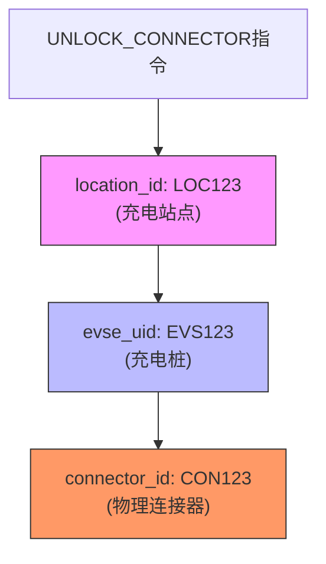
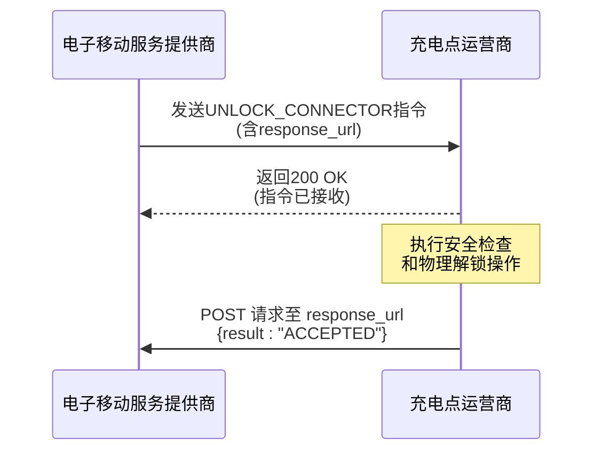

# UNLOCK_CONNECTOR指令

<cite>
**Referenced Files in This Document **   
- [sample-data.js](file://src/sample-data.js)
- [ocpi-validators.js](file://src/ocpi-validators.js)
</cite>

## 目录
1. [技术细节与安全考量](#技术细节与安全考量)
2. [三级定位体系解析](#三级定位体系解析)
3. [异步确认机制](#异步确认机制)
4. [物理连接器解锁流程](#物理连接器解锁流程)
5. [标准请求格式](#标准请求格式)
6. [适用场景与风险规避](#适用场景与风险规避)

## 技术细节与安全考量

UNLOCK_CONNECTOR指令是OCPI（开放充电点接口）协议中用于远程解锁电动汽车充电连接器的关键命令。该指令的设计旨在解决充电完成后车辆滞留、用户误操作或紧急情况下的连接器释放问题，确保充电站资源的有效利用和用户的安全。

从技术实现角度看，该指令通过标准化的JSON结构传递必要的定位信息和回调地址，实现了跨运营商平台的互操作性。其核心功能依赖于精确的设备定位能力和可靠的异步通信机制。在安全层面，系统必须实施严格的权限验证，防止未经授权的解锁操作，同时需要检测车辆当前状态以避免在充电过程中意外断开连接，造成设备损坏或安全事故。

该指令的处理流程涉及多个安全验证环节，包括身份认证、权限检查、设备状态确认和防误操作保护。这些机制共同构成了一个纵深防御体系，确保只有在满足所有安全条件的情况下才会执行物理解锁动作。

**Section sources**
- [ocpi-validators.js](file://src/ocpi-validators.js#L885-L928)
- [sample-data.js](file://src/sample-data.js#L700-L704)

## 三级定位体系解析

UNLOCK_CONNECTOR指令的成功执行依赖于一个精确的三级定位体系，该体系通过`location_id`、`evse_uid`和`connector_id`三个关键字段协同工作，实现对特定物理连接器的唯一标识和精准控制。

第一级`location_id`用于指定充电站点的全局唯一标识符。在一个城市或区域内可能存在多个充电站，`location_id`确保了指令被路由到正确的物理位置。第二级`evse_uid`（电动车辆供电设备唯一标识符）进一步将范围缩小到站点内的具体充电桩。一个充电站通常配备多台EVSE设备，`evse_uid`能够准确识别目标充电桩。第三级`connector_id`则指向充电桩上的具体物理连接器。现代充电桩可能提供多个连接口以支持同时为多辆车充电，`connector_id`最终锁定了需要解锁的具体连接器。

这种分层定位模型不仅提高了寻址的准确性，还增强了系统的可扩展性和灵活性。它允许系统独立管理不同层级的实体，并支持复杂的充电网络拓扑结构。例如，在大型充电枢纽中，可以通过组合这三个ID快速定位并控制任意一个连接器，而无需了解底层硬件的具体布局。



**Diagram sources **
- [sample-data.js](file://src/sample-data.js#L701-L703)

**Section sources**
- [sample-data.js](file://src/sample-data.js#L701-L703)
- [ocpi-validators.js](file://src/ocpi-validators.js#L885-L928)

## 异步确认机制

UNLOCK_CONNECTOR指令采用异步通信模式，其中`response_url`字段扮演着至关重要的角色。当CPO（充电点运营商）接收到解锁指令后，不会立即返回最终结果，而是先确认指令接收成功，随后在后台执行一系列安全检查和物理操作。整个过程可能需要一定时间，因此使用异步机制可以避免客户端长时间等待。

`response_url`是一个由eMSP（电子移动服务提供商）提供的回调端点URL。CPO在完成解锁操作（无论成功或失败）后，会向此URL发送一个包含操作结果的HTTP POST请求。该响应通常包括一个状态码（如"ACCEPTED"表示操作成功，"REJECTED"表示被拒绝）以及相关的描述信息。这种设计解耦了指令发起方和执行方，提高了系统的响应性和可靠性。

异步确认机制的优势在于它能够处理可能出现的各种延迟情况，例如网络通信延迟、设备响应延迟或需要人工干预的特殊情况。同时，它也为错误处理和重试逻辑提供了空间。如果CPO无法立即执行操作，它可以先返回"QUEUED"状态，并在稍后通过`response_url`通知最终结果，确保了操作的最终一致性。



**Diagram sources **
- [sample-data.js](file://src/sample-data.js#L700)

**Section sources**
- [sample-data.js](file://src/sample-data.js#L700)
- [ocpi-validators.js](file://src/ocpi-validators.js#L885-L928)

## 物理连接器解锁流程

物理连接器的解锁是一个涉及多重安全验证的严谨流程，旨在防止任何可能导致设备损坏或人身伤害的误操作。该流程始于对UNLOCK_CONNECTOR指令的接收，并立即启动一系列验证步骤。

首先进行的是权限校验。系统会验证发起指令的eMSP是否具有对该充电站点及特定连接器的操作权限。这通常基于预先建立的商业合作协议和API访问令牌。权限校验失败将直接导致指令被拒绝。

其次，系统会进行车辆状态检测。这是最关键的一步，系统会查询目标连接器的实时状态，重点检查是否正在进行充电活动。如果检测到电流流动，系统将强制拒绝解锁请求，以防止带电断开连接造成的电弧和设备损坏。此外，系统还会检查车辆是否处于锁定状态或有其他软件层面的锁定信号。

最后，系统会激活防误操作机制。这包括但不限于：要求二次确认、记录完整的审计日志、触发现场声光警报以提醒周围人员，以及在执行前设置短暂的延迟窗口供人工干预。只有当所有安全检查均通过后，CPO系统才会向充电桩发送物理解锁信号，驱动机械锁释放连接器。

**Section sources**
- [ocpi-validators.js](file://src/ocpi-validators.js#L885-L928)

## 标准请求格式

UNLOCK_CONNECTOR指令遵循严格的JSON格式规范，确保了不同系统间的兼容性和数据完整性。一个标准的请求实例包含以下核心字段：

```json
{
  "response_url": "https://example.com/response",
  "location_id": "LOC123",
  "evse_uid": "EVS123",
  "connector_id": "CON123"
}
```

其中，`response_url`必须是一个有效的URL，用于接收操作结果；`location_id`、`evse_uid`和`connector_id`均为字符串类型，长度限制在36个字符以内，用于精确指定目标连接器。所有字段均为必填项，缺少任何一个都将导致请求被拒绝。

该格式定义在`ocpi-validators.js`文件中的`UnlockConnectorCommandSchema`里，使用Zod库进行数据验证。此架构确保了传入数据的类型、格式和约束都符合OCPI协议标准，为后续的安全处理流程提供了可靠的数据基础。

**Section sources**
- [sample-data.js](file://src/sample-data.js#L700-L704)
- [ocpi-validators.js](file://src/ocpi-validators.js#L885-L928)

## 适用场景与风险规避

UNLOCK_CONNECTOR指令主要适用于处理车辆充电完成后长时间滞留的场景。例如，用户忘记拔枪离开，或者因账户问题导致自动扣费失败而无法正常结束会话。在这种情况下，eMSP可以通过此指令远程协助用户解锁连接器，释放充电位供其他用户使用，从而提高充电网络的整体运营效率。

然而，该指令也伴随着潜在风险，必须采取措施加以规避。首要风险是安全风险，即在车辆正在充电时误触发解锁。为此，系统必须实施硬性安全联锁，确保只有在完全断电后才能执行解锁。其次是滥用风险，恶意用户可能试图频繁调用此指令干扰正常服务。对此，应实施严格的速率限制和访问控制策略。最后是责任归属风险，若因解锁操作导致车辆或充电设备损坏，需有清晰的日志记录和审计追踪来界定责任。通过完善的日志记录、操作确认机制和用户通知流程，可以有效降低这些风险，确保指令被负责任地使用。