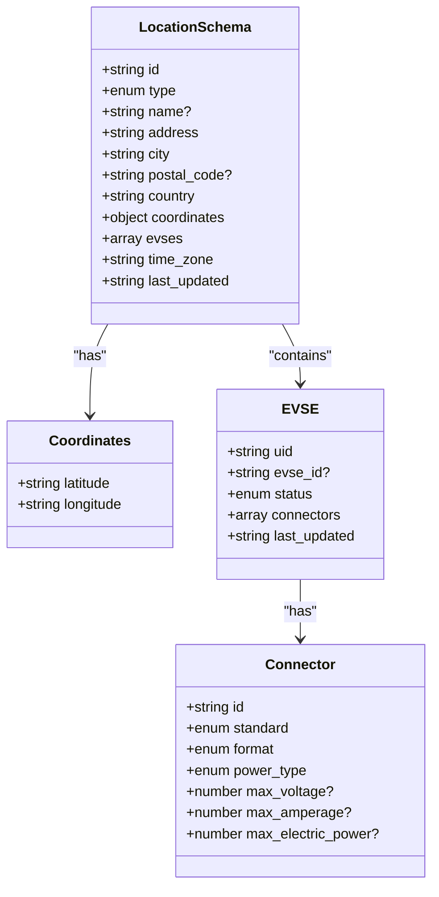
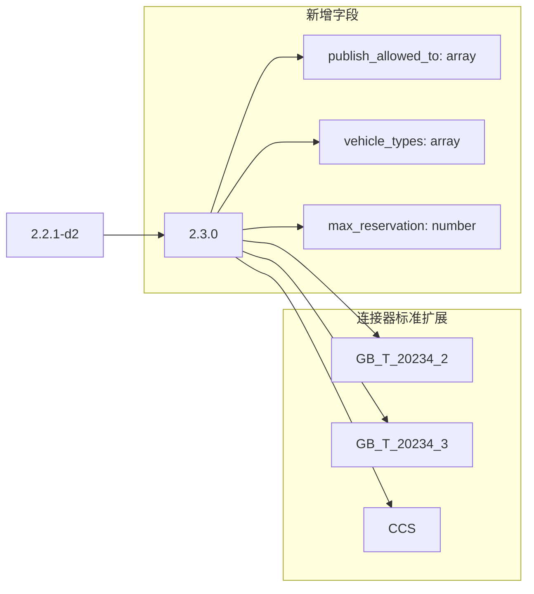
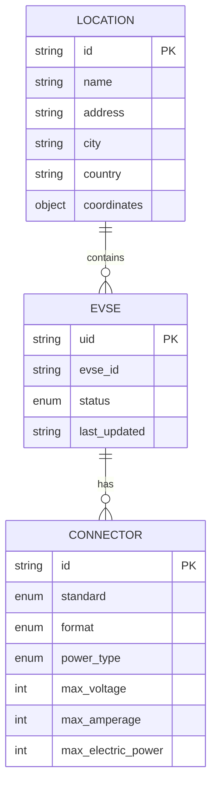
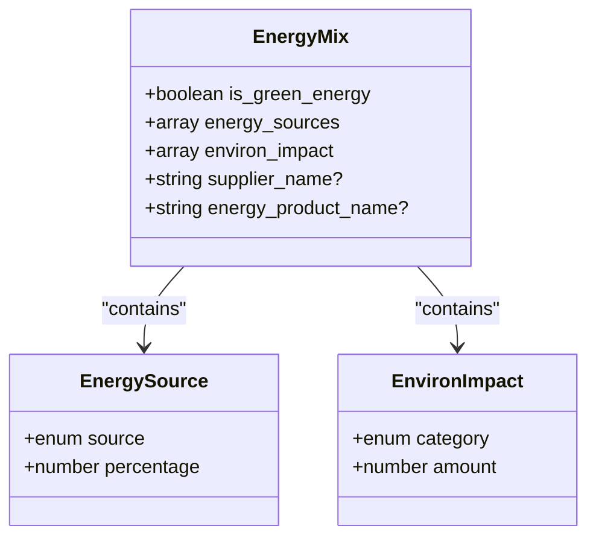

# Locations模块

<cite>
**Referenced Files in This Document **  
- [ocpi-validators.js](file://src/ocpi-validators.js)
- [sample-data.js](file://src/sample-data.js)
</cite>

## 目录
1. [引言](#引言)  
2. [核心数据模型与验证规则](#核心数据模型与验证规则)  
3. [版本演进分析](#版本演进分析)  
4. [核心字段约束详解](#核心字段约束详解)  
5. [嵌套对象验证逻辑](#嵌套对象验证逻辑)  
6. [示例数据展示](#示例数据展示)  

## 引言

本文档深入剖析OCPI协议中Locations模块的数据模型和验证规则。通过分析`ocpi-validators.js`文件中的`LocationSchema_211`、`LocationSchema_221`和`LocationSchema_230`定义，详细阐述不同版本间字段结构的演进变化。重点说明核心字段如`id`、`coordinates`、`evses`、`connectors`的约束条件，以及各版本新增特性（如2.2.1-d2的`country_code`/`party_id`、2.3.0的`publish_allowed_to`/`vehicle_types`）。结合`sample-data.js`中的示例数据，展示合法JSON实例，并对比说明必填项、可选项及嵌套对象的验证逻辑。

**Section sources**
- [ocpi-validators.js](file://src/ocpi-validators.js#L43-L553)

## 核心数据模型与验证规则

Locations模块采用Zod库进行数据验证，确保JSON结构符合OCPI规范。每个版本的Location Schema都定义了严格的字段类型、长度限制、枚举值和正则表达式约束。



**Diagram sources **
- [ocpi-validators.js](file://src/ocpi-validators.js#L43-L154)
- [ocpi-validators.js](file://src/ocpi-validators.js#L297-L418)
- [ocpi-validators.js](file://src/ocpi-validators.js#L421-L553)

**Section sources**
- [ocpi-validators.js](file://src/ocpi-validators.js#L43-L553)

## 版本演进分析

### 2.1.1-d2 到 2.2.1-d2 的演进

从2.1.1-d2到2.2.1-d2，Locations模块引入了关键的全局标识符，增强了数据的唯一性和可寻址性。

```mermaid
flowchart LR
A[2.1.1-d2] --> B[2.2.1-d2]
subgraph 新增字段
B --> C[country_code: string(2)]
B --> D[party_id: string(3)]
B --> E[publish: boolean]
end
subgraph 字段改进
B --> F[max_voltage/max_amperage<br/>替代 voltage/amperage]
B --> G[tariff_ids: array<br/>替代 tariff_id]
B --> H[floor_level: string(4)]
end
```

**Diagram sources **
- [ocpi-validators.js](file://src/ocpi-validators.js#L43-L154)
- [ocpi-validators.js](file://src/ocpi-validators.js#L297-L418)

**Section sources**
- [ocpi-validators.js](file://src/ocpi-validators.js#L43-L154)
- [ocpi-validators.js](file://src/ocpi-validators.js#L297-L418)

### 2.2.1-d2 到 2.3.0 的演进

2.3.0版本进一步扩展了功能，增加了对车辆类型的支持和发布权限控制，使充电站信息更加精细化。



**Diagram sources **
- [ocpi-validators.js](file://src/ocpi-validators.js#L297-L418)
- [ocpi-validators.js](file://src/ocpi-validators.js#L421-L553)

**Section sources**
- [ocpi-validators.js](file://src/ocpi-validators.js#L297-L418)
- [ocpi-validators.js](file://src/ocpi-validators.js#L421-L553)

## 核心字段约束详解

### 基础标识字段

| 字段 | 版本 | 类型 | 约束 | 必填 |
|------|------|------|------|------|
| `id` | 所有版本 | string | 最大36字符 | 是 |
| `country_code` | 2.2.1+, 2.3.0 | string | 精确2字符 | 是 |
| `party_id` | 2.2.1+, 2.3.0 | string | 最大3字符 | 是 |

**Section sources**
- [ocpi-validators.js](file://src/ocpi-validators.js#L43-L154)
- [ocpi-validators.js](file://src/ocpi-validators.js#L297-L418)
- [ocpi-validators.js](file://src/ocpi-validators.js#L421-L553)

### 地理位置字段

| 字段 | 版本 | 类型 | 约束 | 必填 |
|------|------|------|------|------|
| `address` | 所有版本 | string | 最大45字符 | 是 |
| `city` | 所有版本 | string | 最大45字符 | 是 |
| `country` | 所有版本 | string | 精确3字符 | 是 |
| `coordinates.latitude` | 所有版本 | string | 正则: `/^-?[0-9]{1,2}\.[0-9]{5,7}$/` | 是 |
| `coordinates.longitude` | 所有版本 | string | 正则: `/^-?[0-9]{1,2}\.[0-9]{5,7}$/` | 是 |

**Section sources**
- [ocpi-validators.js](file://src/ocpi-validators.js#L43-L154)
- [ocpi-validators.js](file://src/ocpi-validators.js#L297-L418)
- [ocpi-validators.js](file://src/ocpi-validators.js#L421-L553)

### 充电设施字段

| 字段 | 版本 | 类型 | 约束 | 必填 |
|------|------|------|------|------|
| `evses[].uid` | 所有版本 | string | 最大36字符 | 是 |
| `evses[].status` | 所有版本 | enum | AVAILABLE, BLOCKED等 | 是 |
| `evses[].connectors[].id` | 所有版本 | string | 最大36字符 | 是 |
| `evses[].connectors[].standard` | 所有版本 | enum | CHADEMO, IEC_62196_T2等 | 是 |
| `evses[].connectors[].max_voltage` | 2.2.1+, 2.3.0 | number | 整数 | 否 |
| `evses[].connectors[].max_amperage` | 2.2.1+, 2.3.0 | number | 整数 | 否 |
| `evses[].connectors[].max_electric_power` | 2.2.1+, 2.3.0 | number | 整数 | 否 |

**Section sources**
- [ocpi-validators.js](file://src/ocpi-validators.js#L43-L154)
- [ocpi-validators.js](file://src/ocpi-validators.js#L297-L418)
- [ocpi-validators.js](file://src/ocpi-validators.js#L421-L553)

## 嵌套对象验证逻辑

### EVSE与连接器关系

EVSE（电动车辆供电设备）包含一个或多个连接器，形成一对多关系。每个连接器都有独立的规格参数。



**Diagram sources **
- [ocpi-validators.js](file://src/ocpi-validators.js#L43-L154)
- [ocpi-validators.js](file://src/ocpi-validators.js#L297-L418)
- [ocpi-validators.js](file://src/ocpi-validators.js#L421-L553)

**Section sources**
- [ocpi-validators.js](file://src/ocpi-validators.js#L43-L154)
- [ocpi-validators.js](file://src/ocpi-validators.js#L297-L418)
- [ocpi-validators.js](file://src/ocpi-validators.js#L421-L553)

### 能源混合信息

能源混合数据描述了电力来源的构成，包括绿色能源比例和环境影响。



**Diagram sources **
- [ocpi-validators.js](file://src/ocpi-validators.js#L43-L154)
- [ocpi-validators.js](file://src/ocpi-validators.js#L297-L418)
- [ocpi-validators.js](file://src/ocpi-validators.js#L421-L553)

**Section sources**
- [ocpi-validators.js](file://src/ocpi-validators.js#L43-L154)
- [ocpi-validators.js](file://src/ocpi-validators.js#L297-L418)
- [ocpi-validators.js](file://src/ocpi-validators.js#L421-L553)

## 示例数据展示

### OCPI 2.1.1-d2 示例

该示例展示了基础的充电站信息，包含单个EVSE和连接器。

```json
{
  "id": "LOC001",
  "type": "PARKING_LOT",
  "name": "Amsterdam Charging Hub 2.1.1",
  "address": "Keizersgracht 123",
  "city": "Amsterdam",
  "postal_code": "1015 CJ",
  "country": "NLD",
  "coordinates": {
    "latitude": "52.370216",
    "longitude": "4.895168"
  },
  "evses": [
    {
      "uid": "EVS123",
      "status": "AVAILABLE",
      "connectors": [
        {
          "id": "CON123",
          "standard": "IEC_62196_T2",
          "format": "SOCKET",
          "power_type": "AC_3_PHASE",
          "voltage": 400,
          "amperage": 32
        }
      ]
    }
  ],
  "time_zone": "Europe/Amsterdam",
  "last_updated": "2024-01-15T14:30:00Z"
}
```

**Section sources**
- [sample-data.js](file://src/sample-data.js#L5-L58)

### OCPI 2.2.1-d2 示例

此版本增加了国家代码、运营商ID和发布标志，同时使用最大电压/电流代替固定值。

```json
{
  "country_code": "NL",
  "party_id": "ABC",
  "id": "LOC123",
  "publish": true,
  "name": "Amsterdam Charging Hub 2.2.1",
  "address": "Keizersgracht 123",
  "city": "Amsterdam",
  "country": "NLD",
  "coordinates": {
    "latitude": "52.370216",
    "longitude": "4.895168"
  },
  "evses": [
    {
      "uid": "EVS123",
      "status": "AVAILABLE",
      "connectors": [
        {
          "id": "CON123",
          "standard": "IEC_62196_T2",
          "format": "SOCKET",
          "power_type": "AC_3_PHASE",
          "max_voltage": 400,
          "max_amperage": 32,
          "max_electric_power": 22000
        }
      ]
    }
  ],
  "time_zone": "Europe/Amsterdam",
  "last_updated": "2024-01-15T14:30:00Z"
}
```

**Section sources**
- [sample-data.js](file://src/sample-data.js#L149-L208)

### OCPI 2.3.0 示例

最新版本支持车辆类型限制和发布权限，适用于重型车辆充电站。

```json
{
  "country_code": "NL",
  "party_id": "ABC",
  "id": "LOC456",
  "publish": true,
  "publish_allowed_to": [
    {
      "uid": "PUB123",
      "type": "APP_USER",
      "contract_id": "CONT456"
    }
  ],
  "name": "Smart HDV Charging Hub 2.3.0",
  "address": "Zuiderpark 456",
  "city": "Rotterdam",
  "country": "NLD",
  "coordinates": {
    "latitude": "51.890401",
    "longitude": "4.466362"
  },
  "vehicle_types": ["HDV", "TRUCK", "BUS"],
  "max_reservation": 48,
  "evses": [
    {
      "uid": "EVS456",
      "status": "AVAILABLE",
      "vehicle_types": ["HDV", "TRUCK"],
      "connectors": [
        {
          "id": "CON456",
          "standard": "CCS",
          "format": "CABLE",
          "power_type": "DC",
          "max_voltage": 1000,
          "max_amperage": 500,
          "max_electric_power": 500000
        }
      ]
    }
  ],
  "time_zone": "Europe/Amsterdam",
  "last_updated": "2024-01-15T14:30:00Z"
}
```

**Section sources**
- [sample-data.js](file://src/sample-data.js#L210-L294)