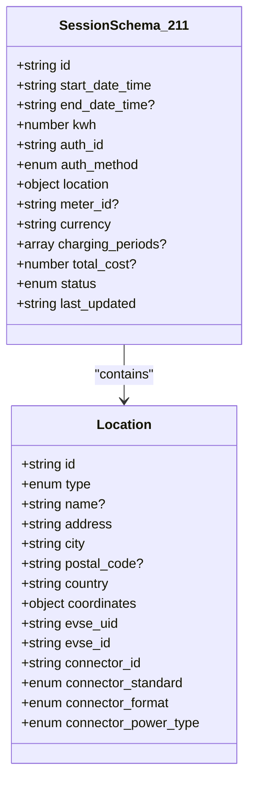
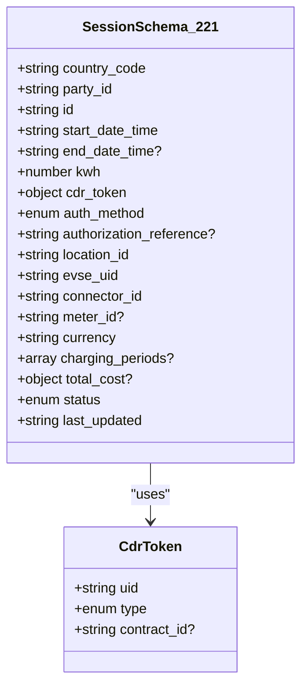
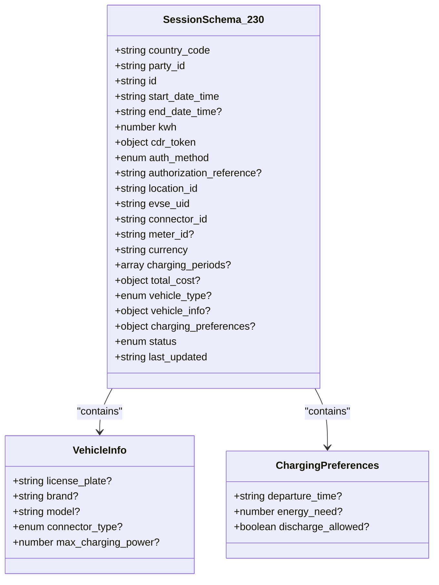
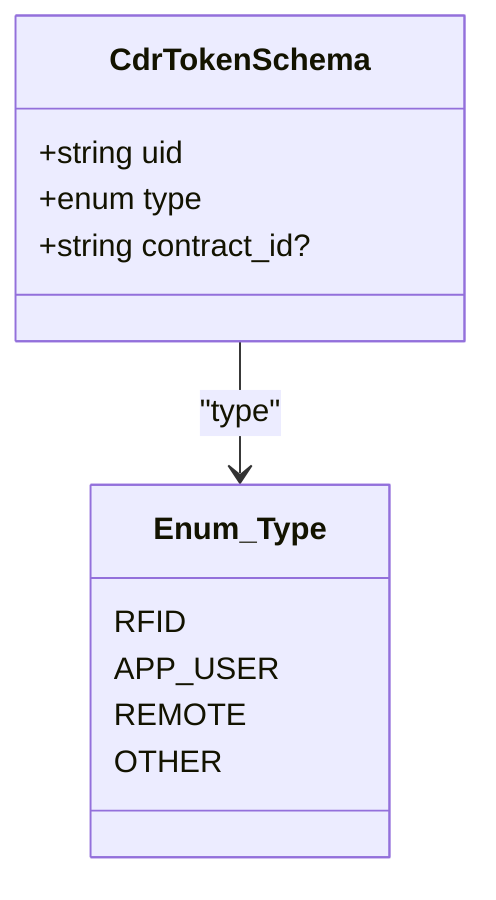
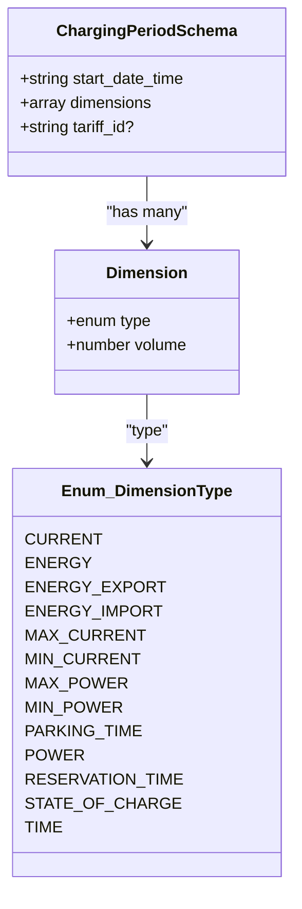
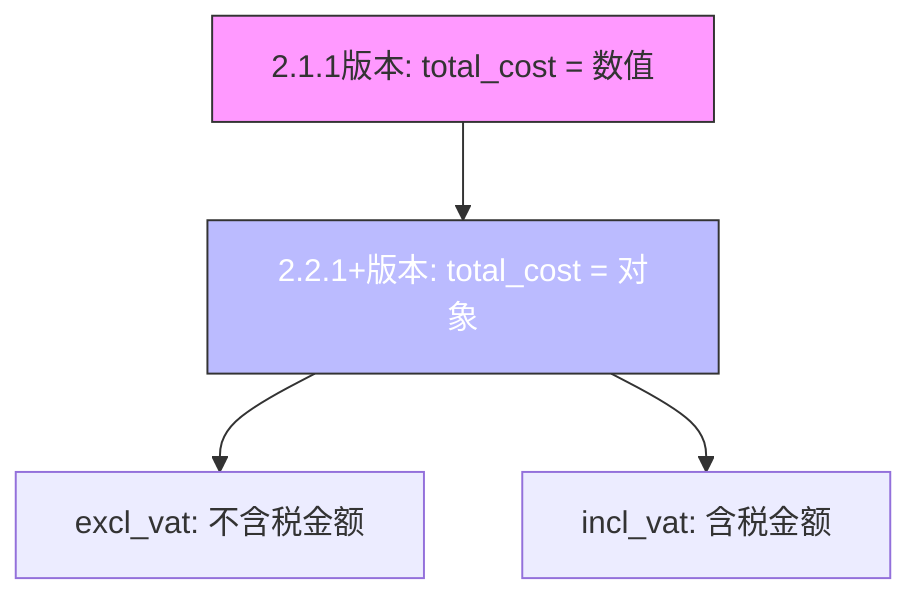

# Sessions模块

<cite>
**Referenced Files in This Document**   
- [ocpi-validators.js](file://src/ocpi-validators.js)
- [sample-data.js](file://src/sample-data.js)
</cite>

## 目录
1. [引言](#引言)
2. [数据模型演进](#数据模型演进)
3. [核心验证机制](#核心验证机制)
4. [复杂嵌套结构分析](#复杂嵌套结构分析)
5. [版本差异与兼容性](#版本差异与兼容性)
6. [实际案例演示](#实际案例演示)
7. [常见错误识别](#常见错误识别)

## 引言

Sessions模块是OCPI（开放充电点接口）协议中的核心组件，负责管理电动汽车的充电会话。本文档基于`ocpi-validators.js`文件中的`SessionSchema_211`、`SessionSchema_221`和`SessionSchema_230`三个验证模式，全面解析从基础会话信息到高级功能的完整数据模型。通过结合`sample-data.js`中的实际案例，我们将深入探讨不同版本间的演变过程，特别是`total_cost`字段从简单数值到包含增值税信息的对象化转变，以及2.3.0版本引入的车辆信息和充电偏好等高级特性。

**Section sources**
- [ocpi-validators.js](file://src/ocpi-validators.js#L157-L196)
- [ocpi-validators.js](file://src/ocpi-validators.js#L556-L585)
- [ocpi-validators.js](file://src/ocpi-validators.js#L588-L636)

## 数据模型演进

### 基础会话信息 (2.1.1版本)
在OCPI 2.1.1-d2版本中，`SessionSchema_211`定义了最基础的会话数据结构。该模式包含了会话ID、开始和结束时间、消耗电量(kWh)、认证信息、位置详情、计量表ID、货币类型、充电周期、总成本和状态等关键字段。其中，位置信息直接内嵌在会话对象中，包含了详细的地理位置坐标、EVSE（电动车辆供电设备）标识符和连接器信息。



**Diagram sources **
- [ocpi-validators.js](file://src/ocpi-validators.js#L157-L196)

**Section sources**
- [ocpi-validators.js](file://src/ocpi-validators.js#L157-L196)

### 增强型会话信息 (2.2.1版本)
随着OCPI协议升级至2.2.1-d2版本，`SessionSchema_221`引入了多项重要改进。最显著的变化是将`auth_id`替换为更通用的`cdr_token`对象，实现了认证令牌的标准化。同时，新增了`country_code`和`party_id`字段以支持跨运营商的数据交换，并扩展了`auth_method`枚举值，增加了`COMMAND`选项以支持远程启动会话的功能。



**Diagram sources **
- [ocpi-validators.js](file://src/ocpi-validators.js#L556-L585)

**Section sources**
- [ocpi-validators.js](file://src/ocpi-validators.js#L556-L585)

### 智能会话信息 (2.3.0版本)
OCPI 2.3.0版本的`SessionSchema_230`带来了革命性的增强功能，标志着从基本充电管理向智能充电服务的转变。除了继承2.2.1版本的所有特性外，该模式新增了`vehicle_info`和`charging_preferences`两个关键对象，使得系统能够获取车辆的具体信息并根据用户的充电需求进行优化调度。



**Diagram sources **
- [ocpi-validators.js](file://src/ocpi-validators.js#L588-L636)

**Section sources**
- [ocpi-validators.js](file://src/ocpi-validators.js#L588-L636)

## 核心验证机制

### 字段类型与约束
所有三个版本的会话模式都严格遵循Zod库的类型验证规则，确保数据的完整性和一致性。每个字段都有明确的类型定义和约束条件：
- **字符串字段**：使用`.max()`和`.length()`方法限制最大长度或固定长度
- **数值字段**：使用`.nonnegative()`确保非负数，`.positive()`确保正数
- **枚举字段**：通过`.enum([])`限定可接受的值列表
- **日期时间字段**：使用`.datetime()`验证ISO 8601格式的时间戳
- **可选字段**：通过`.optional()`标记，允许字段不存在

### 地理坐标验证
地理位置坐标的验证采用了严格的正则表达式模式，确保纬度和经度的格式正确：
- 纬度范围：`^-?[0-9]{1,2}\.[0-9]{5,7}$`，覆盖-90到90度
- 经度范围：`^-?[0-9]{1,2}\.[0-9]{5,7}$`，覆盖-180到180度
这种精确的正则表达式设计防止了无效地理坐标的输入，保证了地图服务的准确性。

### 认证方法演进
认证方法(`auth_method`)的枚举值随着版本迭代不断扩展：
- 2.1.1版本：`['AUTH_REQUEST', 'WHITELIST']`
- 2.2.1及以后版本：`['AUTH_REQUEST', 'COMMAND', 'WHITELIST']`
新增的`COMMAND`选项支持通过远程命令启动会话，为用户提供了更大的灵活性。

**Section sources**
- [ocpi-validators.js](file://src/ocpi-validators.js#L157-L636)

## 复杂嵌套结构分析

### cdr_token结构验证
`cdr_token`是一个关键的嵌套对象，用于标识充电会话的认证令牌。其验证规则包括：
- `uid`：字符串，最大36个字符
- `type`：枚举值，包括`'RFID'`, `'APP_USER'`, `'REMOTE'`, `'OTHER'`
- `contract_id`：可选字符串，最大36个字符

该结构在2.2.1和2.3.0版本中保持一致，但在2.3.0版本中对`uid`字段移除了最大长度限制，提供了更好的灵活性。



**Diagram sources **
- [ocpi-validators.js](file://src/ocpi-validators.js#L7-L11)

**Section sources**
- [ocpi-validators.js](file://src/ocpi-validators.js#L7-L11)

### charging_periods结构验证
`charging_periods`数组记录了会话期间的多个充电周期，每个周期包含开始时间、维度数组和可选的资费ID。维度数组中的每个元素都有类型和体积两个属性：
- **类型**：枚举值包括`'CURRENT'`, `'ENERGY'`, `'ENERGY_EXPORT'`, `'ENERGY_IMPORT'`, `'MAX_CURRENT'`, `'MIN_CURRENT'`, `'MAX_POWER'`, `'MIN_POWER'`, `'PARKING_TIME'`, `'POWER'`, `'RESERVATION_TIME'`, `'STATE_OF_CHARGE'`, `'TIME'`
- **体积**：数值型，表示该维度的实际测量值

这种灵活的设计允许详细记录各种充电参数，为计费和数据分析提供丰富信息。



**Diagram sources **
- [ocpi-validators.js](file://src/ocpi-validators.js#L33-L40)

**Section sources**
- [ocpi-validators.js](file://src/ocpi-validators.js#L33-L40)

### total_cost结构演变
`total_cost`字段的演变体现了OCPI协议对财务透明度要求的提升：
- **2.1.1版本**：简单的数值型字段，仅表示含税总价
- **2.2.1及以后版本**：复杂的对象结构，包含`excl_vat`（不含税）和`incl_vat`（含税）两个可选数值

这一变化使得系统能够清晰地区分税费部分，满足了不同国家和地区税务报告的需求。



**Section sources**
- [ocpi-validators.js](file://src/ocpi-validators.js#L157-L636)

## 版本差异与兼容性

### 主要版本差异对比
下表总结了三个主要版本之间的关键差异：

| 特性 | 2.1.1版本 | 2.2.1版本 | 2.3.0版本 |
|------|-----------|-----------|-----------|
| 国家代码 | 无 | 有 | 有 |
| 运营商ID | 无 | 有 | 有 |
| 认证令牌 | auth_id | cdr_token | cdr_token |
| 认证方式 | AUTH_REQUEST, WHITELIST | 新增COMMAND | 保持不变 |
| 总成本 | 数值 | 对象(excl/incl VAT) | 对象(excl/incl VAT) |
| 车辆信息 | 无 | 无 | 有(vehicle_info) |
| 充电偏好 | 无 | 无 | 有(charging_preferences) |
| 预留状态 | 无 | 有(RESERVATION) | 有(RESERVATION) |

### 向后兼容性策略
尽管存在显著差异，但OCPI协议设计时考虑了向后兼容性。例如，`cdr_token`结构在2.2.1和2.3.0版本中基本保持一致，只有细微调整。此外，核心的充电周期和位置信息结构也保持了高度的一致性，确保了不同版本系统间的基本互操作性。

**Section sources**
- [ocpi-validators.js](file://src/ocpi-validators.js#L157-L636)

## 实际案例演示

### 构造符合规范的会话数据
以下步骤演示如何构造一个符合2.3.0版本规范的会话数据：

1. **基础信息设置**：定义国家代码、运营商ID、会话ID和时间戳
2. **认证信息配置**：创建`cdr_token`对象，包含UID、类型和合同ID
3. **位置关联**：指定`location_id`、`evse_uid`和`connector_id`
4. **充电详情**：记录消耗电量(kWh)和货币类型
5. **充电周期**：添加一个或多个充电周期，每个周期包含开始时间和维度数组
6. **成本计算**：提供不含税和含税的总成本
7. **高级特性**：可选地添加车辆信息和充电偏好

```json
{
  "country_code": "NL",
  "party_id": "ABC",
  "id": "SES456",
  "start_date_time": "2024-01-15T14:30:00Z",
  "kwh": 155.7,
  "cdr_token": {
    "uid": "TOK456",
    "type": "OTHER",
    "contract_id": "HDV_CON456"
  },
  "auth_method": "COMMAND",
  "location_id": "LOC456",
  "evse_uid": "EVS456",
  "connector_id": "CON456",
  "currency": "EUR",
  "charging_periods": [
    {
      "start_date_time": "2024-01-15T14:30:00Z",
      "dimensions": [
        { "type": "ENERGY", "volume": 155.7 },
        { "type": "TIME", "volume": 7200 }
      ]
    }
  ],
  "total_cost": {
    "excl_vat": 93.42,
    "incl_vat": 113.04
  },
  "vehicle_info": {
    "license_plate": "NL-HDV-456",
    "brand": "Volvo",
    "model": "FH Electric",
    "connector_type": "CCS",
    "max_charging_power": 500000
  },
  "charging_preferences": {
    "departure_time": "2024-01-16T06:00:00Z",
    "energy_need": 200.0
  },
  "status": "ACTIVE"
}
```

**Section sources**
- [sample-data.js](file://src/sample-data.js#L450-L649)

## 常见错误识别

### 结构性错误
常见的结构性错误包括：
- **缺失必需字段**：如忘记提供`country_code`或`party_id`
- **字段类型错误**：将字符串类型的`id`误设为数字
- **枚举值超出范围**：使用不在允许列表中的`auth_method`值
- **格式不正确**：日期时间不符合ISO 8601标准

### 数据逻辑错误
数据逻辑层面的常见问题有：
- **时间顺序错误**：结束时间早于开始时间
- **数值矛盾**：总电量与充电周期中记录的能量总和不符
- **地理位置异常**：坐标值超出合理范围
- **成本计算错误**：含税价格与不含税价格的差额不符合税率规定

### 版本特定错误
针对特定版本的常见错误：
- **2.1.1版本**：错误地使用`cdr_token`而非`auth_id`
- **2.2.1+版本**：将`total_cost`设为简单数值而非对象
- **2.3.0版本**：`vehicle_info`中的`max_charging_power`设为负数或零

通过仔细检查这些常见错误点，可以有效提高数据质量和系统稳定性。

**Section sources**
- [ocpi-validators.js](file://src/ocpi-validators.js#L157-L636)
- [sample-data.js](file://src/sample-data.js#L50-L649)