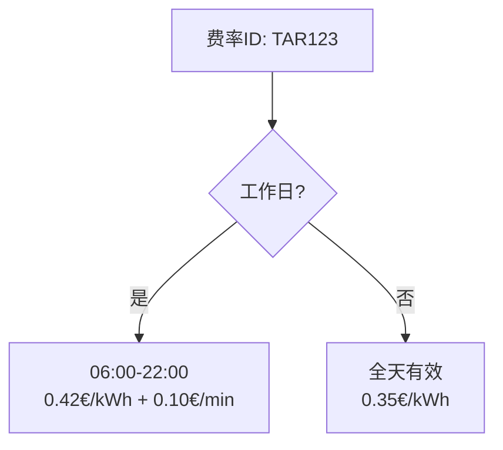

# Tariffs模块

<cite>
**Referenced Files in This Document **   
- [ocpi-validators.js](file://src/ocpi-validators.js)
- [sample-data.js](file://src/sample-data.js)
</cite>

## 目录
1. [Tariff数据结构概述](#tariff数据结构概述)
2. [价格组件与计算方式](#价格组件与计算方式)
3. [限制条件组合应用](#限制条件组合应用)
4. [绿色能源信息披露](#绿色能源信息披露)
5. [多时段费率示例分析](#多时段费率示例分析)
6. [时间字段格式合规性](#时间字段格式合规性)

## Tariff数据结构概述

Tariff（费率）模块是OCPI协议中用于定义充电服务计费规则的核心数据结构。该模块通过`TariffSchema_211`进行严格定义，包含费率标识、货币单位、价格元素、使用限制和能源构成等关键信息。

**Section sources**
- [ocpi-validators.js](file://src/ocpi-validators.js#L252-L294)

## 价格组件与计算方式

### 价格组件类型

Tariff模块中的`price_components`数组定义了不同类型的计费方式，每种类型对应特定的充电资源消耗维度：

- **ENERGY（电能）**：按实际消耗的电量（kWh）计费
- **FLAT（固定费用）**：一次性收取的固定费用
- **PARKING_TIME（停车时间）**：根据车辆停放时长计费
- **TIME（充电时间）**：按实际充电时长计费

### Step Size含义

`step_size`字段表示计费周期的最小单位，决定了费用计算的粒度：
- 对于ENERGY类型，`step_size`为1表示按每kWh计费
- 对于TIME类型，`step_size`为60表示按每分钟计费
- 费用计算遵循"向上取整"原则，例如当`step_size`=60且充电时间为65秒时，将按1分钟计费

**Section sources**
- [ocpi-validators.js](file://src/ocpi-validators.js#L263-L270)

## 限制条件组合应用

### 时间限制

`restrictions`对象支持多种时间维度的限制条件组合：
- `start_time`与`end_time`：定义每日生效的时间窗口（24小时制）
- `day_of_week`：指定一周中生效的具体星期
- `start_date`与`end_date`：定义费率的有效日期范围

### 电量与功率限制

- `min_kwh`与`max_kwh`：设置充电量的下限和上限
- `min_power`与`max_power`：限制充电设备的最小和最大功率输出
- `min_duration`与`max_duration`：规定充电会话的最短和最长持续时间

这些限制条件可以灵活组合，实现复杂的业务场景，如工作日高峰时段的高电价策略或周末优惠套餐。

**Section sources**
- [ocpi-validators.js](file://src/ocpi-validators.js#L272-L284)

## 绿色能源信息披露

### 能源构成要求

`energy_mix`对象用于披露电力来源的环保信息，必须包含以下内容：
- `is_green_energy`：布尔值，明确标识是否为绿色能源
- `energy_sources`：详细列出各类能源的占比，包括SOLAR（太阳能）、WIND（风能）、WATER（水力）等可再生能源，以及NUCLEAR（核能）、COAL（煤炭）等传统能源
- 各能源来源的`percentage`总和必须等于100%

### 供应商信息

- `supplier_name`：提供电力的供应商名称
- `energy_product_name`：具体的能源产品名称
- `environ_impact`：环境影响评估，包括CARBON_DIOXIDE（二氧化碳排放）等指标

此信息披露机制增强了充电服务的透明度，帮助用户做出环保选择。

**Section sources**
- [ocpi-validators.js](file://src/ocpi-validators.js#L286-L293)

## 多时段费率示例分析

### 工作日定价策略

在`sample-data.js`中定义的工作日费率（周一至周五）采用复合计价模式：
- 电能费用：0.42欧元/kWh
- 时间费用：0.10欧元/分钟
- 生效时段：每天06:00至22:00

这种组合计价方式既考虑了能源成本，也包含了服务占用成本。

### 周末定价策略

周末费率（周六和周日）采用简化模式：
- 仅收取电能费用：0.35欧元/kWh
- 无时间附加费
- 全天候有效

通过对比可见，周末费率不仅单价更低，而且取消了时间费用，体现了非高峰时段的优惠政策。

**Diagram sources **
- [sample-data.js](file://src/sample-data.js#L220-L245)

**Section sources**
- [sample-data.js](file://src/sample-data.js#L220-L245)

## 时间字段格式合规性

### Last Updated字段

`last_updated`字段必须遵循ISO 8601标准的日期时间格式：
- 格式要求：YYYY-MM-DDTHH:mm:ssZ
- 示例：2024-01-15T10:00:00Z
- 必须使用UTC时间（以Z结尾）

### 其他时间字段

- `start_time`和`end_time`：HH:mm格式，如"06:00"
- `start_date`和`end_date`：YYYY-MM-DD格式，如"2024-01-15"
- 所有时间字段都需通过正则表达式验证，确保格式正确性和数值合理性

严格的时间格式要求保证了系统间数据交换的一致性和可靠性。

**Section sources**
- [ocpi-validators.js](file://src/ocpi-validators.js#L294)