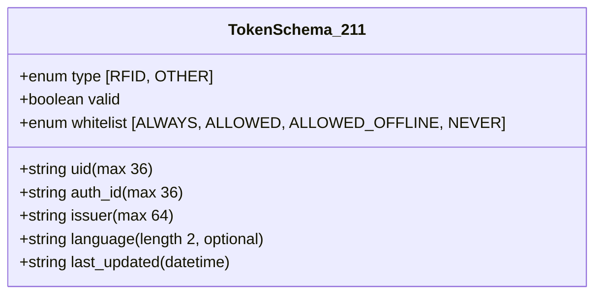
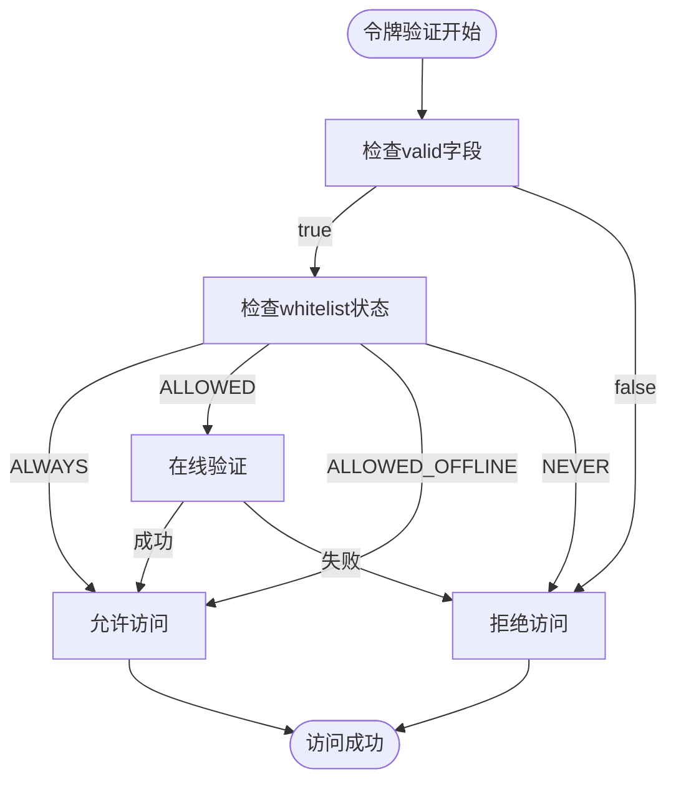
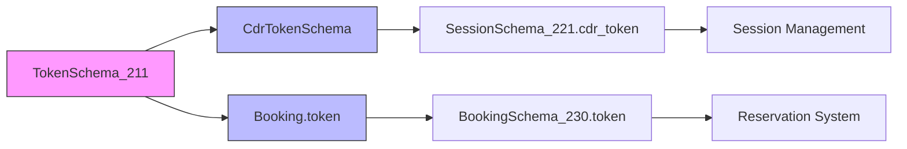

<cite>
**Referenced Files in This Document**
- [ocpi-validators.js](file://src/ocpi-validators.js)
- [sample-data.js](file://src/sample-data.js)
</cite>

## 目录
1. [Tokens模块](#tokens模块)
2. [TokenSchema_211数据规范](#tokenschema_211数据规范)
3. [核心字段技术要求](#核心字段技术要求)
4. [Whitelist状态与访问权限](#whitelist状态与访问权限)
5. [有效令牌实例分析](#有效令牌实例分析)
6. [发行方与语言设置](#发行方与语言设置)
7. [版本演进与整合趋势](#版本演进与整合趋势)

## Tokens模块

本文档深入解析OCPI协议中Tokens（认证令牌）模块的验证逻辑与数据规范。基于`ocpi-validators.js`文件中的`TokenSchema_211`定义，阐明uid、type、auth_id等核心字段的技术要求，特别是whitelist状态（ALWAYS、ALLOWED等）对访问权限的影响。通过`sample-data.js`中的实例，展示有效令牌的完整结构，并解释issuer发行方信息和language语言设置的实际应用场景。同时指出该模块在2.2.1-d2及后续版本中被整合至其他对象（如cdr_token）的变化趋势。

**Section sources**
- [ocpi-validators.js](file://src/ocpi-validators.js#L240-L249)
- [sample-data.js](file://src/sample-data.js#L658-L666)

## TokenSchema_211数据规范

`TokenSchema_211`是OCPI 2.1.1-d2版本中用于定义认证令牌的数据结构模式。该模式使用Zod库进行类型安全的验证，确保所有传入的令牌数据符合预定义的格式和约束条件。此模式主要应用于需要对用户或设备进行身份验证的场景，如启动充电会话、预订充电桩等操作。



**Diagram sources**
- [ocpi-validators.js](file://src/ocpi-validators.js#L240-L249)

**Section sources**
- [ocpi-validators.js](file://src/ocpi-validators.js#L240-L249)

## 核心字段技术要求

### UID (唯一标识符)
UID字段作为令牌的全局唯一标识，其最大长度限制为36个字符。这通常对应一个UUID格式的字符串，确保在分布式系统中不会发生冲突。

### Type (令牌类型)
Type字段定义了令牌的物理或逻辑类型，目前支持两种枚举值：'RFID'（射频识别卡）和'OTHER'（其他类型）。该字段用于区分不同类型的认证介质。

### Auth ID (认证标识)
Auth ID字段同样具有36个字符的最大长度限制，用于在系统内部关联特定的认证事件或会话。它可能与用户的账户ID或其他认证凭证相关联。

### Valid (有效性)
Valid字段是一个布尔值，直接指示该令牌当前是否处于有效状态。系统在处理认证请求时，会首先检查此标志位。

**Section sources**
- [ocpi-validators.js](file://src/ocpi-validators.js#L240-L249)

## Whitelist状态与访问权限

Whitelist字段是决定令牌访问权限的关键因素，其值决定了持有者可以在何种条件下使用服务。该字段包含四个枚举值：

- **ALWAYS**: 持有者始终被允许访问，无论网络状况如何。
- **ALLOWED**: 持有者被允许访问，但可能需要在线验证。
- **ALLOWED_OFFLINE**: 在网络离线的情况下，持有者仍被允许访问，适用于紧急情况或网络不稳定区域。
- **NEVER**: 持有者被永久禁止访问，即使在网络离线时也不允许。

这些状态直接影响系统的授权决策流程，例如在`SessionSchema_221`中，当`auth_method`为'WHITELIST'时，系统将根据此字段的值来决定是否启动充电会话。

**Section sources**
- [ocpi-validators.js](file://src/ocpi-validators.js#L240-L249)

## 有效令牌实例分析

通过`sample-data.js`中的`sampleToken`实例，可以观察到一个完整的有效令牌结构：

```json
{
  "uid": "TOK123",
  "type": "RFID",
  "auth_id": "AUTH123",
  "issuer": "Sample Company",
  "valid": true,
  "whitelist": "ALLOWED",
  "last_updated": "2024-01-15T14:30:00Z"
}
```

此实例展示了所有必需字段的典型取值。值得注意的是，`language`字段在此例中未出现，因为它在`TokenSchema_211`中被定义为可选字段。该实例可用于单元测试或作为API响应的示例数据。



**Diagram sources**
- [sample-data.js](file://src/sample-data.js#L658-L666)
- [ocpi-validators.js](file://src/ocpi-validators.js#L240-L249)

**Section sources**
- [sample-data.js](file://src/sample-data.js#L658-L666)

## 发行方与语言设置

### Issuer (发行方)
Issuer字段记录了令牌的发行机构名称，最大长度为64个字符。这对于多运营商环境下的责任追溯和品牌展示至关重要。例如，在跨运营商充电场景中，系统可以根据issuer信息选择正确的结算路径。

### Language (语言)
Language字段为可选的两位ISO语言代码（如'en'、'zh'），用于指定与该令牌相关的用户界面语言偏好。虽然在基础令牌中为可选，但在更复杂的交互场景（如多语言提示音或显示屏）中，此信息可用于提供个性化的用户体验。

**Section sources**
- [ocpi-validators.js](file://src/ocpi-validators.js#L240-L249)

## 版本演进与整合趋势

随着OCPI协议从2.1.1-d2版本向2.2.1-d2及更高版本演进，Tokens模块经历了显著的架构变化。最明显的变化是`TokenSchema_211`中的核心字段被整合进新的复合对象中。

在2.2.1-d2版本的`SessionSchema_221`中，原有的令牌信息被重构为`cdr_token`对象，其定义由独立的`CdrTokenSchema`提供。新结构不仅保留了`uid`和`type`字段，还增加了`contract_id`以支持更复杂的合同关系管理。

此外，在2.3.0版本的`BookingSchema_230`中，可以看到`token`字段直接内嵌了一个与`TokenSchema_211`高度相似的结构体，这表明令牌的核心概念仍然存在，但其应用上下文已从单一的认证功能扩展到了预订、支付等多个业务场景。

这一演变趋势体现了OCPI协议从简单认证向综合服务管理的发展方向，即通过模块化和复用的方式，将令牌机制深度集成到整个充电生态系统的各个业务流程中。



**Diagram sources**
- [ocpi-validators.js](file://src/ocpi-validators.js#L240-L249)
- [ocpi-validators.js](file://src/ocpi-validators.js#L7-L11)
- [ocpi-validators.js](file://src/ocpi-validators.js#L556-L585)
- [ocpi-validators.js](file://src/ocpi-validators.js#L705-L746)

**Section sources**
- [ocpi-validators.js](file://src/ocpi-validators.js#L7-L11)
- [ocpi-validators.js](file://src/ocpi-validators.js#L556-L585)
- [ocpi-validators.js](file://src/ocpi-validators.js#L705-L746)