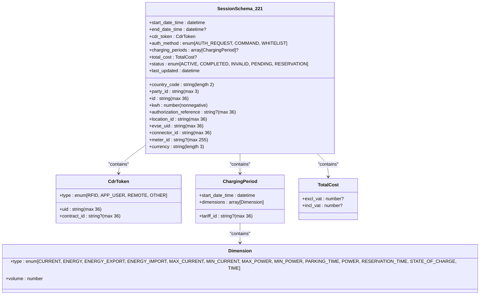
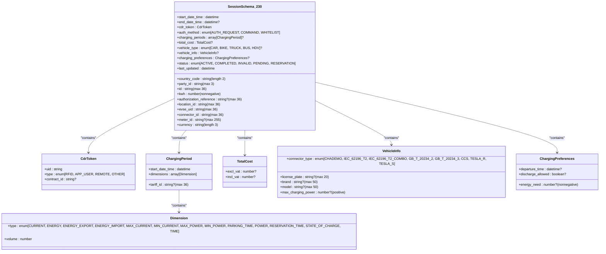
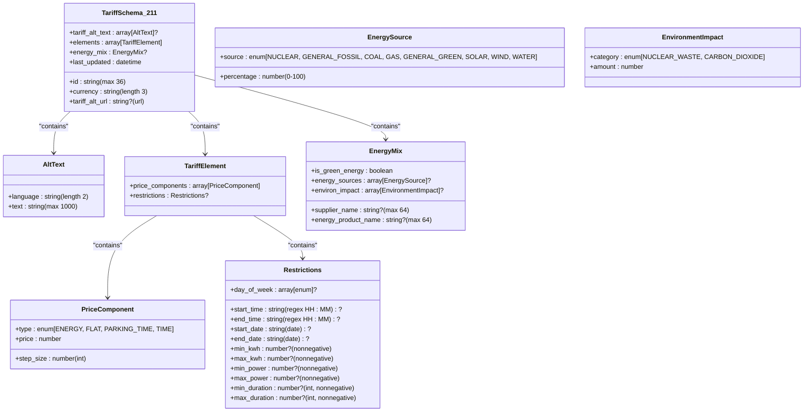
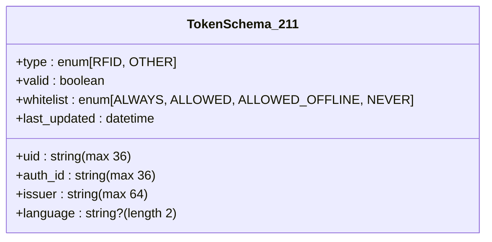
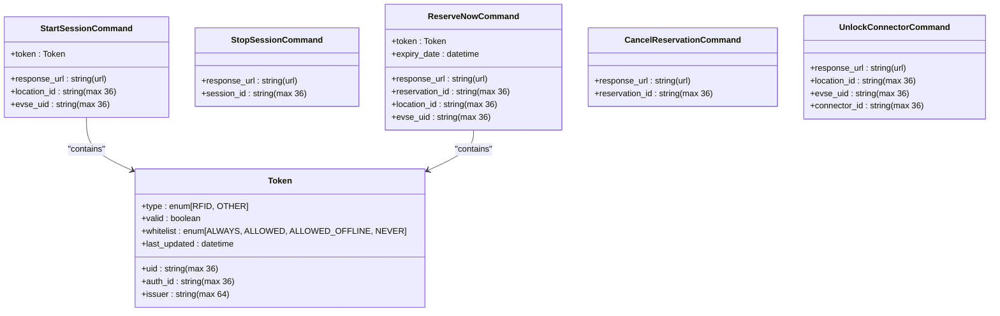
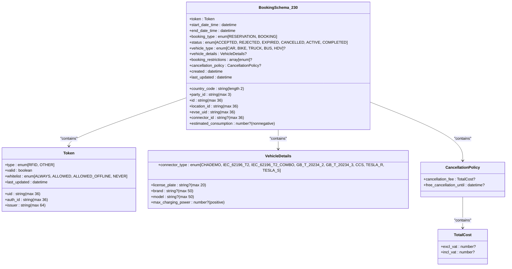
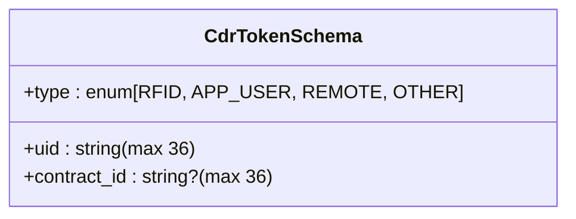
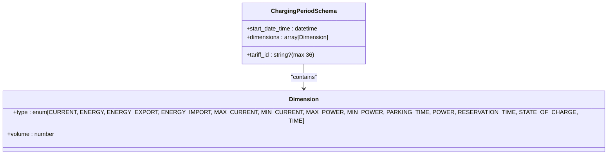

# 验证模块详解

<cite>
**Referenced Files in This Document**   
- [ocpi-validators.js](file://src/ocpi-validators.js)
- [sample-data.js](file://src/sample-data.js)
</cite>

## 目录
1. [引言](#引言)
2. [Locations模块验证机制](#locations模块验证机制)
3. [Sessions模块验证机制](#sessions模块验证机制)
4. [CDRs模块验证机制](#cdrs模块验证机制)
5. [Tariffs模块验证机制](#tariffs模块验证机制)
6. [Tokens模块验证机制](#tokens模块验证机制)
7. [Commands模块验证机制](#commands模块验证机制)
8. [Bookings模块验证机制](#bookings模块验证机制)
9. [公共数据结构](#公共数据结构)

## 引言

本文档深入剖析OCPI（开放充电点接口）功能模块的验证机制，重点分析`ocpi-validators.js`中的Zod模式定义和`sample-data.js`中的实例数据。通过结合具体代码实现和示例数据，详细解释各个模块的数据模型要求、关键字段约束、必填项规则和嵌套结构规范。文档将展示不同OCPI版本（2.1.1-d2、2.2.1-d2、2.3.0）之间的演进变化，并通过合法与非法JSON的判别逻辑说明验证过程。

**Section sources**
- [ocpi-validators.js](file://src/ocpi-validators.js#L1-L1006)
- [sample-data.js](file://src/sample-data.js#L1-L723)

## Locations模块验证机制

Locations模块用于描述充电站的位置信息，其验证机制在不同OCPI版本中有所演进。从2.1.1到2.3.0版本，该模块增加了国家代码、运营商ID等全局标识符，并引入了车辆类型支持等新特性。

### OCPI 2.1.1-d2 Location Schema

```mermaid
classDiagram
class LocationSchema_211 {
+id : string (max 36)
+type : enum[ON_STREET, PARKING_GARAGE, UNDERGROUND_GARAGE, PARKING_LOT, OTHER]
+name : string? (max 255)
+address : string (max 45)
+city : string (max 45)
+postal_code : string? (max 10)
+country : string (length 3)
+coordinates : object{latitude, longitude}
+related_locations : array[object]?
+evses : array[EVSE]
+directions : array[object]?
+operator : object{name}?
+suboperator : object{name}?
+owner : object{name}?
+facilities : array[enum]?
+time_zone : string
+opening_times : object{twentyfourseven, regular_hours, exceptional_openings, exceptional_closings}?
+charging_when_closed : boolean?
+images : array[Image]?
+energy_mix : EnergyMix?
+last_updated : datetime
}
class EVSE {
+uid : string (max 36)
+evse_id : string? (max 48)
+status : enum[AVAILABLE, BLOCKED, CHARGING, INOPERATIVE, OUTOFORDER, PLANNED, REMOVED, RESERVED, UNKNOWN]
+status_schedule : array[StatusSchedule]?
+capabilities : array[enum]?
+connectors : array[Connector]
+physical_reference : string? (max 16)
+directions : array[object]?
+parking_restrictions : array[enum]?
+images : array[Image]?
+last_updated : datetime
}
class Connector {
+id : string (max 36)
+standard : enum[CHADEMO, DOMESTIC_A, ..., TESLA_S]
+format : enum[SOCKET, CABLE]
+power_type : enum[AC_1_PHASE, AC_3_PHASE, DC]
+voltage : number? (int)
+amperage : number? (int)
+tariff_id : string? (max 36)
+terms_and_conditions : string? (url)
+last_updated : datetime
}
class Image {
+url : string (url)
+thumbnail : string? (url)
+category : enum[CHARGER, ENTRANCE, LOCATION, NETWORK, OPERATOR, OTHER, OWNER]
+type : string (max 4)
+width : number? (int)
+height : number? (int)
}
class EnergyMix {
+is_green_energy : boolean
+energy_sources : array[EnergySource]?
+environ_impact : array[EnvironmentImpact]?
+supplier_name : string? (max 64)
+energy_product_name : string? (max 64)
}
class EnergySource {
+source : enum[NUCLEAR, GENERAL_FOSSIL, COAL, GAS, GENERAL_GREEN, SOLAR, WIND, WATER]
+percentage : number (0-100)
}
class EnvironmentImpact {
+category : enum[NUCLEAR_WASTE, CARBON_DIOXIDE]
+amount : number
}
LocationSchema_211 --> EVSE : "contains"
EVSE --> Connector : "contains"
EVSE --> Image : "contains"
LocationSchema_211 --> Image : "contains"
LocationSchema_211 --> EnergyMix : "contains"
```

**Diagram sources**
- [ocpi-validators.js](file://src/ocpi-validators.js#L43-L154)
- [sample-data.js](file://src/sample-data.js#L4-L246)

**Section sources**
- [ocpi-validators.js](file://src/ocpi-validators.js#L43-L154)
- [sample-data.js](file://src/sample-data.js#L4-L246)

### OCPI 2.2.1-d2 Location Schema

```mermaid
classDiagram
class LocationSchema_221 {
+country_code : string (length 2)
+party_id : string (max 3)
+id : string (max 36)
+publish : boolean
+name : string? (max 255)
+address : string (max 45)
+city : string (max 45)
+postal_code : string? (max 10)
+state : string? (max 20)
+country : string (length 3)
+coordinates : object{latitude, longitude}
+related_locations : array[object]?
+parking_restrictions : array[enum]?
+opening_times : object{twentyfourseven, regular_hours, exceptional_openings, exceptional_closings}?
+charging_when_closed : boolean?
+images : array[Image]?
+energy_mix : EnergyMix?
+directions : array[object]?
+operator : object{name}?
+suboperator : object{name}?
+owner : object{name}?
+facilities : array[enum]?
+evses : array[EVSE]
+time_zone : string
+last_updated : datetime
}
class EVSE {
+uid : string (max 36)
+evse_id : string? (max 48)
+status : enum[AVAILABLE, BLOCKED, CHARGING, INOPERATIVE, OUTOFORDER, PLANNED, REMOVED, RESERVED, UNKNOWN]
+status_schedule : array[StatusSchedule]?
+capabilities : array[enum]?
+connectors : array[Connector]
+floor_level : string? (max 4)
+coordinates : object{latitude, longitude}?
+physical_reference : string? (max 16)
+directions : array[object]?
+parking_restrictions : array[enum]?
+images : array[Image]?
+last_updated : datetime
}
class Connector {
+id : string (max 36)
+standard : enum[CHADEMO, DOMESTIC_A, ..., TESLA_S]
+format : enum[SOCKET, CABLE]
+power_type : enum[AC_1_PHASE, AC_3_PHASE, DC]
+max_voltage : number? (int)
+max_amperage : number? (int)
+max_electric_power : number? (int)
+tariff_ids : array[string]? (max 36)
+terms_and_conditions : string? (url)
+last_updated : datetime
}
class Image {
+url : string (url)
+thumbnail : string? (url)
+category : enum[CHARGER, ENTRANCE, LOCATION, NETWORK, OPERATOR, OTHER, OWNER]
+type : string (max 4)
+width : number? (int)
+height : number? (int)
}
class EnergyMix {
+is_green_energy : boolean
+energy_sources : array[EnergySource]?
+environ_impact : array[EnvironmentImpact]?
+supplier_name : string? (max 64)
+energy_product_name : string? (max 64)
}
class EnergySource {
+source : enum[NUCLEAR, GENERAL_FOSSIL, COAL, GAS, GENERAL_GREEN, SOLAR, WIND, WATER]
+percentage : number (0-100)
}
class EnvironmentImpact {
+category : enum[NUCLEAR_WASTE, CARBON_DIOXIDE]
+amount : number
}
LocationSchema_221 --> EVSE : "contains"
EVSE --> Connector : "contains"
EVSE --> Image : "contains"
LocationSchema_221 --> Image : "contains"
LocationSchema_221 --> EnergyMix : "contains"
```

**Diagram sources**
- [ocpi-validators.js](file://src/ocpi-validators.js#L297-L418)
- [sample-data.js](file://src/sample-data.js#L250-L378)

**Section sources**
- [ocpi-validators.js](file://src/ocpi-validators.js#L297-L418)
- [sample-data.js](file://src/sample-data.js#L250-L378)

### OCPI 2.3.0 Location Schema

```mermaid
classDiagram
class LocationSchema_230 {
+country_code : string (length 2)
+party_id : string (max 3)
+id : string (max 36)
+publish : boolean
+publish_allowed_to : array[PublishAllowedTo]?
+name : string? (max 255)
+address : string (max 45)
+city : string (max 45)
+postal_code : string? (max 10)
+state : string? (max 20)
+country : string (length 3)
+coordinates : object{latitude, longitude}
+related_locations : array[object]?
+parking_restrictions : array[enum]?
+opening_times : object{twentyfourseven, regular_hours, exceptional_openings, exceptional_closings}?
+charging_when_closed : boolean?
+images : array[Image]?
+energy_mix : EnergyMix?
+directions : array[object]?
+operator : object{name}?
+suboperator : object{name}?
+owner : object{name}?
+facilities : array[enum]?
+vehicle_types : array[enum]?
+max_reservation : number? (int)
+evses : array[EVSE]
+time_zone : string
+last_updated : datetime
}
class PublishAllowedTo {
+uid : string (max 36)
+type : enum[APP_USER, RFID]
+contract_id : string (max 36)
}
class EVSE {
+uid : string (max 36)
+evse_id : string? (max 48)
+status : enum[AVAILABLE, BLOCKED, CHARGING, INOPERATIVE, OUTOFORDER, PLANNED, REMOVED, RESERVED, UNKNOWN]
+status_schedule : array[StatusSchedule]?
+capabilities : array[enum]?
+vehicle_types : array[enum]?
+connectors : array[Connector]
+floor_level : string? (max 4)
+coordinates : object{latitude, longitude}?
+physical_reference : string? (max 16)
+directions : array[object]?
+parking_restrictions : array[enum]?
+images : array[Image]?
+last_updated : datetime
}
class Connector {
+id : string (max 36)
+standard : enum[CHADEMO, DOMESTIC_A, ..., CCS, GB_T_20234_2, GB_T_20234_3]
+format : enum[SOCKET, CABLE]
+power_type : enum[AC_1_PHASE, AC_3_PHASE, DC]
+max_voltage : number? (int)
+max_amperage : number? (int)
+max_electric_power : number? (int)
+tariff_ids : array[string]? (max 36)
+terms_and_conditions : string? (url)
+last_updated : datetime
}
class Image {
+url : string (url)
+thumbnail : string? (url)
+category : enum[CHARGER, ENTRANCE, LOCATION, NETWORK, OPERATOR, OTHER, OWNER]
+type : string (max 4)
+width : number? (int)
+height : number? (int)
}
class EnergyMix {
+is_green_energy : boolean
+energy_sources : array[EnergySource]?
+environ_impact : array[EnvironmentImpact]?
+supplier_name : string? (max 64)
+energy_product_name : string? (max 64)
}
class EnergySource {
+source : enum[NUCLEAR, GENERAL_FOSSIL, COAL, GAS, GENERAL_GREEN, SOLAR, WIND, WATER]
+percentage : number (0-100)
}
class EnvironmentImpact {
+category : enum[NUCLEAR_WASTE, CARBON_DIOXIDE]
+amount : number
}
LocationSchema_230 --> PublishAllowedTo : "contains"
LocationSchema_230 --> EVSE : "contains"
EVSE --> Connector : "contains"
EVSE --> Image : "contains"
LocationSchema_230 --> Image : "contains"
LocationSchema_230 --> EnergyMix : "contains"
```

**Diagram sources**
- [ocpi-validators.js](file://src/ocpi-validators.js#L421-L553)
- [sample-data.js](file://src/sample-data.js#L382-L588)

**Section sources**
- [ocpi-validators.js](file://src/ocpi-validators.js#L421-L553)
- [sample-data.js](file://src/sample-data.js#L382-L588)

## Sessions模块验证机制

Sessions模块用于描述充电会话的详细信息，包括开始时间、结束时间、电量消耗等。随着OCPI版本的演进，该模块增加了更详细的费用计算、车辆信息和充电偏好设置。

### OCPI 2.1.1-d2 Session Schema

```mermaid
classDiagram
class SessionSchema_211 {
+id : string (max 36)
+start_date_time : datetime
+end_date_time : datetime?
+kwh : number (nonnegative)
+auth_id : string (max 36)
+auth_method : enum[AUTH_REQUEST, WHITELIST]
+location : LocationInfo
+meter_id : string? (max 255)
+currency : string (length 3)
+charging_periods : array[ChargingPeriod]?
+total_cost : number? (nonnegative)
+status : enum[ACTIVE, COMPLETED, INVALID, PENDING]
+last_updated : datetime
}
class LocationInfo {
+id : string (max 36)
+type : enum[ON_STREET, PARKING_GARAGE, UNDERGROUND_GARAGE, PARKING_LOT, OTHER]
+name : string? (max 255)
+address : string (max 45)
+city : string (max 45)
+postal_code : string? (max 10)
+country : string (length 3)
+coordinates : object{latitude, longitude}
+evse_uid : string (max 36)
+evse_id : string (max 48)
+connector_id : string (max 36)
+connector_standard : enum[CHADEMO, IEC_62196_T2, IEC_62196_T2_COMBO, CCS, TESLA_R, TESLA_S]
+connector_format : enum[SOCKET, CABLE]
+connector_power_type : enum[AC_1_PHASE, AC_3_PHASE, DC]
}
class ChargingPeriod {
+start_date_time : datetime
+dimensions : array[Dimension]
+tariff_id : string? (max 36)
}
class Dimension {
+type : enum[ENERGY, FLAT, PARKING_TIME, TIME]
+volume : number
}
SessionSchema_211 --> LocationInfo : "contains"
SessionSchema_211 --> ChargingPeriod : "contains"
ChargingPeriod --> Dimension : "contains"
```

**Diagram sources**
- [ocpi-validators.js](file://src/ocpi-validators.js#L157-L196)
- [sample-data.js](file://src/sample-data.js#L4-L246)

**Section sources**
- [ocpi-validators.js](file://src/ocpi-validators.js#L157-L196)
- [sample-data.js](file://src/sample-data.js#L4-L246)

### OCPI 2.2.1-d2 Session Schema



**Diagram sources**
- [ocpi-validators.js](file://src/ocpi-validators.js#L556-L585)
- [sample-data.js](file://src/sample-data.js#L250-L378)

**Section sources**
- [ocpi-validators.js](file://src/ocpi-validators.js#L556-L585)
- [sample-data.js](file://src/sample-data.js#L250-L378)

### OCPI 2.3.0 Session Schema



**Diagram sources**
- [ocpi-validators.js](file://src/ocpi-validators.js#L588-L636)
- [sample-data.js](file://src/sample-data.js#L382-L588)

**Section sources**
- [ocpi-validators.js](file://src/ocpi-validators.js#L588-L636)
- [sample-data.js](file://src/sample-data.js#L382-L588)

## CDRs模块验证机制

CDRs（充电数据记录）模块用于记录已完成的充电会话的详细信息，包括费用、能耗、时间等。该模块在不同版本中保持了较高的兼容性，但在2.3.0版本中增加了更详细的费用分解和签名数据支持。

### OCPI 2.1.1-d2 CDR Schema

```mermaid
classDiagram
class CDRSchema_211 {
+id : string (max 36)
+start_date_time : datetime
+end_date_time : datetime
+auth_id : string (max 36)
+auth_method : enum[AUTH_REQUEST, WHITELIST]
+location : LocationInfo
+meter_id : string? (max 255)
+currency : string (length 3)
+charging_periods : array[ChargingPeriod]
+total_cost : number (nonnegative)
+total_energy : number (nonnegative)
+total_time : number (nonnegative)
+last_updated : datetime
}
class LocationInfo {
+id : string (max 36)
+name : string? (max 255)
+address : string (max 45)
+city : string (max 45)
+postal_code : string? (max 10)
+country : string (length 3)
+coordinates : object{latitude, longitude}
+evse_uid : string (max 36)
+evse_id : string (max 48)
+connector_id : string (max 36)
+connector_standard : enum[CHADEMO, IEC_62196_T2, IEC_62196_T2_COMBO, CCS, TESLA_R, TESLA_S]
+connector_format : enum[SOCKET, CABLE]
+connector_power_type : enum[AC_1_PHASE, AC_3_PHASE, DC]
}
class ChargingPeriod {
+start_date_time : datetime
+dimensions : array[Dimension]
+tariff_id : string? (max 36)
}
class Dimension {
+type : enum[ENERGY, FLAT, PARKING_TIME, TIME]
+volume : number
}
CDRSchema_211 --> LocationInfo : "contains"
CDRSchema_211 --> ChargingPeriod : "contains"
ChargingPeriod --> Dimension : "contains"
```

**Diagram sources**
- [ocpi-validators.js](file://src/ocpi-validators.js#L199-L237)
- [sample-data.js](file://src/sample-data.js#L4-L246)

**Section sources**
- [ocpi-validators.js](file://src/ocpi-validators.js#L199-L237)
- [sample-data.js](file://src/sample-data.js#L4-L246)

### OCPI 2.2.1-d2 and 2.3.0 CDR Schema

```mermaid
classDiagram
class CDRSchema {
+country_code : string (length 2)
+party_id : string (max 3)
+id : string (max 36)
+start_date_time : datetime
+end_date_time : datetime
+session_id : string? (max 36)
+cdr_token : CdrToken
+auth_method : enum[AUTH_REQUEST, COMMAND, WHITELIST]
+authorization_reference : string? (max 36)
+cdr_location : CdrLocation
+meter_id : string? (max 255)
+currency : string (length 3)
+charging_periods : array[ChargingPeriod]
+total_cost : TotalCost
+total_energy : number (nonnegative)
+total_time : number (nonnegative)
+last_updated : datetime
}
class CdrToken {
+uid : string
+type : enum[RFID, APP_USER, REMOTE, OTHER]
+contract_id : string?
}
class CdrLocation {
+id : string (max 36)
+name : string? (max 255)
+address : string (max 45)
+city : string (max 45)
+postal_code : string? (max 10)
+state : string? (max 20)
+country : string (length 3)
+coordinates : object{latitude, longitude}
+evse_uid : string (max 36)
+evse_id : string (max 48)
+connector_id : string (max 36)
+connector_standard : enum[CHADEMO, IEC_62196_T2, IEC_62196_T2_COMBO, CCS, TESLA_R, TESLA_S]
+connector_format : enum[SOCKET, CABLE]
+connector_power_type : enum[AC_1_PHASE, AC_3_PHASE, DC]
}
class ChargingPeriod {
+start_date_time : datetime
+dimensions : array[Dimension]
+tariff_id : string? (max 36)
}
class Dimension {
+type : enum[CURRENT, ENERGY, ENERGY_EXPORT, ENERGY_IMPORT, MAX_CURRENT, MIN_CURRENT, MAX_POWER, MIN_POWER, PARKING_TIME, POWER, RESERVATION_TIME, STATE_OF_CHARGE, TIME]
+volume : number
}
class TotalCost {
+excl_vat : number?
+incl_vat : number?
}
CDRSchema --> CdrToken : "contains"
CDRSchema --> CdrLocation : "contains"
CDRSchema --> ChargingPeriod : "contains"
ChargingPeriod --> Dimension : "contains"
CDRSchema --> TotalCost : "contains"
```

**Diagram sources**
- [ocpi-validators.js](file://src/ocpi-validators.js#L749-L799)
- [sample-data.js](file://src/sample-data.js#L250-L378)

**Section sources**
- [ocpi-validators.js](file://src/ocpi-validators.js#L749-L799)
- [sample-data.js](file://src/sample-data.js#L250-L378)

### OCPI 2.3.0 CDR Schema

```mermaid
classDiagram
class CDRSchema_230 {
+country_code : string (length 2)
+party_id : string (max 3)
+id : string (max 36)
+start_date_time : datetime
+end_date_time : datetime
+session_id : string? (max 36)
+cdr_token : CdrToken
+auth_method : enum[AUTH_REQUEST, COMMAND, WHITELIST]
+authorization_reference : string? (max 36)
+cdr_location : CdrLocation
+meter_id : string? (max 255)
+currency : string (length 3)
+tariffs : array[TariffReference]?
+charging_periods : array[ChargingPeriod]
+signed_data : SignedData?
+total_cost : TotalCost
+total_fixed_cost : TotalCost?
+total_energy : number (nonnegative)
+total_energy_cost : TotalCost?
+total_time : number (nonnegative)
+total_time_cost : TotalCost?
+total_parking_time : number? (nonnegative)
+total_parking_cost : TotalCost?
+total_reservation_cost : TotalCost?
+remark : string? (max 1000)
+invoice_reference_id : string? (max 39)
+credit : boolean?
+credit_reference_id : string? (max 39)
+home_charging_compensation : boolean?
+last_updated : datetime
}
class CdrToken {
+uid : string (max 36)
+type : enum[RFID, APP_USER, REMOTE, OTHER]
+contract_id : string? (max 36)
}
class CdrLocation {
+id : string (max 36)
+name : string? (max 255)
+address : string (max 45)
+city : string (max 45)
+postal_code : string? (max 10)
+state : string? (max 20)
+country : string (length 3)
+coordinates : object{latitude, longitude}
+evse_uid : string (max 36)
+evse_id : string (max 48)
+connector_id : string (max 36)
+connector_standard : enum[CHADEMO, IEC_62196_T2, IEC_62196_T2_COMBO, CCS, TESLA_R, TESLA_S]
+connector_format : enum[SOCKET, CABLE]
+connector_power_type : enum[AC_1_PHASE, AC_3_PHASE, DC]
}
class TariffReference {
+country_code : string (length 2)
+party_id : string (max 3)
+id : string (max 36)
}
class ChargingPeriod {
+start_date_time : datetime
+dimensions : array[Dimension]
+tariff_id : string? (max 36)
}
class Dimension {
+type : enum[CURRENT, ENERGY, ENERGY_EXPORT, ENERGY_IMPORT, MAX_CURRENT, MIN_CURRENT, MAX_POWER, MIN_POWER, PARKING_TIME, POWER, RESERVATION_TIME, STATE_OF_CHARGE, TIME]
+volume : number
}
class TotalCost {
+excl_vat : number?
+incl_vat : number?
}
class SignedData {
+encoding_method : enum[BASE64]
+encoding_method_version : number? (int)
+public_key : string?
+signed_values : array[SignedValue]
+url : string? (url)
}
class SignedValue {
+nature : string (max 32)
+plain_data : string (max 512)
+signed_data : string (max 5000)
}
CDRSchema_230 --> CdrToken : "contains"
CDRSchema_230 --> CdrLocation : "contains"
CDRSchema_230 --> TariffReference : "contains"
CDRSchema_230 --> ChargingPeriod : "contains"
ChargingPeriod --> Dimension : "contains"
CDRSchema_230 --> TotalCost : "contains"
CDRSchema_230 --> SignedData : "contains"
SignedData --> SignedValue : "contains"
```

**Diagram sources**
- [ocpi-validators.js](file://src/ocpi-validators.js#L639-L702)
- [sample-data.js](file://src/sample-data.js#L382-L588)

**Section sources**
- [ocpi-validators.js](file://src/ocpi-validators.js#L639-L702)
- [sample-data.js](file://src/sample-data.js#L382-L588)

## Tariffs模块验证机制

Tariffs模块用于定义充电费率，包括价格组件、限制条件和能源混合信息。该模块在不同版本中保持了基本结构的一致性，但增加了对多语言文本和URL的支持。

### OCPI 2.1.1-d2 Tariff Schema



**Diagram sources**
- [ocpi-validators.js](file://src/ocpi-validators.js#L252-L294)
- [sample-data.js](file://src/sample-data.js#L4-L246)

**Section sources**
- [ocpi-validators.js](file://src/ocpi-validators.js#L252-L294)
- [sample-data.js](file://src/sample-data.js#L4-L246)

## Tokens模块验证机制

Tokens模块用于描述用户身份令牌，包括RFID卡、应用程序用户等。该模块在不同版本中保持了基本结构，但在后续版本中被整合到其他模块的复合结构中。

### OCPI 2.1.1-d2 Token Schema



**Diagram sources**
- [ocpi-validators.js](file://src/ocpi-validators.js#L240-L249)
- [sample-data.js](file://src/sample-data.js#L4-L246)

**Section sources**
- [ocpi-validators.js](file://src/ocpi-validators.js#L240-L249)
- [sample-data.js](file://src/sample-data.js#L4-L246)

## Commands模块验证机制

Commands模块本身没有独立的验证模式，而是通过其他模块的复合结构来实现命令验证。这些命令通常包含响应URL和相关实体（如令牌、会话ID等）的信息。

### 命令结构示例



**Diagram sources**
- [sample-data.js](file://src/sample-data.js#L650-L723)

**Section sources**
- [sample-data.js](file://src/sample-data.js#L650-L723)

## Bookings模块验证机制

Bookings模块是OCPI 2.3.0版本引入的新功能，用于处理预订和预约。该模块提供了完整的预订生命周期管理，包括创建、接受、取消和完成状态。

### OCPI 2.3.0 Booking Schema



**Diagram sources**
- [ocpi-validators.js](file://src/ocpi-validators.js#L705-L746)
- [sample-data.js](file://src/sample-data.js#L382-L588)

**Section sources**
- [ocpi-validators.js](file://src/ocpi-validators.js#L705-L746)
- [sample-data.js](file://src/sample-data.js#L382-L588)

## 公共数据结构

多个OCPI模块共享一些公共数据结构，这些结构在验证机制中起到了重要作用。

### CdrToken结构



**Diagram sources**
- [ocpi-validators.js](file://src/ocpi-validators.js#L7-L11)

**Section sources**
- [ocpi-validators.js](file://src/ocpi-validators.js#L7-L11)

### CdrLocation结构

```mermaid
classDiagram
class CdrLocationSchema {
+id : string (max 36)
+name : string? (max 255)
+address : string (max 45)
+city : string (max 45)
+postal_code : string? (max 10)
+state : string? (max 20)
+country : string (length 3)
+coordinates : object{latitude, longitude}
+evse_uid : string (max 36)
+evse_id : string (max 48)
+connector_id : string (max 36)
+connector_standard : enum[CHADEMO, IEC_62196_T2, IEC_62196_T2_COMBO, CCS, TESLA_R, TESLA_S]
+connector_format : enum[SOCKET, CABLE]
+connector_power_type : enum[AC_1_PHASE, AC_3_PHASE, DC]
}
```

**Diagram sources**
- [ocpi-validators.js](file://src/ocpi-validators.js#L13-L31)

**Section sources**
- [ocpi-validators.js](file://src/ocpi-validators.js#L13-L31)

### ChargingPeriod结构



**Diagram sources**
- [ocpi-validators.js](file://src/ocpi-validators.js#L33-L40)

**Section sources**
- [ocpi-validators.js](file://src/ocpi-validators.js#L33-L40)